---
tags:
  - kanban/todo
  - type/task
  - domain/PUB
  - priority/P0
parent: "[[desarrollo]]"
children: []
depends_on:
  - "[[PUB-015]]"
  - "[[INS-011]]"
blocks:
  - "[[CRE-011]]"
status: todo
assignee: "@dev"
created: 2026-08-04
updated: 2026-08-04
---

# [[PUB-014]] Pasarela MercadoPago Argentina: SDK, Webhooks, IPN, Pagos Efectivo, Cuotas Sin Interés

## Descripción
Implementar integración completa de MercadoPago para Argentina: SDK oficial, credenciales, métodos de pago locales (PagoFácil, Rapipago, Provincia NET), cuotas sin interés, webhooks IPN, testing sandbox.

## Código de Ejemplo
```php
// app/Services/MercadoPagoArgentinaService.php
namespace App\Services;

use MercadoPago\Client\Preference\PreferenceClient;
use MercadoPago\Client\Payment\PaymentClient;
use MercadoPago\MercadoPagoConfig;

class MercadoPagoArgentinaService
{
    public function __construct(
        protected string $clientId,
        protected string $clientSecret,
        protected string $accessToken,
        protected string $publicKey,
        protected string $mode = 'sandbox'
    ) {
        MercadoPagoConfig::setAccessToken($this->accessToken);
    }

    public function createCheckoutPreference(array $data): array
    {
        $client = new PreferenceClient();
        
        $preference = [
            'items' => [[
                'id' => $data['item_id'],
                'title' => $data['title'],
                'description' => $data['description'] ?? '',
                'quantity' => 1,
                'currency_id' => 'ARS',
                'unit_price' => (float) $data['price'],
            ]],
            'payer' => [
                'email' => $data['payer_email'],
                'name' => $data['payer_name'] ?? '',
                'surname' => $data['payer_surname'] ?? '',
                'phone' => ['area_code' => '', 'number' => $data['payer_phone'] ?? ''],
                'identification' => ['type' => 'DNI', 'number' => $data['payer_dni'] ?? ''],
                'address' => [
                    'street_name' => $data['payer_address'] ?? '',
                    'street_number' => $data['payer_number'] ?? '',
                    'zip_code' => $data['payer_zip'] ?? '',
                ],
            ],
            'back_urls' => [
                'success' => $data['success_url'],
                'failure' => $data['failure_url'],
                'pending' => $data['pending_url'],
            ],
            'auto_return' => 'approved',
            'notification_url' => $data['webhook_url'],
            'external_reference' => $data['external_reference'],
            'expires' => true,
            'expiration_date_from' => now()->toISOString(),
            'expiration_date_to' => now()->addDays(2)->toISOString(),
            
            // Métodos de pago Argentina
            'payment_methods' => [
                'excluded_payment_methods' => [],
                'excluded_payment_types' => [],
                'installments' => 12,
                'default_installments' => 1,
            ],
            
            // Cuotas sin interés
            'installments' => $this->getInterestFreeInstallments(),
        ];

        $client = new PreferenceClient();
        return $client->create($preference);
    }

    private function getInterestFreeInstallments(): array
    {
        // Cuotas sin interés promocionales (actualizar según promociones vigentes)
        return [
            ['installments' => 3, 'rate' => 0],
            ['installments' => 6, 'rate' => 0],
            ['installments' => 9, 'rate' => 0],
            ['installments' => 12, 'rate' => 0],
        ];
    }

    public function getPaymentMethods(): array
    {
        return [
            'credit_card' => [
                'label' => 'Tarjeta de Crédito',
                'installments' => true,
                'interest_free' => $this->getInterestFreeInstallments(),
            ],
            'debit_card' => [
                'label' => 'Tarjeta de Débito',
                'installments' => false,
            ],
            'account_money' => [
                'label' => 'Dinero en Cuenta MercadoPago',
                'installments' => false,
            ],
            'ticket' => [
                'label' => 'Efectivo (PagoFácil, Rapipago, Provincia NET)',
                'installments' => false,
                'expiration_days' => 2,
            ],
            'bank_transfer' => [
                'label' => 'Transferencia Bancaria',
                'installments' => false,
            ],
        ];
    }

    public function processWebhook(array $payload): void
    {
        $topic = $payload['topic'] ?? '';
        $resourceId = $payload['data']['id'] ?? '';

        if ($topic === 'payment') {
            $paymentClient = new PaymentClient();
            $payment = $paymentClient->get($resourceId);
            $this->handlePaymentNotification($payment);
        }
    }

    private function handlePaymentNotification(array $payment): void
    {
        $status = $payment['status'] ?? '';
        $externalRef = $payment['external_reference'] ?? '';
        $paymentMethodId = $payment['payment_method_id'] ?? '';

        $subscription = \App\Models\Subscription::where('external_reference', $externalRef)->first();
        
        if ($subscription && $status === 'approved') {
            $subscription->update([
                'status' => 'active',
                'mercadopago_payment_id' => $payment['id'],
                'paid_at' => now(),
                'payment_method' => $paymentMethodId,
                'installments' => $payment['installments'] ?? 1,
            ]);

            // Activar acceso al canal
            $subscription->activateAccess();
        }
    }

    public function refundPayment(string $paymentId, float $amount = null): array
    {
        $paymentClient = new PaymentClient();
        $refundData = $amount ? ['amount' => $amount] : [];
        return $paymentClient->refund($paymentId, $refundData);
    }
}
```

```blade
{{-- resources/views/domains/creadores/channels/gateways/mercadopago-config.blade.php --}}
@extends('layouts.dashboard')

@section('content')
<div class="container mx-auto px-4 py-8 max-w-3xl">
    <div class="mb-8">
        <h1 class="text-2xl font-bold text-text-primary">MercadoPago Argentina</h1>
        <p class="text-text-secondary">Configuración específica para Argentina: pagos en efectivo, cuotas sin interés, webhooks IPN.</p>
    </div>

    <div class="card card--elevated p-6 mb-6">
        <h2 class="text-xl font-semibold mb-4">Métodos de Pago Habilitados</h2>
        <div class="space-y-3">
            @foreach($paymentMethods as $method)
            <label class="flex items-center gap-3 p-4 border border-border-primary rounded-lg hover:bg-bg-tertiary cursor-pointer">
                <input type="checkbox" class="checkbox" checked disabled>
                <div class="flex-1">
                    <p class="font-medium text-text-primary">{{ $method['label'] }}</p>
                    <p class="text-sm text-text-secondary">
                        @if($method['installments'])
                            Cuotas: {{ $method['interest_free'] ? 'Sin interés (3, 6, 9, 12)' : 'Con interés' }}
                        @else
                            Pago único
                        @endif
                        @if(isset($method['expiration_days']))
                            • Expira en {{ $method['expiration_days'] }} días
                        @endif
                    </p>
                </div>
            </div>
            @endforeach
        </div>
    </div>

    <div class="card card--elevated p-6 mb-6">
        <h2 class="text-xl font-semibold mb-4">Cuotas Sin Interés</h2>
        <p class="text-text-secondary mb-4">Configura las cuotas sin interés disponibles (promociones bancarias vigentes).</p>
        
        <div class="grid grid-cols-2 md:grid-cols-4 gap-4">
            @foreach([3, 6, 9, 12] as $cuotas)
            <label class="flex items-center justify-center p-3 border border-border-primary rounded-lg cursor-pointer">
                <input type="checkbox" class="checkbox sr-only" checked>
                <span class="font-medium">{{ $cuotas }} cuotas</span>
            </label>
            @endforeach
        </div>
        
        <p class="text-sm text-text-muted mt-4">* Las cuotas sin interés dependen de promociones bancarias vigentes. Actualizar mensualmente.</p>
    </div>

    <div class="card card--elevated p-6 mb-6">
        <h2 class="text-xl font-semibold mb-4">Webhook IPN (Instant Payment Notification)</h2>
        <p class="text-text-secondary mb-4">URL para recibir notificaciones automáticas de pagos.</p>
        
        <div class="flex gap-2 mb-4">
            <input type="text" value="{{ route('webhooks.mercadopago', $channel) }}" class="input flex-1 font-mono text-sm" readonly>
            <button class="btn btn--ghost btn--sm" onclick="copyWebhook()">
                <x-icon name="copy" class="w-4 h-4" />
                Copiar
            </button>
        </div>
        
        <div class="p-3 bg-bg-tertiary rounded-lg text-sm text-text-secondary">
            <strong>Configurar en MercadoPago:</strong><br>
            1. Ir a <a href="https://www.mercadopago.com.ar/developers/panel" target="_blank" class="text-accent-primary">Panel Desarrolladores</a><br>
            2. Tu aplicación > Notificaciones > IPN<br>
            3. Agregar URL: <code>{{ route('webhooks.mercadopago', $channel) }}</code><br>
            4. Seleccionar eventos: <code>payment</code>, <code>merchant_order</code>
        </div>
    </div>

    <div class="card card--elevated p-6">
        <h2 class="text-xl font-semibold mb-4">Modo de Operación</h2>
        <div class="flex gap-4">
            <label class="flex items-center gap-2 cursor-pointer">
                <input type="radio" name="mode" value="sandbox" class="radio" checked>
                <span>Sandbox (Pruebas)</span>
            </label>
            <label class="flex items-center gap-2 cursor-pointer">
                <input type="radio" name="mode" value="production" class="radio">
                <span>Producción</span>
            </label>
        </div>
        <p class="text-sm text-text-muted mt-2">Usa Sandbox para probar con tarjetas de prueba: <code>5031 7557 3453 0604</code> (aprobada)</p>
    </div>
</div>
@endsection
```

## Diagramas Mermaid

```mermaid
graph TD
    A[MercadoPago Argentina] --> B[SDK PHP Oficial]
    A --> C[Credenciales]
    A --> D[Métodos Pago AR]
    A --> E[Cuotas Sin Interés]
    A --> F[Webhooks IPN]
    A --> G[Testing Sandbox]
    
    B --> B1[mercadopago/dx-php]
    B --> B2[Composer install]
    
    C --> C1[Client ID + Secret]
    C --> C2[Access Token + Public Key]
    C --> C3[Sandbox / Producción]
    
    D --> D1[Tarjeta Crédito/Débito]
    D --> D2[Dinero en Cuenta MP]
    D --> D3[Efectivo: PagoFácil, Rapipago, Provincia NET]
    D --> D4[Transferencia Bancaria]
    
    E --> E1[3, 6, 9, 12 cuotas sin interés]
    E --> E2[Promociones bancarias]
    E --> E3[Configurable por creador]
    
    F --> F1[IPN: payment + merchant_order]
    F --> F2[HMAC SHA256 validation]
    F --> F3[External Reference mapping]
    
    G --> G1[Sandbox: tarjetas prueba]
    G --> G2[Credenciales TEST]
    G --> G3[Webhook testing]
```


## Criterios de Aceptación
- [ ] SDK MercadoPago PHP instalado (`composer require mercadopago/dx-php`)
- [ ] Credenciales encriptadas: Client ID, Secret, Access Token, Public Key
- [ ] Modo Sandbox/Producción con toggle
- [ ] Métodos de pago Argentina: Tarjeta Crédito/Débito, Dinero en Cuenta MP, Efectivo (PagoFácil, Rapipago, Provincia NET), Transferencia
- [ ] Cuotas sin interés: 3, 6, 9, 12 (configurables, promociones bancarias)
- [ ] Webhook IPN configurado: events `payment`, `merchant_order`, validación HMAC SHA256
- [ ] Mapping external_reference → suscripción/orden
- [ ] Manejo estados: approved, pending, rejected, cancelled, refunded
- [ ] Testing Sandbox: tarjetas de prueba (5031 7557 3453 0604 aprobada)
- [ ] Logging webhooks: request/response para debugging
- [ ] Reembolsos parciales/totales via API
- [ ] Documentación: URLs webhook, eventos, testing

## Notas Técnicas
- SDK: `mercadopago/dx-php` (oficial)
- Access Token: 194 dígitos, renovar cada 6 meses
- Public Key: para frontend checkout.js
- IPN (Instant Payment Notification): POST a webhook URL
- HMAC SHA256: `x-signature` header = `id|ts` firmado con Client Secret
- Sandbox URLs: `https://sandbox.mercadopago.com.ar`
- Production URLs: `https://api.mercadopago.com`
- Tarjetas prueba: 5031 7557 3453 0604 (aprobada), 5031 1111 1111 1111 (rechazada)
- Efectivo: expira 48h, comprobante con código de barras
- Cuotas sin interés: actualizar según promociones bancarias mensuales

## Enlaces
- [[CRE-011]] Config pasarelas creador
- [[PUB-006]] Pasarela integración general
- [[PUB-007]] Webhook handler
- [[PUB-015]] Transferencias bancarias
- [[INS-011]] Instalador config MP