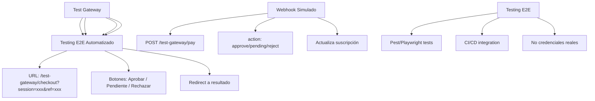

---
tags:
  - kanban/todo
  - type/task
  - domain/PUB
  - priority/P0
parent: "[[desarrollo]]"
children: []
depends_on:
  - "[[PUB-006]]"
blocks:
  - "[[PUB-004]]"
status: todo
assignee: "@dev"
created: 2026-08-04
updated: 2026-08-04
---

# [[PUB-016]] Pasarela de Prueba (Sandbox): Mock Payments, Testing E2E, Webhooks Simulados

## Descripción
Implementar pasarela de prueba (mock/sandbox) para testing E2E sin necesidad de credenciales reales: pagos simulados, webhooks simulados, testing E2E automatizado.

## Código de Ejemplo
```php
// app/Domains/Public/Services/Gateways/TestGateway.php
namespace App\Domains\Public\Services\Gateways;

use App\Domains\Public\Contracts\PaymentGatewayInterface;

class TestGateway implements PaymentGatewayInterface
{
    public function __construct(
        protected bool $autoApprove = true,
        protected int $delayMs = 1000
    ) {}

    public function createCheckout(array $data): array
    {
        // Simular delay de red
        if ($this->delayMs > 0) {
            usleep($this->delayMs * 1000);
        }

        $sessionId = 'test_session_' . uniqid();
        $externalRef = $data['external_reference'];
        
        return [
            'url' => route('test-gateway.checkout', ['session' => $sessionId, 'ref' => $data['external_reference']]),
            'session_id' => $sessionId,
            'external_reference' => $externalRef,
        ];
    }

    public function verifyPayment(string $reference): array
    {
        $subscription = Subscription::where('external_reference', $reference)->first();
        
        if (!$subscription) {
            return ['status' => 'not_found'];
        }

        return [
            'status' => $this->autoApprove ? 'approved' : 'pending',
            'amount' => $subscription->price,
            'currency' => $subscription->currency,
            'payment_id' => 'test_payment_' . uniqid(),
            'payment_method' => 'test_card',
            'installments' => 1,
        ];
    }

    public function refundPayment(string $paymentId, float $amount = null): array
    {
        return ['status' => 'refunded', 'refund_id' => 'test_refund_' . uniqid()];
    }

    public function getGatewayName(): string { return 'test'; }
    public function getSupportedCurrencies(): array { return ['ARS', 'USD']; }
}
```

```php
// routes/test-gateway.php
Route::get('/test-gateway/checkout', function (Request $request) {
    $session = $request->query('session');
    $ref = $request->query('ref');
    
    return view('test-gateway.checkout', compact('session', 'ref'));
})->name('test-gateway.checkout');

Route::post('/test-gateway/pay', function (Request $request) {
    $ref = $request->input('external_reference');
    $action = $request->input('action', 'approve'); // approve, reject, pending
    
    $subscription = Subscription::where('external_reference', $ref)->first();
    
    if ($subscription) {
        $subscription->update([
            'status' => $action === 'approve' ? 'active' : ($action === 'reject' ? 'rejected' : 'pending_payment'),
            'activated_at' => now(),
            'renews_at' => now()->addMonth(),
        ]);
        
        if ($subscription->status === 'active') {
            // Generar invite link + notificaciones
            app(\App\Domains\Public\Services\WebhookProcessor::class)
                ->processApprovedPayment('test', [
                    'external_reference' => $subscription->external_reference,
                ]);
        }
    }
    
    return redirect()->route('test-gateway.result', ['subscription' => $subscription->id]);
})->name('test-gateway.pay');

Route::get('/test-gateway/result/{subscription}', function (Subscription $subscription) {
    return view('test-gateway.result', compact('subscription'));
})->name('test-gateway.result');
```

```blade
{{-- resources/views/test-gateway/checkout.blade.php --}}
@extends('layouts.public')

@section('content')
<div class="container mx-auto px-4 py-16 max-w-2xl text-center">
    <div class="w-20 h-20 mx-auto mb-6 bg-warning-100 dark:bg-warning-900/30 rounded-full flex items-center justify-center">
        <x-icon name="alert-triangle" class="w-10 h-10 text-warning-600" />
    </div>
    
    <h1 class="text-2xl font-bold text-text-primary mb-4">Modo Prueba (Sandbox)</h1>
    <p class="text-text-secondary mb-8">
        Esta es una pasarela de prueba para testing. No se procesan pagos reales.
    </p>

    <div class="card card--elevated p-6 max-w-md mx-auto">
        <h2 class="text-xl font-semibold mb-4">Simular Pago</h2>
        
        <div class="space-y-4">
            <div class="p-4 bg-bg-tertiary rounded-lg text-left">
                <p class="font-medium text-text-primary">Referencia: {{ $ref }}</p>
                <p class="text-sm text-text-secondary mt-1">Suscripción de prueba</p>
            </div>

            <div class="space-y-3">
                <button onclick="simulatePayment('approve')" class="btn btn--success btn--full-width">
                    <x-icon name="check-circle" class="w-4 h-4 mr-2" />
                    Simular Pago Aprobado
                </button>
                <button onclick="simulatePayment('pending')" class="btn btn--warning btn--full-width">
                    <x-icon name="clock" class="w-4 h-4 mr-2" />
                    Simular Pago Pendiente
                </button>
                <button onclick="simulatePayment('reject')" class="btn btn--error btn--full-width">
                    <x-icon name="x-circle" class="w-4 h-4 mr-2" />
                    Simular Pago Rechazado
                </button>
            </div>
        </div>
    </div>

    <div class="mt-6 p-4 bg-bg-tertiary rounded-lg text-sm text-text-secondary">
        <strong>Tarjetas de prueba:</strong><br>
        Aprobada: 5031 7557 3453 0604<br>
        Rechazada: 5031 1111 1111 1111<br>
        Pendiente: 5031 2222 2222 2222
    </div>
</div>
@endsection

@push('scripts')
<script>
function simulatePayment(action) {
    document.getElementById('action-input').value = action;
    document.getElementById('payment-form').submit();
}
</script>
@endpush
```

```blade
{{-- resources/views/test-gateway/result.blade.php --}}
@extends('layouts.public')

@section('content')
<div class="container mx-auto px-4 py-16 max-w-2xl text-center">
    <div class="w-20 h-20 mx-auto mb-6 bg-success-100 dark:bg-success-900/30 rounded-full flex items-center justify-center">
        <x-icon name="check-circle" class="w-10 h-10 text-success-600" />
    </div>
    
    <h1 class="text-2xl font-bold text-text-primary mb-4">¡Pago Simulado Exitoso!</h1>
    <p class="text-text-secondary mb-8">La suscripción ha sido activada correctamente.</p>
    
    <a href="{{ route('client.dashboard') }}" class="btn btn--primary btn--lg">
        Ir a mi Dashboard
    </a>
</div>
@endsection
```

```php
// routes/test-gateway.php
Route::get('/test-gateway/checkout', function (Request $request) {
    $session = $request->query('session');
    $ref = $request->query('ref');
    
    return view('test-gateway.checkout', compact('session', 'ref'));
})->name('test-gateway.checkout');

Route::post('/test-gateway/pay', function (Request $request) {
    $ref = $request->input('external_reference');
    $action = $request->input('action', 'approve'); // approve, reject, pending
    
    $subscription = Subscription::where('external_reference', $ref)->first();
    
    if ($subscription) {
        $subscription->update([
            'status' => $action === 'approve' ? 'active' : ($action === 'reject' ? 'rejected' : 'pending_payment'),
            'activated_at' => now(),
            'renews_at' => now()->addMonth(),
        ]);
        
        if ($subscription->status === 'active') {
            // Generar invite link + notificaciones
            app(\App\Domains\Public\Services\WebhookProcessor::class)
                ->processApprovedPayment('test', [
                    'external_reference' => $subscription->external_reference,
                ]);
        }
    }
    
    return redirect()->route('test-gateway.result', ['subscription' => $subscription->id]);
})->name('test-gateway.pay');

Route::get('/test-gateway/result/{subscription}', function (Subscription $subscription) {
    return view('test-gateway.result', compact('subscription'));
})->name('test-gateway.result');
```

```javascript
// scripts/visual-test.js - Script para CI
const { execSync } = require('child_process');
const fs = require('fs');

console.log('🔍 Running visual regression tests...');

// 1. Build assets
console.log('📦 Building assets...');
execSync('npm run build:prod', { stdio: 'inherit' });

// 2. Start dev server
console.log('🚀 Starting dev server...');
const server = require('child_process').spawn('php', ['artisan', 'serve', '--port=8000'], { detached: true });

// Wait for server
await new Promise(resolve => setTimeout(resolve, 3000));

// 3. Run Playwright tests
console.log('🎭 Running Playwright tests...');
try {
    execSync('npx playwright test', { stdio: 'inherit' });
    console.log('✅ Visual tests passed!');
} catch (error) {
    console.error('❌ Visual tests failed!');
    process.exit(1);
} finally {
    // Kill server
    process.kill(-server.pid);
}
```

## Diagramas Mermaid


## Criterios de Aceptación
- [ ] TestGateway implementa PaymentGatewayInterface
- [ ] Checkout simulado con 3 botones: Aprobar, Pendiente, Rechazar
- [ ] No requiere credenciales reales (modo test)
- [ ] Simula delay de red configurable
- [ ] Webhook simulado: POST /test-gateway/pay con action
- [ ] Actualiza suscripción según acción (active/pending/rejected)
- [ ] Genera invite link + notificaciones igual que producción
- [ ] Testing E2E: Pest tests para flujo completo checkout
- [ ] Playwright tests: flujo visual completo
- [ ] CI/CD: tests corren en pipeline sin credenciales
- [ ] Documentado en `docu/especificaciones/test-gateway.md`

## Notas Técnicas
- Solo disponible en entorno `local` y `testing` (middleware `EnsureTestEnvironment`)
- No requiere credenciales reales ni conectividad externa
- Útil para: desarrollo local, CI/CD, testing QA, demos
- Auto-approve configurable para tests rápidos
- Delay configurable para simular latencia real
- Logs detallados para debugging tests

## Enlaces
- [[PUB-006]] Pasarela abstracción (TestGateway implementa interface)
- [[PUB-004]] Checkout Flow (usa factory)
- [[PUB-007]] Webhook handler (mismo procesador)
- [[TST-F-012]] Browser tests (usa test gateway)
- [[TST-F-010]] Feature tests instalador