---
tags:
  - kanban/todo
  - type/task
  - domain/PUB
  - priority/P0
parent: "[[desarrollo]]"
children: []
depends_on:
  - "[[PUB-006]]"
  - "[[CRE-013]]"
  - "[[PUB-019]]"
blocks:
  - "[[CRE-011]]"
status: todo
assignee: "@dev"
created: 2026-08-04
updated: 2026-08-04
---

# [[PUB-017]] Facturación Clientes: Factura A/B/C, PDF, AFIP CAE (Argentina), Descarga

## Descripción
Implementar facturación completa para clientes: generación de factura A/B/C según tipo de contribuyente, solicitud CAE a AFIP/ARCA, generación PDF con QR/PDF417, envío por email, descarga desde panel.

## Código de Ejemplo
```php
// app/Services/ClientBillingService.php
namespace App\Services;

use App\Models\{Payment, Invoice, Subscription, User, ChannelPago};
use App\Services\AfipWsfeService;
use Barryvdh\DomPDF\Facade\Pdf;

class ClientBillingService
{
    public function generateInvoiceForPayment(Payment $payment): Invoice
    {
        $user = $payment->user;
        $subscription = $payment->subscription;
        $channel = $subscription->channel;
        $amount = $payment->amount;

        // Determinar tipo factura según contribuyente cliente
        $invoiceType = $this->determineInvoiceType($user);

        // Calcular impuestos
        $taxData = $this->calculateTaxes($amount, $user);

        // Crear factura en estado draft
        $invoice = Invoice::create([
            'payment_id' => $payment->id,
            'subscription_id' => $subscription->id,
            'channel_pago_id' => $subscription->channel_pago_id,
            'issuer_id' => config('afip.cuil'), // TG-PayGate como emisor
            'receiver_id' => $user->id,
            'type' => $invoiceType,
            'point_of_sale' => config('afip.default_point_of_sale', 1),
            'currency' => 'ARS',
            'total_gravado' => $taxData['gravado'],
            'vat_rate' => $taxData['vat_rate'],
            'vat_amount' => $taxData['vat_amount'],
            'ganancias_withholding' => $taxData['ganancias'],
            'iva_withholding' => $taxData['iva_retention'],
            'iibb_withholding' => $taxData['iibb'],
            'total_neto' => $taxData['neto'],
            'total_iva' => $taxData['vat_amount'],
            'total' => $amount,
            'status' => 'draft',
            'taxpayer_type_issuer' => 'responsable_inscripto', // TG-PayGate
            'taxpayer_type_receiver' => $user->taxpayer_type ?? 'consumidor_final',
        ]);

        // Solicitar CAE a AFIP/ARCA
        $caeData = $this->requestCAE($invoice);
        $invoice->update([
            'cai' => $caeData['cae'],
            'cae_number' => $caeData['cae_number'],
            'cae_due_date' => $caeData['cae_due_date'],
            'afip_xml_request' => $caeData['request_xml'],
            'afip_xml_response' => $caeData['response_xml'],
            'status' => $caeData['authorized'] ? 'authorized' : 'rejected',
        ]);

        // Generar PDF
        $pdfPath = $this->generateInvoicePDF($invoice);
        $invoice->update(['pdf_path' => $pdfPath]);

        // Enviar email
        $this->sendInvoiceEmail($payment, $invoice);

        return $invoice;
    }

    private function calculateTaxes(float $amount, User $user): array
    {
        $taxService = app(\App\Services\ArgentineTaxService::class);
        
        // IVA 21% servicios digitales
        $vatRate = 0.21;
        $vatAmount = round($amount * $vatRate / (1 + $vatRate), 2);
        $gravado = round($amount - $vatAmount, 2);

        // Retención Ganancias: 6% servicios digitales (RG 830/2023)
        $ganancias = 0;
        if ($user->taxpayer_type === 'responsable_inscripto') {
            $ganancias = round($gravado * 0.06, 2);
        }

        // Retención IVA: 100% para RI, 50% para Monotributo
        $ivaRetention = 0;
        if (in_array($user->taxpayer_type, ['responsable_inscripto', 'monotributo'])) {
            $ivaRetention = round($vatAmount * ($user->taxpayer_type === 'responsable_inscripto' ? 1 : 0.5), 2);
        }

        // IIBB según domicilio fiscal usuario
        $iibb = 0;
        if ($user->tax_province) {
            $iibb = app(\App\Services\ArgentineTaxService::class)->calculateIIBB($gravado, $user->tax_province);
        }

        $neto = $amount - $ganancias - $ivaRetention - $iibb;

        return [
            'gravado' => $gravado,
            'vat_rate' => $vatRate,
            'vat_amount' => $vatAmount,
            'ganancias' => $ganancias,
            'iva_retention' => $ivaRetention,
            'iibb' => $iibb,
            'neto' => max(0, $neto),
        ];
    }

    private function determineInvoiceType(User $user): string
    {
        return match($user->taxpayer_type) {
            'responsable_inscripto' => 'A', // TG-PayGate es RI, emite A a RI
            'monotributo' => 'B', // RI emite B a Monotributo
            'exento' => 'E',
            default => 'B', // Consumidor Final
        };
    }

    private function requestCAE(Invoice $invoice): array
    {
        $afipService = app(AfipWsfeService::class);
        return $afipService->authorizeInvoice($invoice);
    }

    private function generateInvoicePDF(Invoice $invoice): string
    {
        $pdf = Pdf::loadView('pdf.invoice', ['invoice' => $invoice]);
        $path = "invoices/{$invoice->number}.pdf";
        \Storage::disk('local')->put($path, $pdf->output());
        return $path;
    }

    private function sendInvoiceEmail(Payment $payment, Invoice $invoice): void
    {
        $user = $payment->user;
        \Mail::to($user->email)->send(new \App\Mail\ClientInvoiceMail($payment, $invoice));
    }
}
```

```blade
{{-- resources/views/pdf/invoice.blade.php --}}
<!DOCTYPE html>
<html lang="es">
<head>
    <meta charset="UTF-8">
    <style>
        @page { margin: 20mm; }
        body { font-family: 'Inter', sans-serif; font-size: 10px; color: #1a1a1a; }
        .header { display: flex; justify-content: space-between; margin-bottom: 20px; }
        .logo { font-size: 24px; font-weight: bold; color: #82B7C3; }
        .invoice-title { text-align: right; }
        .invoice-title h1 { font-size: 18px; margin: 0; }
        .invoice-title .type { font-size: 14px; background: #82B7C3; color: white; padding: 2px 8px; border-radius: 4px; }
        .data-grid { display: grid; grid-template-columns: repeat(2, 1fr); gap: 8px; margin-bottom: 20px; }
        .data-item { background: #f5f5f5; padding: 8px; border-radius: 4px; }
        .data-item strong { display: block; font-size: 9px; color: #666; margin-bottom: 2px; }
        table { width: 100%; border-collapse: collapse; font-size: 9px; }
        th, td { border: 1px solid #ddd; padding: 6px; text-align: left; }
        th { background: #82B7C3; color: white; }
        .totals { width: 300px; margin-left: auto; font-size: 9px; }
        .totals div { display: flex; justify-content: space-between; padding: 4px 0; }
        .totals .total { font-weight: bold; font-size: 11px; border-top: 2px solid #333; padding-top: 8px; }
        .qr-section { text-align: center; margin-top: 30px; }
        .footer { margin-top: 30px; font-size: 8px; color: #666; text-align: center; }
    </style>
</head>
<body>
    <div class="header">
        <div class="logo">TG-PayGate</div>
        <div class="invoice-title">
            <h1>FACTURA <span class="type">{{ $invoice->type }}</span></h1>
            <p>N° {{ $invoice->number }}</p>
        </div>
    </div>

    <div class="data-grid">
        <div class="data-item"><strong>Fecha Emisión</strong>{{ $invoice->created_at->format('d/m/Y') }}</div>
        <div class="data-item"><strong>CAE</strong>{{ $invoice->cai }}</div>
        <div class="data-item"><strong>Vto. CAE</strong>{{ $invoice->cae_due_date->format('d/m/Y') }}</div>
        <div class="data-item"><strong>Punto de Venta</strong>{{ $invoice->point_of_sale }}</div>
        <div class="data-item"><strong>Cliente</strong>{{ $invoice->receiver->name }}</div>
        <div class="data-item"><strong>CUIT/CUIL</strong>{{ $invoice->receiver->cuit_cuil }}</div>
        <div class="data-item"><strong>Condición IVA</strong>{{ $invoice->taxpayer_type_receiver }}</div>
        <div class="data-item"><strong>Domicilio</strong>{{ $invoice->receiver->tax_address }}</div>
    </div>

    <table>
        <thead>
            <tr>
                <th>Descripción</th>
                <th style="width: 80px;">Cant.</th>
                <th style="width: 100px;">Precio Unit.</th>
                <th style="width: 80px;">IVA %</th>
                <th style="width: 100px;">Importe</th>
            </tr>
        </thead>
        <tbody>
            <tr>
                <td>Suscripción canal: {{ $invoice->subscription->channel->name }}</td>
                <td>1</td>
                <td>{{ number_format($invoice->total_gravado, 2) }}</td>
                <td>{{ $invoice->vat_rate * 100 }}%</td>
                <td>{{ number_format($invoice->total, 2) }}</td>
            </tr>
        </tbody>
    </table>

    <div class="totals">
        <div><span>Gravado:</span><span>{{ number_format($invoice->total_gravado, 2) }}</span></div>
        <div><span>IVA {{ $invoice->vat_rate * 100 }}%:</span><span>{{ number_format($invoice->vat_amount, 2) }}</span></div>
        @if($invoice->ganancias_withholding > 0)
        <div><span>Ret. Ganancias:</span><span>{{ number_format($invoice->ganancias_withholding, 2) }}</span></div>
        @endif
        @if($invoice->iva_withholding > 0)
        <div><span>Ret. IVA:</span><span>{{ number_format($invoice->iva_withholding, 2) }}</span></div>
        @endif
        @if($invoice->iibb_withholding > 0)
        <div><span>Ret. IIBB:</span><span>{{ number_format($invoice->iibb_withholding, 2) }}</span></div>
        @endif
        <div class="total"><span>TOTAL:</span><span>{{ number_format($invoice->total, 2) }}</span></div>
    </div>

    <div class="qr-section">
        qr_code_data_uri }}" alt="QR AFIP" width="100" height="100">
        <p style="margin-top: 8px; font-size: 8px;">CAE: {{ $invoice->cai }} | Vto: {{ $invoice->cae_due_date->format('d/m/Y') }}</p>
    </div>

    <div class="footer">
        <p>TG-PayGate - CUIT: {{ config('afip.cuil') }} - Punto de Venta: {{ $invoice->point_of_sale }}</p>
        <p>Factura Electrónica autorizada por AFIP/ARCA - {{ $invoice->created_at->format('d/m/Y H:i') }}</p>
        <p>Esta factura es un documento válido para fines fiscales.</p>
    </div>
</body>
</html>
```

```php
// app/Services/AfipWsfeService.php
class AfipWsfeService
{
    public function authorizeInvoice(Invoice $invoice): array
    {
        $wsfe = new \Afip\Wsfe\Wsfe([
            'cuit' => config('afip.cuit'),
            'cert' => config('afip.cert_path'),
            'key' => config('afip.key_path'),
            'production' => config('afip.env') === 'production',
        ]);

        $data = [
            'CantReg' => 1,
            'PtoVta' => $invoice->point_of_sale,
            'CbteTipo' => $this->getCbteTipo($invoice->type),
            'Concepto' => 3, // Servicios
            'DocTipo' => $this->getDocTypeCode($invoice->receiver->taxpayer_type),
            'DocNro' => $invoice->receiver->cuit_cuil,
            'CbteDesde' => $invoice->number,
            'CbteHasta' => $invoice->number,
            'ImpTotal' => $invoice->total,
            'ImpTotConc' => 0,
            'ImpNeto' => $invoice->total_gravado,
            'ImpOpEx' => 0,
            'ImpIVA' => $invoice->vat_amount,
            'ImpTrib' => $invoice->ganancias_withholding + $invoice->iva_withholding + $invoice->iibb_withholding,
            'FchServDesde' => $invoice->created_at->format('Ymd'),
            'FchServHasta' => $invoice->created_at->format('Ymd'),
            'FchVtoPago' => $invoice->created_at->format('Ymd'),
            'MonId' => 'PES',
            'MonCotiz' => 1.0000,
        ];

        $result = $this->wsfe->CAESolicitar($data);
        
        return [
            'authorized' => $result['Resultado'] === 'A',
            'cae' => $result['CAE'] ?? null,
            'cae_number' => $result['CAE'] ?? null,
            'cae_due_date' => $result['CAEFchVto'] ? \Carbon\Carbon::createFromFormat('Ymd', $result['CAEFchVto']) : null,
            'request_xml' => $result['xml_request'] ?? null,
            'response_xml' => $result['xml_response'] ?? null,
        ];
    }

    private function getCbteTipo(string $type): int
    {
        return match($type) {
            'A' => 1, 'B' => 6, 'C' => 11, 'E' => 19, default => 6,
        };
    }
}
```

## Diagramas Mermaid

```mermaid
graph TD
    A[Facturación Cliente] --> B[Pago Procesado]
    A --> B[Determinar Tipo Factura]
    A --> C[Calcular Impuestos]
    A --> D[Solicitar CAE AFIP]
    A --> E[Generar PDF]
    A --> F[Enviar Email]
    
    B --> B1[RI → Factura A]
    B --> B2[Mono/CF → Factura B]
    B --> B3[Exento → Factura E]
    
    C --> C1[IVA 21% Servicios Digitales]
    C --> C2[Ret. Ganancias 6% RI]
    C --> C3[Ret. IVA 100% RI/50% Mono]
    C --> C4[IIBB por Provincia]
    
    D --> D1[WSFE v1 ARCA]
    D --> D2[CAE 14 dígitos + 2 díg. verif.]
    D --> D3[Vencimiento 10 días]
    
    E --> E1[PDF con DomPDF]
    E --> E2[QR AFIP + PDF417]
    E --> E3[QR Code con datos CAE]
    
    F --> F1[Email con PDF adjunto]
    F --> F2[Descarga en panel cliente]
    F --> F3[Historial facturas]
```


## Criterios de Aceptación
- [ ] Generación automática factura al procesar pago (event listener)
- [ ] Tipo factura A/B/E según contribuyente cliente (RI=Factura A a RI, B a Mono/CF)
- [ ] Cálculo IVA 21% servicios digitales, retenciones Ganancias (6% RI), IVA (100% RI/50% Mono), IIBB provincia
- [ ] Solicitud CAE a ARCA WSFE v1 (testing/production), manejo errores/reintentos
- [ ] Generación PDF con DomPDF: datos emisor/receptor, detalle, totales, CAE, QR AFIP, código PDF417
- [ ] QR Code AFIP: URL verificación con CAE, CUIT, fecha, importe
- [ ] Envío email automático con PDF adjunto al cliente
- [ ] Descarga PDF desde panel cliente (historial facturas)
- [ ] Vista historial facturas con filtros: estado, tipo, fecha, monto
- [ ] Manejo errores AFIP: reintento automático (3x), notificación si falla
- [ ] Almacenamiento XML request/response AFIP para auditoría
- [ ] PDF417 barcode obligatorio en factura impresa
- [ ] Testing: generación factura A/B, CAE mock, PDF generado, email enviado

## Notas Técnicas
- AFIP = ARCA (Agencia Recaudación Control Aduanero) desde 2024
- WSFE v1: Web Service Factura Electrónica
- CAE: 14 dígitos + 2 dígitos verificación (módulo 11)
- Vencimiento CAE: 10 días corridos desde autorización
- QR Code AFIP: `https://www.afip.gob.ar/fe/qr/?p={base64}` (parámetros codificados base64)
- PDF417: código barras 2D obligatorio en factura impresa (RG 4368/2014)
- Certificado digital .crt + .key OpenSSL, vigencia 1 año
- Monotributo: Factura C (RG 4369/2014) - si TG-PayGate fuera monotributo (no es el caso)
- Factura M: Monotributo unificado (opcional v1.1)
- Libro IVA Ventas: generación automática mensual (RG 3685/2014)

## Enlaces
- [[CRE-013]] Facturación creador (paralelo)
- [[PUB-019]] Legislación argentina
- [[ADM-012]] Reportes fiscales
- [[CRM-012]] Facturación CRM