---
tags:
  - kanban/todo
  - type/task
  - domain/PUB
  - priority/P0
parent: "[[desarrollo]]"
children: []
depends_on:
  - "[[FUN-006]]"
  - "[[FUN-008]]"
  - "[[PUB-006]]"
  - "[[INS-012]]"
blocks:
  - "[[CRE-015]]"
  - "[[ADM-010]]"
  - "[[CRM-011]]"
  - "[[CRE-013]]"
  - "[[CRE-014]]"
  - "[[ADM-011]]"
  - "[[ADM-013]]"
  - "[[CRE-017]]"
  - "[[PUB-017]]"
status: todo
assignee: "@dev"
created: 2026-08-04
updated: 2026-08-04
---

# [[PUB-019]] Legislación Impositiva Argentina: AFIP, Factura A/B/C, IVA, Ganancias, IIBB, Monotributo, CAE

## Descripción
Implementar cumplimiento completo de legislación impositiva argentina (AFIP/ARCA) en TG-PayGate: Factura A/B/C, IVA (21%, 10.5%, 27%), Impuesto a las Ganancias, IIBB provinciales, Monotributo, Responsable Inscripto, AFIP CAE, Factura Electrónica, retenciones.

## Código de Ejemplo
```php
// app/Domains/Public/Services/ArgentineTaxService.php
namespace App\Domains\Public\Services;

use App\Models\{User, Transaction, Invoice};

class ArgentineTaxService
{
    // Tipos de contribuyente AFIP
    const TAXPAYER_TYPES = [
        'responsable_inscripto' => 'Responsable Inscripto',
        'monotributo' => 'Monotributo',
        'exento' => 'Exento',
        'no_categorizado' => 'No Categorizado',
        'consumidor_final' => 'Consumidor Final',
    ];

    // Tipos de factura según contribuyente
    const INVOICE_TYPES = [
        'responsable_inscripto' => ['A', 'B'], // RI emite A a RI, B a CF/Monotributo
        'monotributo' => ['C'], // Monotributo emite C
        'exento' => ['E'], // Exento emite E
    ];

    // Alícuotas IVA Argentina
    const VAT_RATES = [
        'general' => 0.21,      // 21% - General
        'reduced' => 0.105,     // 10.5% - Reducida (alimentos, medicamentos, etc.)
        'increased' => 0.27,    // 27% - Incrementada (servicios financieros, etc.)
        'exempt' => 0.00,       // 0% - Exento
    ];

    // Retenciones Ganancias (RG 830/2023)
    const GANANCIAS_WITHHOLDINGS = [
        'services' => 0.06,      // 6% - Servicios profesionales
        'rent' => 0.15,          // 15% - Alquileres
        'interest' => 0.15,      // 15% - Intereses
        'dividends' => 0.07,     // 7% - Dividendos
    ];

    // IIBB por provincia (alícuotas aproximadas CABA)
    const IIBB_RATES = [
        'CABA' => 0.035,         // 3.5% - Ciudad Autónoma de Buenos Aires
        'BA' => 0.035,           // 3.5% - Provincia de Buenos Aires
        'CORDOBA' => 0.045,      // 4.5% - Córdoba
        'SANTA_FE' => 0.04,      // 4% - Santa Fe
        // ... resto de provincias
    ];

    public function calculateVAT(float $amount, string $vatType = 'general'): float
    {
        $rate = self::VAT_RATES[$vatType] ?? self::VAT_RATES['general'];
        return round($amount * $rate, 2);
    }

    public function calculateGananciasWithholding(float $amount, string $concept): float
    {
        $rate = self::GANANCIAS_WITHHOLDINGS[$concept] ?? 0;
        return round($amount * $rate, 2);
    }

    public function calculateIIBB(float $amount, string $province): float
    {
        $rate = self::IIBB_RATES[strtoupper($province)] ?? 0;
        return round($amount * $rate, 2);
    }

    public function determineInvoiceType(User $issuer, User $receiver): string
    {
        $issuerType = $issuer->taxpayer_type ?? 'consumidor_final';
        $receiverType = $receiver->taxpayer_type ?? 'consumidor_final';

        $allowedTypes = self::INVOICE_TYPES[$issuerType] ?? ['B'];

        // RI emite A a RI, B a CF/Monotributo
        if ($issuerType === 'responsable_inscripto') {
            return in_array($receiverType, ['responsable_inscripto']) ? 'A' : 'B';
        }

        return $allowedTypes[0] ?? 'B';
    }

    public function generateCAE(Invoice $invoice): string
    {
        // Integración con ARCA (ex AFIP) WS FE
        $afipService = app(\App\Services\AfipWsfeService::class);
        return $afipService->requestCAE($invoice);
    }
}
```

```php
// app/Models/Invoice.php - Modelo factura con campos fiscales argentinos
class Invoice extends Model
{
    protected $fillable = [
        'number', 'type', // A, B, C, E, M
        'point_of_sale', 'cai', // CAE
        'cae_due_date', 'cae_number',
        'taxpayer_type_issuer', 'taxpayer_type_receiver',
        'vat_rate', 'vat_amount',
        'ganancias_withholding', 'iva_withholding', 'iibb_withholding',
        'total_gravado', 'total_iva', 'total_neto', 'total',
        'currency', 'exchange_rate',
        'afip_xml_request', 'afip_xml_response',
        'status', // draft, authorized, rejected, cancelled
    ];

    protected $casts = [
        'vat_rate' => 'decimal:4',
        'vat_amount' => 'decimal:2',
        'ganancias_withholding' => 'decimal:2',
        'iva_withholding' => 'decimal:2',
        'iibb_withholding' => 'decimal:2',
        'total_gravado' => 'decimal:2',
        'total_iva' => 'decimal:2',
        'total_neto' => 'decimal:2',
        'total' => 'decimal:2',
        'exchange_rate' => 'decimal:4',
        'cae_due_date' => 'datetime',
    ];
}
```

```php
// database/migrations/YYYY_MM_DD_create_invoices_table.php
Schema::create('invoices', function (Blueprint $table) {
    $table->id();
    $table->string('number', 20)->unique(); // 0001-00000001
    $table->enum('type', ['A', 'B', 'C', 'E', 'M']); // Tipos AFIP
    $table->unsignedInteger('point_of_sale'); // 1-9999
    $table->string('cai', 50)->nullable(); // CAE
    $table->date('cae_due_date')->nullable();
    $table->string('cae_number', 20)->nullable();
    
    $table->foreignId('issuer_id')->constrained('users');
    $table->foreignId('receiver_id')->constrained('users');
    $table->string('taxpayer_type_issuer'); // responsable_inscripto, monotributo, etc.
    $table->string('taxpayer_type_receiver');
    
    $table->decimal('vat_rate', 5, 4)->default(0.21);
    $table->decimal('vat_amount', 15, 2)->default(0);
    $table->decimal('ganancias_withholding', 15, 2)->default(0);
    $table->decimal('iva_withholding', 15, 2)->default(0);
    $table->decimal('iibb_withholding', 15, 2)->default(0);
    
    $table->decimal('total_gravado', 15, 2)->default(0);
    $table->decimal('total_iva', 15, 2)->default(0);
    $table->decimal('total_neto', 15, 2)->default(0);
    $table->decimal('total', 15, 2)->default(0);
    $table->string('currency', 3)->default('ARS');
    $table->decimal('exchange_rate', 10, 4)->default(1);
    
    $table->text('afip_xml_request')->nullable();
    $table->text('afip_xml_response')->nullable();
    $table->enum('status', ['draft', 'authorized', 'rejected', 'cancelled'])->default('draft');
    
    $table->timestamps();
    
    $table->index(['issuer_id', 'status']);
    $table->index(['receiver_id', 'status']);
    $table->index(['cae_number', 'cae_due_date']);
});
```

```php
// config/afip.php - Configuración AFIP/ARCA
return [
    'environment' => env('AFIP_ENV', 'testing'), // testing, production
    'cuil' => env('AFIP_CUIL'),
    'certificate' => env('AFIP_CERT_PATH'),
    'private_key' => env('AFIP_KEY_PATH'),
    'wsfe' => [
        'wsdl_testing' => 'https://wswhomo.afip.gov.ar/wsfev1/service.asmx?WSDL',
        'wsdl_production' => 'https://servicios1.afip.gov.ar/wsfev1/service.asmx?WSDL',
    ],
    'ws_sr_padron' => [
        'wsdl_testing' => 'https://wswhomo.afip.gov.ar/ws_sr_padron_a13/service.asmx?WSDL',
        'wsdl_production' => 'https://servicios1.afip.gov.ar/ws_sr_padron_a13/service.asmx?WSDL',
    ],
    'default_point_of_sale' => env('AFIP_POS', 1),
    'invoice_types' => [
        'A' => 1, 'B' => 6, 'C' => 11, 'E' => 19, 'M' => 51,
    ],
];
```

## Diagramas Mermaid

```mermaid
graph TD
    A[Legislación Argentina] --> B[Tipos Contribuyente]
    A --> C[Tipos Factura]
    A --> D[IVA]
    A --> E[Ganancias]
    A --> F[IIBB]
    A --> G[Monotributo]
    A --> H[CAE/Factura Electrónica]
    A --> I[Retenciones]
    
    B --> B1[Responsable Inscripto]
    B --> B2[Monotributo]
    B --> B3[Exento]
    B --> B4[Consumidor Final]
    
    C --> C1[A: RI → RI]
    C --> C2[B: RI → CF/Mono]
    C --> C3[C: Monotributo]
    C --> C4[E: Exento]
    
    D --> D1[21% General]
    D --> D2[10.5% Reducida]
    D --> D3[27% Incrementada]
    
    E --> E1[Servicios 6%]
    E --> E2[Alquileres 15%]
    E --> E3[Intereses 15%]
    
    F --> F1[CABA 3.5%]
    F --> F2[BA 3.5%]
    F --> F3[Córdoba 4.5%]
    
    G --> G1[Categorías A-K]
    G --> G2[Recategorización]
    
    H --> H1[WSFE v1]
    H --> H2[CAE + Vencimiento]
    H --> H3[PDF417 / QR]
    
    I --> I1[Ganancias 6-15%]
    I --> I2[IVA 100% / 50%]
    I --> I3[IIBB variable]
```


## Criterios de Aceptación
- [ ] Modelo User con campos: `taxpayer_type`, `cuit_cuil`, `iibb_number`, `tax_address`, `tax_condition`
- [ ] Servicio `ArgentineTaxService` con cálculos IVA (21%, 10.5%, 27%), Ganancias (6-15%), IIBB por provincia
- [ ] Lógica determinación tipo factura A/B/C/E según contribuyente emisor/receptor
- [ ] Modelo Invoice con campos AFIP: tipo (A/B/C/E/M), punto de venta, CAE, CAE vencimiento, retenciones
- [ ] Integración ARCA WSFE v1 para solicitud CAE (testing/production)
- [ ] Configuración AFIP: CUIT, certificado, clave privada, WSDL testing/production
- [ ] Cálculo automático IVA (21% general, 10.5% reducida, 27% incrementada)
- [ ] Cálculo retenciones: Ganancias (servicios 6%, alquileres 15%), IVA (100%/50%), IIBB por provincia
- [ ] Determinación automática tipo factura A/B/C/E según contribuyente emisor/receptor
- [ ] Generación PDF factura con código QR/PDF417 (CAE + datos fiscales)
- [ ] Modelo Monotributo: categorías A-K, recategorización, límites facturación
- [ ] Libro IVA Ventas/Compras generación (RG 3685/2014)
- [ ] Retenciones Ganancias (RG 830/2023): servicios 6%, alquileres 15%, intereses 15%
- [ ] IIBB por jurisdicción: CABA 3.5%, BA 3.5%, Córdoba 4.5%, etc.
- [ ] Compliance RG 4367/4368/4369 (Factura electrónica, CAE, QR)
- [ ] Testing: cálculos impuestos, determinación tipo factura, generación CAE mock

## Notas Técnicas
- AFIP = ARCA (Agencia de Recaudación y Control Aduanero) desde 2024
- WSFE v1: Web Service Factura Electrónica v1
- CAE: Código de Autorización Electrónico (14 dígitos + 2 dígitos verificación)
- CAE vencimiento: 10 días corridos desde autorización
- QR Code en factura: URL ARCA con parámetros CAE, CUIT, fecha, importe
- PDF417: Código de barras 2D obligatorio en factura impresa
- Monotributo: Categorías A-K, límites facturación anual, recategorización semestral
- RG 3685/2014: Libro IVA digital (ventas/compras)
- RG 4367/2014: Factura electrónica obligatoria
- RG 4368/2014: CAE y QR obligatorio
- RG 4369/2014: Comprobantes clase M (monotributo)
- RG 830/2023: Nuevo régimen retenciones Ganancias
- WSDL Testing: `wswhomo.afip.gov.ar`, Production: `servicios1.afip.gov.ar`
- Certificado digital: .crt + .key (OpenSSL), vigencia 1 año
- CUIT emisor: 11 dígitos (20/23/24/27 + 8 dígitos + dígito verificador)

## Enlaces
- [[FUN-006]] User Model (tax fields)
- [[FUN-008]] Config (.env AFIP)
- [[CRE-015]] Creador config fiscal
- [[CRE-016]] Ciclos cobro creador
- [[CRE-017]] Facturación creador
- [[ADM-010]] Config fiscal global
- [[ADM-011]] Compliance AFIP
- [[ADM-012]] Reportes fiscales
- [[ADM-013]] Retenciones config
- [[CRM-011]] Gestión fiscal clientes
- [[CRM-012]] Facturación CRM
- [[CRM-013]] Conciliación fiscal
- [[PUB-017]] Facturación clientes
- [[PUB-018]] Instalador config fiscal
- [[INS-012]] Instalador paso fiscal