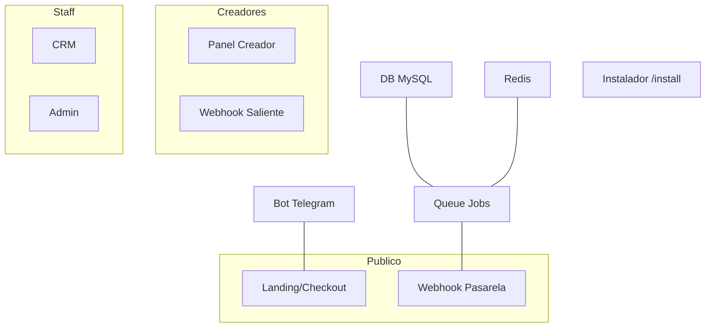

---
tags:
  - kanban/todo
  - type/task
  - domain/SEC
  - priority/P0
parent: "[[desarrollo]]"
children: []
depends_on: []
blocks:
  - "[[SEC-002]]"
  - "[[SEC-003]]"
  - "[[SEC-004]]"
  - "[[FUN-005]]"
status: todo
assignee: "@dev"
created: 2026-08-05
updated: 2026-08-05
---

# [[SEC-001]] Threat Modeling STRIDE Global

## Descripción
Construir el modelo de amenazas del sistema completo **antes de escribir código**. Aplicar STRIDE (Spoofing, Tampering, Repudiation, Information Disclosure, Denial of Service, Elevation of Privilege) sobre cada componente: autenticación, pasarelas de pago, webhooks, bot Telegram, paneles creador/staff/admin, instalador y cola de jobs.

Este es el punto de partida de toda la arquitectura de seguridad: sus hallazgos alimentan el Risk Register (SEC-003) y la Security Baseline (SEC-004).

## Código de Ejemplo
```markdown
<!-- docu/arquitectura/seguridad/threat-model.md -->
# Threat Model TG-PayGate v1.0

## Ámbitos STRIDE
| Componente | S | T | R | I | D | E | Mitigación principal |
|------------|---|---|---|---|---|---|----------------------|
| Checkout (Public) | JWT | Firmas | Audit log | TLS 1.3 | Rate limit | RBAC | ... |
| Webhook pasarela | HMAC | Idempotencia | Ledger | No-card | DLQ | -- | ... |
| Bot Telegram | Secreto | Nonce | Audit | No PII | Flood ctl | Scopes | ... |
| Instalador | One-time token | Honeypot | Audit | .env locked | Throttle | -- | ... |

## Assets protegidos
1. Tokens de bot Telegram (AES-256)
2. Claves de firma de webhooks
3. Datos personales (GDPR)
4. Fondos de creadores y balances
5. Claves de API de pasarelas
```

## Diagramas Mermaid
### Árbol de Componentes a Modelar


## Criterios de Aceptación
- [ ] Documento `docu/arquitectura/seguridad/threat-model.md` creado
- [ ] STRIDE aplicado a los 8+ componentes del sistema
- [ ] Cada amenaza identificada tiene un código (`THR-001`, `THR-002`, ...)
- [ ] Assets protegidos enumerados con clasificación de sensibilidad
- [ ] Amenazas priorizadas (probabilidad × impacto) y mapeadas a mitigaciones
- [ ] Revisado por par (peer review) antes de iniciar desarrollo de pagos

## Notas Técnicas
- Utilizar método "kill chain" de cada flujo de dinero: crear-cobrar-confirmar-reembolsar-retirar
- Incluir flujos del instalador: es el vector más riesgoso de un sistema portable
- No marcar como done hasta que SEC-002 (DFD) esté integrado
- Amenazas críticas deben tener un ticket de mitigación propio

## Enlaces
- [[SEC-002]] Trust Boundaries + DFD
- [[SEC-003]] Security Risk Register
- [[SEC-004]] Security Baseline
- [[TST-S-001]] SAST (verificación automática de mitigaciones)
