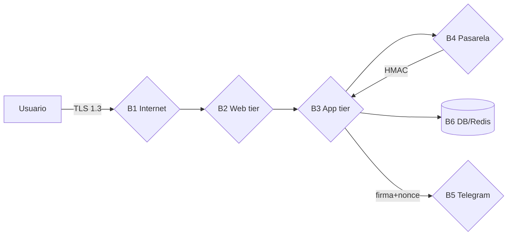

---
tags:
  - kanban/todo
  - type/task
  - domain/SEC
  - priority/P0
parent: "[[desarrollo]]"
children: []
depends_on:
  - "[[SEC-001]]"
blocks:
  - "[[SEC-003]]"
  - "[[SEC-004]]"
status: todo
assignee: "@dev"
created: 2026-08-05
updated: 2026-08-05
---

# [[SEC-002]] Trust Boundaries y Data Flow Diagram (DFD)

## Descripción
Definir las **trust boundaries** (límites de confianza) del sistema y documentar los Data Flow Diagrams (DFD) de todos los flujos de datos sensibles: pago, webhook, retiro, invitación Telegram y datos personales. Cada cruce de boundary debe tener un control de seguridad explícito.

## Código de Ejemplo
```markdown
<!-- docu/arquitectura/seguridad/dfd.md -->
# Trust Boundaries

## Límites
| Boundary | Aplica a | Control requerido al cruzar |
|----------|----------|------------------------------|
| B1 Internet | Usuarios | TLS, rate limit, CSRF |
| B2 Web tier | Controladores | Auth + Authorization, input validation |
| B3 App tier | Services | Domain checks, idempotencia |
| B4 Pasarela externa | Stripe/MP/PayPal | Firma HMAC, TLS, verify signature |
| B5 Telegram | Bot API | Secreto compartido, timestamp, nonce |
| B6 DB/Redis | Persistencia | Encrypted fields, parametrized queries |

## Flujos (subset)
- F1 Checkout: Usuario → B1 → B2 → B3 → B4 → B3 → B2 → Usuario
- F2 Webhook: B4 → B2 → B3 → Ledger → Queue
- F3 Invite: B3 → B5 → Usuario Telegram
```

## Diagramas Mermaid


## Criterios de Aceptación
- [ ] Trust boundaries documentadas (6+ límites) con controles obligatorios
- [ ] DFD de los flujos: checkout, webhook entrante, webhook saliente, retiro, invitación, instalador
- [ ] Cada flujo indica: actor, datos, destino y control en cada cruce de boundary
- [ ] Diagramas Mermaid incluidos en `docu/arquitectura/seguridad/dfd.md`
- [ ] DFD usado como input del Risk Register (SEC-003) y de las Policies (SEC-023)

## Notas Técnicas
- Marcar explícitamente dónde entra dinero real y dónde cambia de estado
- Los webhooks externos cruzan B4→B2: la verificación de firma debe ser el primer check
- El instalador tiene su propia boundary (no autenticado, expuesto solo pre-instalación)

## Enlaces
- [[SEC-001]] Threat Modeling
- [[SEC-003]] Security Risk Register
- [[DOC-008]] Spec pasarelas de pago
