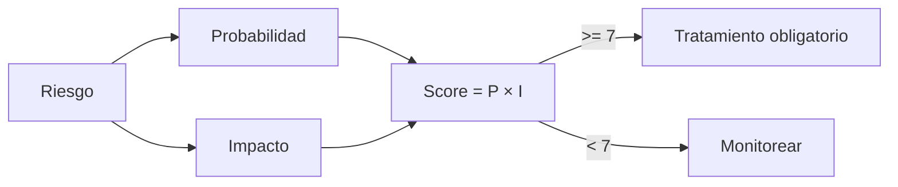

---
tags:
  - kanban/todo
  - type/task
  - domain/SEC
  - priority/P0
parent: "[[desarrollo]]"
children: []
depends_on:
  - "[[SEC-001]]"
  - "[[SEC-002]]"
blocks:
  - "[[SEC-004]]"
  - "[[SEC-050]]"
status: todo
assignee: "@dev"
created: 2026-08-05
updated: 2026-08-05
---

# [[SEC-003]] Security Risk Register + Mitigaciones

## Descripción
Convertir las amenazas de SEC-001 y los flujos de SEC-002 en un **registro de riesgos** formal: cada riesgo con ID, categoría, probabilidad, impacto, score, mitigación, propietario y test de verificación. Es el contrato que guía todas las decisiones de seguridad posteriores.

## Código de Ejemplo
```markdown
<!-- docu/arquitectura/seguridad/risk-register.md -->
| ID | Riesgo | P | I | Score | Mitigación | Verificación |
|----|--------|---|---|-------|------------|--------------|
| RSK-001 | Doble cobro por replay webhook | M | C | 9 | Idempotencia + nonce | SEC-016, SEC-043 |
| RSK-002 | Tokens Telegram en repositorio | M | C | 9 | AES-256 + secrets audit | SEC-040, TST-S-003 |
| RSK-003 | IDOR creador lee pagos ajenos | A | C | 9 | Policies + tenant scope | SEC-023, SEC-025 |
| RSK-004 | Ataque al instalador | A | C | 9 | Anti-reinstall + lock file | INS-009 |
| RSK-005 | SSRF en webhooks salientes | M | M | 6 | Allowlist IP + no SSRF client | SEC-047 |
```

## Diagramas Mermaid
### Scoring


## Criterios de Aceptación
- [ ] Registro con 15+ riesgos concretos de TG-PayGate (no genéricos)
- [ ] Score = probabilidad × impacto con escala definida (1-3 × 1-3 = 1-9)
- [ ] Riesgos con score ≥ 7 tienen mitigación asignada y propietario
- [ ] Cada mitigación referencia las tareas SEC que la implementan
- [ ] Revisión del registro al menos cada hito (alfa, beta, GA)

## Notas Técnicas
- El registro es un documento vivo: se actualiza con cada hallazgo nuevo
- No eliminar riesgos: marcar como `mitigado`/`aceptado` con evidencia
- Vincular cada riesgo a su test de verificación (SEC-043..SEC-049)

## Enlaces
- [[SEC-001]] Threat Modeling
- [[SEC-002]] Trust Boundaries + DFD
- [[SEC-004]] Security Baseline
