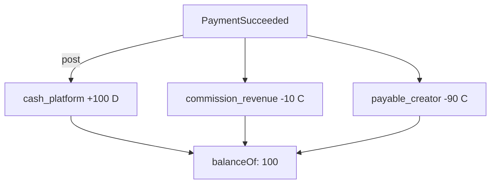

---
tags:
  - kanban/todo
  - type/task
  - domain/SEC
  - priority/P0
parent: "[[desarrollo]]"
children: []
depends_on:
  - "[[SEC-008]]"
blocks:
  - "[[SEC-010]]"
  - "[[SEC-019]]"
status: todo
assignee: "@dev"
created: 2026-08-05
updated: 2026-08-05
---

# [[SEC-009]] Ledger Entries + Reconstrucción de Balances

## Descripción
Definir el **catálogo de movimientos** (`+100 pago`, `-50 comisión`, `-1 devolución`, `+2 payout`) como asientos del ledger y el servicio de agregación que **reconstruye** cualquier balance a partir de los asientos. Todo balance es función pura del ledger: reproducible, auditable y libre de mutaciones.

## Código de Ejemplo
```php
// app/Domains/Financiero/Services/BalanceService.php
final class BalanceService
{
    public function balanceOf(string $accountCode, string $currency): Money
    {
        $net = DB::table('ledger_entries')
            ->where('account_code', $accountCode)
            ->where('currency', $currency)
            ->selectRaw('SUM(CASE WHEN debit THEN amount_cents ELSE -amount_cents END) AS net')
            ->value('net');

        return new Money((int) $net, new Currency($currency));
    }

    // Reconstrucción punto-a-punto (auditoría)
    public function balanceAt(string $accountCode, string $currency, Carbon $until): Money
    {
        $net = DB::table('ledger_entries')
            ->where('account_code', $accountCode)
            ->where('currency', $currency)
            ->where('created_at', '<=', $until)
            ->selectRaw('SUM(CASE WHEN debit THEN amount_cents ELSE -amount_cents END) AS net')
            ->value('net');

        return new Money((int) $net, new Currency($currency));
    }
}
```

## Cálculos y Algoritmos (LaTeX)
### Ejemplo de asiento de un pago de 100 ARS con comisión 10
$$
\begin{aligned}
\text{payment\_received} &: \text{cash\_platform} \quad \text{debit } 100 \\
\text{commission\_revenue} &: \text{commission\_revenue} \quad \text{credit } 10 \\
\text{payable\_creator} &: \text{payable\_creator} \quad \text{credit } 90 \\
\sum \text{debits} &= \sum \text{credits} = 100
\end{aligned}
$$

## Diagramas Mermaid


## Criterios de Aceptación
- [ ] Catálogo de tipos de asiento documentado (pago, comisión, fee, refund, payout, settlement)
- [ ] `BalanceService` con `balanceOf()` y `balanceAt()` (punto en el tiempo)
- [ ] Reconstrucción verificada: nuevo entorno + replay de eventos == mismos balances
- [ ] Índice cubriente para agregaciones por `(account_code, currency, created_at)`
- [ ] Test de idempotencia: re-postear el mismo `entry_group` no duplica asientos

## Notas Técnicas
- Nunca usar `SELECT *` para reconstruir grandes historiales: agregar en SQL
- La moneda es parte del asiento: cada account puede tener múltiples monedas
- Para volúmenes altos, materializar diario + ledger (suma de días), no el balance mutable
- El `entry_group` garantiza idempotencia natural del ledger

## Enlaces
- [[SEC-008]] Ledger de doble entrada
- [[SEC-010]] Invariantes de balance
- [[SEC-019]] Reconciliación
