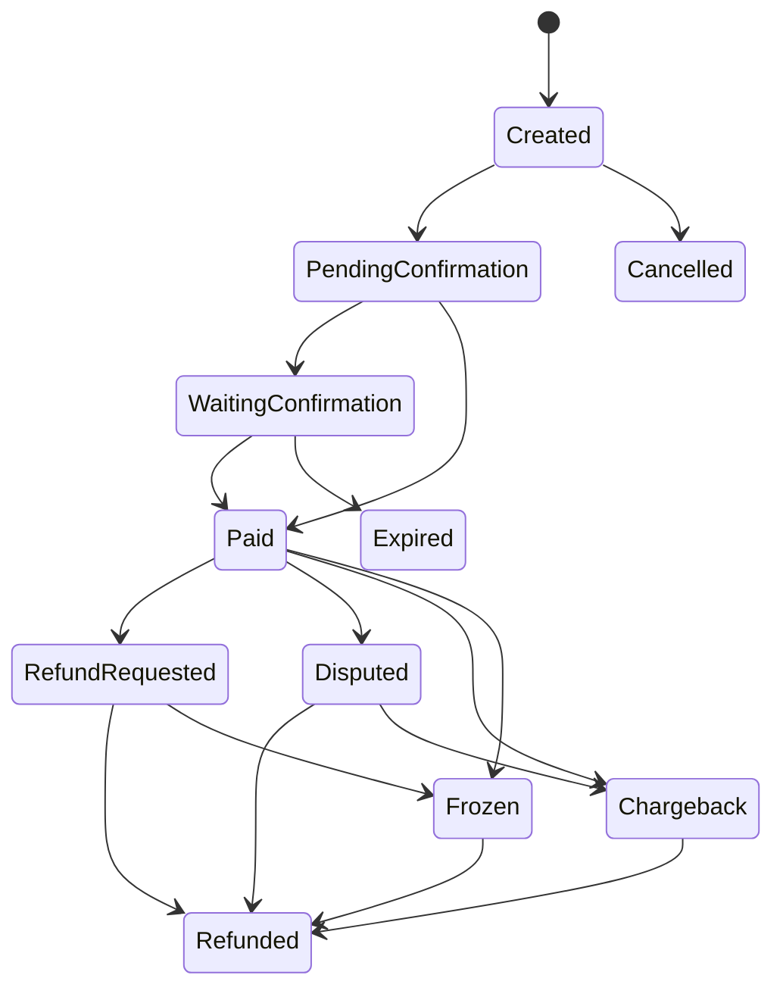

---
tags:
  - kanban/todo
  - type/task
  - domain/SEC
  - priority/P0
parent: "[[desarrollo]]"
children: []
depends_on:
  - "[[SEC-007]]"
blocks:
  - "[[SEC-012]]"
  - "[[SEC-015]]"
  - "[[SEC-017]]"
  - "[[PUB-004]]"
  - "[[DOC-018]]"
status: todo
assignee: "@dev"
created: 2026-08-05
updated: 2026-08-05
---

# [[SEC-011]] Máquina de Estados del Payment

## Descripción
Implementar la **máquina de estados del pago** como enum + transiciones validadas. Estados: `Created → PendingConfirmation → WaitingConfirmation → Paid → Cancelled | Expired → RefundRequested → Refunded | Disputed | Chargeback | Frozen`. Cada transición solo es legal desde ciertos estados y es disparada por eventos verificados.

## Código de Ejemplo
```php
// app/Domains/Financiero/Entities/PaymentState.php
namespace App\Domains\Financiero\Entities;

enum PaymentState: string
{
    case Created = 'created';
    case PendingConfirmation = 'pending_confirmation';
    case WaitingConfirmation = 'waiting_confirmation';
    case Paid = 'paid';
    case Cancelled = 'cancelled';
    case Expired = 'expired';
    case RefundRequested = 'refund_requested';
    case Refunded = 'refunded';
    case Disputed = 'disputed';
    case Chargeback = 'chargeback';
    case Frozen = 'frozen';

    /** @return PaymentState[] */
    public function allowedTransitions(): array
    {
        return match ($this) {
            self::Created => [self::PendingConfirmation, self::Cancelled, self::Expired],
            self::PendingConfirmation => [self::WaitingConfirmation, self::Paid, self::Cancelled, self::Expired],
            self::WaitingConfirmation => [self::Paid, self::Expired, self::Cancelled],
            self::Paid => [self::RefundRequested, self::Disputed, self::Chargeback, self::Frozen],
            self::RefundRequested => [self::Refunded, self::Frozen],
            self::Disputed => [self::Refunded, self::Chargeback, self::Frozen],
            self::Chargeback => [self::Refunded, self::Frozen],
            self::Frozen => [self::Refunded],
            default => [],
        };
    }

    public function canTransitionTo(self $to): bool
    {
        return in_array($to, $this->allowedTransitions(), true);
    }
}
```

## Diagramas Mermaid


## Criterios de Aceptación
- [ ] Enum `PaymentState` con todas las transiciones válidas
- [ ] Transición ilegal lanza `InvalidStateTransition`
- [ ] Cada transición registra evento de dominio (SEC-017) y asiento de ledger si aplica
- [ ] Diagrama Mermaid documentado en `docu/arquitectura/seguridad/state-machines.md`
- [ ] Tests parametrizados de TODA la matriz de transiciones (válidas e inválidas)

## Notas Técnicas
- El estado es **única fuente de verdad**; ninguna condición puede "saltarse" la máquina
- `Frozen` (congelado) lo activa staff/disputa y bloquea cualquier operación de dinero
- Persistir `state_changed_at` para auditoría temporal
- Conectar con SEC-016 (idempotencia): un webhook duplicado no re-dispara transición

## Enlaces
- [[SEC-007]] Entidades dominio financiero
- [[SEC-012]] Máquina de estados del Refund
- [[SEC-015]] Disputas/Chargeback
- [[SEC-016]] Idempotencia
