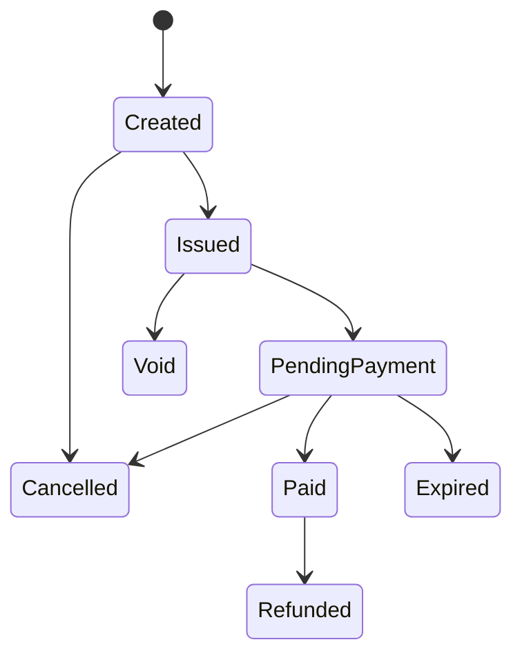

---
tags:
  - kanban/todo
  - type/task
  - domain/SEC
  - priority/P0
parent: "[[desarrollo]]"
children: []
depends_on:
  - "[[SEC-007]]"
blocks:
  - "[[SEC-017]]"
  - "[[SEC-034]]"
  - "[[DOC-018]]"
status: todo
assignee: "@dev"
created: 2026-08-05
updated: 2026-08-05
---

# [[SEC-014]] Máquina de Estados del Invoice (Factura)

## Descripción
Máquina de estados de la **factura** (a la vez entidad comercial y fiscal): `Created → Issued | PendingPayment | Paid | Cancelled | Expired | Refunded | Void`. La factura se emite (CAE AFIP) antes de cobrar, se paga con un `Payment`, y su expiración la ejecuta un job programado (SEC-034).

## Código de Ejemplo
```php
enum InvoiceState: string
{
    case Created = 'created';
    case Issued = 'issued';              // CAE otorgado por AFIP
    case PendingPayment = 'pending_payment';
    case Paid = 'paid';
    case Cancelled = 'cancelled';
    case Expired = 'expired';
    case Refunded = 'refunded';
    case Void = 'void';

    public function allowedTransitions(): array
    {
        return match ($this) {
            self::Created => [self::Issued, self::Cancelled],
            self::Issued => [self::PendingPayment, self::Cancelled, self::Void],
            self::PendingPayment => [self::Paid, self::Expired, self::Cancelled],
            self::Paid => [self::Refunded],
            default => [],
        };
    }
}
```

## Diagramas Mermaid


## Criterios de Aceptación
- [ ] Enum `InvoiceState` + transiciones
- [ ] Regla: no se cobra sin factura emitida (estado `Issued` o superior)
- [ ] Job de expiración: `PendingPayment` con `due_at` vencido → `Expired` (SEC-034)
- [ ] Invoice asociada a Payment vía `payment_id` único
- [ ] Factura `Refunded` solo si payment `Refunded` (consistencia con SEC-012)
- [ ] Trazabilidad AFIP: CAE, vencimiento CAE, QR, PDF enlazados

## Notas Técnicas
- La factura es el nexo entre dominio comercial y fiscal (AFIP, PUB-017/CRE-013)
- `Void` = anulada por emisión incorrecta antes de pago (conserva CAE en AFIP)
- La expiración no genera asientos: solo cambia estado; verificar que no exista payment
- Moneda de la factura debe coincidir con la del payment

## Enlaces
- [[SEC-007]] Entidades dominio financiero
- [[SEC-011]] Máquina de estados del Payment
- [[SEC-034]] Scheduler de expiración
- [[PUB-017]] Facturación AFIP
