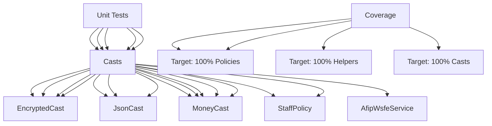

---
tags:
  - kanban/todo
  - type/task
  - domain/TST-F
  - priority/P0
parent: "[[desarrollo]]"
children: []
depends_on:
  - "[[TST-F-001]]"
blocks:
  - "[[TST-F-003]]"
  - "[[TST-F-004]]"
status: todo
assignee: "@dev"
created: 2026-08-04
updated: 2026-08-04
---

# [[TST-F-002]] Unit Tests: Services (100% coverage target), Policies, Helpers, Casts

## Descripción
Tests unitarios exhaustivos para Services, Policies, Helpers y Casts con objetivo 100% coverage.

## Código de Ejemplo
```php
// tests/Unit/Services/ArgentineTaxServiceTest.php
uses()->group('unit');

use App\Services\ArgentineTaxService;

test('calculateVAT returns correct amount for general rate', function () {
    $service = new ArgentineTaxService();
    $result = $service->calculateVAT(10000, 'general');
    expect($result)->toBe(2100.00); // 21% de 10000
});

test('calculateVAT returns correct amount for reduced rate', function () {
    $service = new ArgentineTaxService();
    $result = $service->calculateVAT(10000, 'reduced');
    expect($result)->toBe(1050.00); // 10.5% de 10000
});

test('calculateGananciasWithholding for responsable inscripto services', function () {
    $service = new ArgentineTaxService();
    $result = $service->calculateGananciasWithholding(10000, 'services');
    expect($result)->toBe(600.00); // 6% de 10000
});

test('calculateIIBB for CABA', function () {
    $service = new ArgentineTaxService();
    $result = $service->calculateIIBB(10000, 'CABA');
    expect($result)->toBe(350.00); // 3.5% de 10000
});

test('validateCuitCuil valid CUIT', function () {
    $service = new ArgentineTaxService();
    expect($service->validateCuitCuil('20123456789'))->toBeTrue();
});

test('validateCuitCuil invalid CUIT', function () {
    $service = new ArgentineTaxService();
    expect($service->validateCuitCuil('20123456788'))->toBeFalse();
});
```

```php
// tests/Unit/Policies/ChannelPolicyTest.php
uses()->group('unit');

test('creador can manage own channel', function () {
    $creador = User::factory()->creador()->create();
    $channel = ChannelPago::factory()->for($creador)->create();
    
    expect($creador->can('manage', $channel))->toBeTrue();
});

test('other creador cannot manage channel', function () {
    $creador1 = User::factory()->creador()->create();
    $creador2 = User::factory()->creador()->create();
    $channel = ChannelPago::factory()->for($creador1)->create();
    
    expect($creador2->can('manage', $channel))->toBeFalse();
});

test('admin can manage any channel', function () {
    $admin = User::factory()->admin()->create();
    $channel = ChannelPago::factory()->create();
    
    expect($admin->can('manage', $channel))->toBeTrue();
});

test('staff can view channel', function () {
    $staff = User::factory()->staff()->create();
    $channel = ChannelPago::factory()->create();
    
    expect($staff->can('view', $channel))->toBeTrue();
});
```

```php
// tests/Unit/Helpers/InstallationTest.php
test('Installation::isInstalled returns false when not installed', function () {
    Storage::fake('local');
    Storage::disk('local')->delete('installed');
    config(['app.key' => '']);
    
    expect(Installation::isInstalled())->toBeFalse();
});

test('Installation::isInstalled returns true when fully installed', function () {
    Storage::disk('local')->put('installed', '1');
    config(['app.key' => 'base64:testkey', 'db.database' => 'testing']);
    // Mock migrations table
    Schema::create('migrations', function ($table) {
        $table->id();
        $table->string('migration');
        $table->integer('batch');
    });
    DB::table('migrations')->insert(['migration' => 'test', 'batch' => 1]);
    
    expect(Installation::isInstalled())->toBeTrue();
});
```

```php
// tests/Unit/Casts/EncryptedCastTest.php
test('EncryptedCast encrypts on set and decrypts on get', function () {
    $model = new TestModel();
    $model->secret = 'secret-value';
    
    expect($model->getAttribute('secret'))->toBe('secret-value');
    expect($model->getRawAttribute('secret'))->not->toBe('secret-value');
});
```

## Diagramas Mermaid


## Criterios de Aceptación
- [ ] Services: 100% coverage (ArgentineTax, Telegram, MP, Stripe, AFIP)
- [ ] Policies: 100% coverage (Channel, Subscription, Client, Staff, Creator, Billing)
- [ ] Helpers: 100% coverage (Installation, ArgentineTax, Telegram)
- [ ] Casts: 100% coverage (Encrypted, JSON, Money, Array)
- [ ] Models: 90%+ coverage (accessors, mutators, relationships, scopes)
- [ ] Policies: todos los métodos (view, create, update, delete, manage, etc.)
- [ ] Mutation testing: Infection MSI > 80%
- [ ] Run: `pest --filter=unit --coverage --min=100`

## Notas Técnicas
- Mock externals: HTTP clients (Guzzle), APIs externas (AFIP, MP, Stripe, Telegram)
- Factories para models relacionados
- `Mockery` para mocking servicios externos
- `assertDatabaseHas/assertDatabaseMissing` para BD
- `assertAuthenticated/assertGuest` para auth
- `assertJson/assertJsonStructure` para API

## Enlaces
- [[TST-F-001]] Config Pest
- [[TST-F-003]] Feature tests Auth
- [[TST-F-013]] Mutation testing Infection
- [[TST-F-014]] CI Pipeline