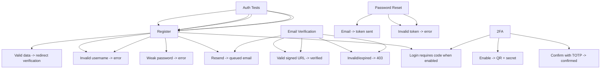

---
tags:
  - kanban/todo
  - type/task
  - domain/TST-F
  - priority/P0
parent: "[[desarrollo]]"
children: []
depends_on:
  - "[[TST-F-001]]"
  - "[[FUN-005]]"
  - "[[FUN-006]]"
blocks:
  - "[[TST-F-005]]"
  - "[[TST-F-004]]"
status: todo
assignee: "@dev"
created: 2026-08-04
updated: 2026-08-04
---

# [[TST-F-003]] Feature Tests: Auth (Login, Register, Verification, Reset, 2FA)

## Descripción
Tests de funcionalidad completos para autenticación: login, registro, verificación email, reset password, 2FA.

## Código de Ejemplo
```php
// tests/Feature/Auth/RegisterTest.php
uses()->group('feature', 'auth');

test('user can register with valid data', function () {
    $response = $this->post(route('register'), [
        'name' => 'Juan Pérez',
        'username' => 'juanperez',
        'email' => 'juan@test.com',
        'password' => 'password123',
        'password_confirmation' => 'password123',
        'timezone' => 'America/Argentina/Buenos_Aires',
    ]);

    $response->assertRedirect(route('verification.notice'));
    $this->assertDatabaseHas('users', [
        'email' => 'juan@test.com',
        'username' => 'juanperez',
        'role' => 'user',
    ]);
    
    $user = User::where('email', 'juan@test.com')->first();
    expect($user->email_verified_at)->toBeNull();
    expect($user->role)->toBe('user');
});

test('register fails with duplicate email', function () {
    User::factory()->create(['email' => 'existing@test.com']);
    
    $response = $this->post(route('register'), [
        'name' => 'Test',
        'username' => 'testuser',
        'email' => 'existing@test.com',
        'password' => 'password123',
        'password_confirmation' => 'password123',
    ]);
    
    $response->assertSessionHasErrors('email');
});

test('register fails with invalid username', function () {
    $response = $this->post(route('register'), [
        'name' => 'Test',
        'username' => 'ab', // muy corto
        'email' => 'test@test.com',
        'password' => 'password123',
        'password_confirmation' => 'password123',
    ]);
    
    $response->assertSessionHasErrors('username');
});
```

```php
// tests/Feature/Auth/LoginTest.php
uses()->group('feature', 'auth');

test('user can login with correct credentials', function () {
    $user = User::factory()->create([
        'email' => 'test@test.com',
        'password' => Hash::make('password123'),
    ]);
    
    $response = $this->post(route('login'), [
        'email' => 'test@test.com',
        'password' => 'password123',
    ]);
    
    $response->assertRedirect(route('home'));
    $this->assertAuthenticatedAs($user);
});

test('login fails with wrong password', function () {
    $user = User::factory()->create(['email' => 'test@test.com']);
    
    $response = $this->post(route('login'), [
        'email' => 'test@test.com',
        'password' => 'wrongpassword',
    ]);
    
    $response->assertSessionHasErrors('email');
    $this->assertGuest();
});

test('login redirects to intended page', function () {
    $user = User::factory()->create();
    
    $response = $this->get(route('creadores.dashboard'));
    $response->assertRedirect(route('login'));
    
    $response = $this->post(route('login'), [
        'email' => $user->email,
        'password' => 'password',
    ]);
    
    $response->assertRedirect(route('creadores.dashboard'));
});
```

```php
// tests/Feature/Auth/EmailVerificationTest.php
uses()->group('feature', 'auth');

test('email verification link works', function () {
    $user = User::factory()->unverified()->create();
    
    $url = URL::temporarySignedRoute(
        'verification.verify',
        60,
        ['id' => $user->id, 'hash' => sha256($user->getEmailForVerification())]
    );
    
    $response = $this->actingAs($user)->get($url);
    
    $response->assertRedirect(route('home'));
    expect($user->fresh()->hasVerifiedEmail())->toBeTrue();
});

test('email verification fails with invalid signature', function () {
    $user = User::factory()->unverified()->create();
    
    $url = route('verification.verify', ['id' => $user->id, 'hash' => 'invalid']);
    
    $response = $this->actingAs($user)->get($url);
    
    $response->assertStatus(403);
});

test('verification email can be resent', function () {
    $user = User::factory()->unverified()->create();
    
    $response = $this->actingAs($user)->post(route('verification.send'));
    
    $response->assertRedirect();
    expect(Mail::to($user->email))->toHaveBeenSent();
});
```

```php
// tests/Feature/Auth/PasswordResetTest.php
uses()->group('feature', 'auth');

test('password reset link can be requested', function () {
    $user = User::factory()->create(['email' => 'test@test.com']);
    
    $response = $this->post(route('password.email'), [
        'email' => 'test@test.com',
    ]);
    
    $response->assertRedirect(route('login'));
    expect(Password::tokenRepository()->recentlyCreatedToken($user))->toBeTrue();
});

test('password can be reset with valid token', function () {
    $user = User::factory()->create();
    $token = Password::createToken($user);
    
    $response = $this->post(route('password.update'), [
        'token' => $token,
        'email' => $user->email,
        'password' => 'newpassword123',
        'password_confirmation' => 'newpassword123',
    ]);
    
    $response->assertRedirect(route('login'));
    expect(Hash::check('newpassword123', $user->fresh()->password))->toBeTrue();
});
```

```php
// tests/Feature/Auth/TwoFactorTest.php
uses()->group('feature', 'auth', '2fa');

test('user can enable 2FA', function () {
    $user = User::factory()->create();
    
    $response = $this->actingAs($user)->post(route('profile.2fa.enable'));
    
    $response->assertOk();
    expect($user->two_factor_secret)->not->toBeNull();
    expect($user->two_factor_recovery_codes)->not->toBeNull();
});

test('user can confirm 2FA with valid code', function () {
    $user = User::factory()->create();
    $secret = $user->two_factor_secret = 'secret';
    $user->save();
    
    $code = (new \OTP\TOTP())->create($secret);
    
    $response = $this->actingAs($user)->post(route('profile.2fa.confirm'), [
        'code' => $code,
    ]);
    
    $response->assertRedirect();
    expect($user->fresh()->two_factor_confirmed_at)->not->toBeNull();
});

test('2FA blocks login without code', function () {
    $user = User::factory()->create([
        'two_factor_confirmed_at' => now(),
        'two_factor_secret' => encrypt('secret'),
    ]);
    
    $response = $this->post(route('login'), [
        'email' => $user->email,
        'password' => 'password',
    ]);
    
    $response->assertSessionHasErrors('code');
});
```

## Diagramas Mermaid


## Criterios de Aceptación
- [ ] Register: valid data -> user created, email unverified, redirected to verification notice
- [ ] Register: duplicate email/username -> validation errors
- [ ] Login: valid creds -> authenticated, redirect intended
- [ ] Login: wrong password -> error, stays guest
- [ ] Login: 2FA enabled -> asks for code
- [ ] Email verification: valid signed URL -> verified, redirect dashboard
- [ ] Email verification: invalid/expired -> 403
- [ ] Email verification: resend button works, rate limited
- [ ] Password reset: request -> email sent, token works -> password changed
- [ ] 2FA: enable -> QR + secret, confirm with TOTP -> confirmed
- [ ] 2FA: login requires code when enabled, wrong code -> error
- [ ] 2FA: disable removes secret, confirmed_at cleared

## Notas Técnicas
- User factory con states: `unverified()`, `with2FA()`
- `MustVerifyEmail` trait en User model
- `Laravel\Fortify\TwoFactorAuthenticationProvider` para 2FA
- Rate limiter: `RateLimiter::for('verification.send', ...)` 1/min
- Signed URLs: `URL::temporarySignedRoute('verification.verify', 60, ['id' => $user->id])`
- Password reset: `Password::createToken($user)`, `Password::reset()`
- 2FA: `Laravel\Fortify\TwoFactorAuthenticationProvider`, TOTP RFC 6238

## Enlaces
- [[TST-F-001]] Config Pest
- [[TST-F-004]] Feature tests Roles + Middleware
- [[TST-F-005]] Feature tests Public
- [[TST-F-014]] CI Pipeline