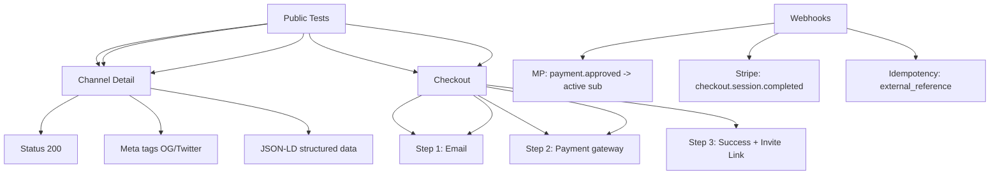

---
tags:
  - kanban/todo
  - type/task
  - domain/TST-F
  - priority/P0
parent: "[[desarrollo]]"
children: []
depends_on:
  - "[[TST-F-004]]"
blocks:
  - "[[TST-F-006]]"
  - "[[TST-F-007]]"
status: todo
assignee: "@dev"
created: 2026-08-04
updated: 2026-08-04
---

# [[TST-F-005]] Feature Tests: Public (Landing, Listado, Detalle, Checkout, Webhook)

## Descripción
Tests de funcionalidad para el dominio público: landing page, listado de canales, detalle de canal, flujo de checkout, manejo de webhooks.

## Código de Ejemplo
```php
// tests/Feature/Public/LandingTest.php
uses()->group('feature', 'public');

test('landing page loads successfully', function () {
    $response = $this->get(route('home'));
    
    $response->assertStatus(200)
             ->assertSee('TG-PayGate')
             ->assertSee('Monetiza tu canal');
});

test('landing page has correct meta tags', function () {
    $response = $this->get(route('home'));
    
    $response->assertSee('<meta property="og:title"', false)
             ->assertSee('<meta property="og:description"', false)
             ->assertSee('<meta property="og:image"', false)
             ->assertSee('<meta name="twitter:card"', false);
});

test('landing page has structured data JSON-LD', function () {
    $response = $this->get(route('home'));
    
    $response->assertSee('"@context":"https://schema.org"', false)
             ->assertSee('"@type":"WebSite"', false);
});
```

```php
// tests/Feature/Public/ChannelListTest.php
uses()->group('feature', 'public');

test('channels list page loads', function () {
    $channels = ChannelPago::factory()->count(5)->active()->create();
    
    $response = $this->get(route('channels.index'));
    
    $response->assertStatus(200);
    foreach ($channels as $channel) {
        $response->assertSee($channel->name);
    }
});

test('channels list has filters', function () {
    $response = $this->get(route('channels.index'));
    
    $response->assertSee('Categoría')
             ->assertSee('Precio')
             ->assertSee('Buscar');
});

test('channel detail page loads', function () {
    $channel = ChannelPago::factory()->active()->create();
    
    $response = $this->get(route('channels.show', $channel->slug));
    
    $response->assertStatus(200)
             ->assertSee($channel->name)
             ->assertSee($channel->price)
             ->assertSee('Comprar acceso');
});
```

```php
// tests/Feature/Public/CheckoutTest.php
uses()->group('feature', 'public', 'checkout');

test('checkout flow: email step', function () {
    $channel = ChannelPago::factory()->active()->create();
    
    $response = $this->get(route('checkout.create', $channel));
    
    $response->assertStatus(200)
             ->assertSee('Ingresa tu email');
});

test('checkout flow: payment step redirect', function () {
    $channel = ChannelPago::factory()->active()->create();
    
    $response = $this->post(route('checkout.store', $channel), [
        'email' => 'test@test.com',
    ]);
    
    $response->assertRedirect()
             ->assertSessionHas('checkout_email');
});

test('checkout success page shows invite link', function () {
    $subscription = Subscription::factory()->active()->create([
        'telegram_invite_link' => 'https://t.me/+invite123',
    ]);
    
    $response = $this->actingAs($subscription->user)
                    ->get(route('checkout.success', $subscription));
    
    $response->assertStatus(200)
             ->assertSee('Acceso concedido')
             ->assertSee('https://t.me/+invite123');
});
```

```php
// tests/Feature/Public/WebhookTest.php
uses()->group('feature', 'public', 'webhook');

test('mercadopago webhook processes approved payment', function () {
    $subscription = Subscription::factory()->pendingPayment()->create();
    
    $payload = [
        'topic' => 'payment',
        'data' => ['id' => '123456'],
    ];
    
    Http::fake([
        'api.mercadopago.com/v1/payments/123456' => Http::response([
            'id' => 123456,
            'status' => 'approved',
            'external_reference' => $subscription->external_reference,
            'transaction_amount' => $subscription->price,
            'currency_id' => 'ARS',
        ], 200),
    ]);
    
    $response = $this->postJson(route('webhooks.mercadopago', $subscription->channel), [
        'topic' => 'payment',
        'data' => ['id' => 123456],
    ]);
    
    $response->assertJson(['status' => 'ok']);
    
    $subscription->refresh();
    expect($subscription->status)->toBe('active')
        ->and($subscription->telegram_invite_link)->not->toBeEmpty();
});
```

## Diagramas Mermaid


## Criterios de Aceptación
- [ ] Landing: status 200, meta tags OG/Twitter, JSON-LD structured data
- [ ] Channels list: filters work, pagination, SEO meta tags
- [ ] Channel detail: price, benefits, CTA, JSON-LD Product schema
- [ ] Checkout: 3 steps (email -> payment -> success), invite link displayed
- [ ] Webhooks: MP approved -> subscription active + invite link generated
- [ ] Webhooks: Stripe checkout.session.completed handled
- [ ] Webhooks: idempotency via external_reference
- [ ] All tests use RefreshDatabase trait
- [ ] All tests use Pest syntax with proper grouping

## Notas Técnicas
- Usar `Http::fake()` para mockear APIs externas
- `RefreshDatabase` trait en tests que usan BD
- `actingAs()` para autenticación en tests
- `Http::fake()` para mockear HTTP clients
- `Mail::fake()` / `Notification::fake()` para notificaciones
- `Queue::fake()` para jobs

## Enlaces
- [[TST-F-001]] Config Pest
- [[TST-F-004]] Roles + Middleware Subdominio
- [[TST-F-006]] Feature tests Clientes
- [[TST-F-014]] CI Pipeline