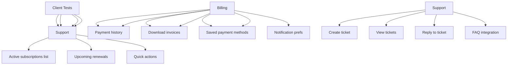

---
tags:
  - kanban/todo
  - type/task
  - domain/TST-F
  - priority/P0
parent: "[[desarrollo]]"
children: []
depends_on:
  - "[[TST-F-008]]"
  - "[[CRE-001]]"
  - "[[CRE-002]]"
  - "[[CRE-003]]"
  - "[[CRE-004]]"
  - "[[CRE-005]]"
  - "[[CRE-006]]"
  - "[[CRE-011]]"
  - "[[CRE-011]]"
blocks:
  - "[[TST-F-012]]"
status: todo
assignee: "@dev"
created: 2026-08-04
updated: 2026-08-04
---

# [[TST-F-009]] Feature Tests: Clientes (Dashboard, Accesos, Perfil, Facturas, Tickets)

## Descripción
Tests de funcionalidad para el área de clientes: dashboard, accesos a canales, perfil, facturación, tickets de soporte.

## Código de Ejemplo
```php
// tests/Feature/Client/DashboardTest.php
uses()->group('feature', 'client');

test('client dashboard shows active subscriptions', function () {
    $user = User::factory()->create(['role' => 'user']);
    $subscriptions = Subscription::factory()->count(3)->active()->for($user)->create();
    
    $response = $this->actingAs($user)->get(route('client.dashboard'));
    
    $response->assertStatus(200)
             ->assertSee('Mis Canales')
             ->assertSee($subscriptions->first()->channel->name);
});

test('client can view subscription details', function () {
    $user = User::factory()->create();
    $subscription = Subscription::factory()->active()->for($user)->create();
    
    $response = $this->actingAs($user)->get(route('client.access.show', $subscription));
    
    $response->assertStatus(200)
             ->assertSee($subscription->channel->name)
             ->assertSee('Acceder al Canal');
});
```

```php
// tests/Feature/Client/ProfileTest.php
uses()->group('feature', 'client', 'profile');

test('client can update profile', function () {
    $user = User::factory()->create(['role' => 'user']);
    
    $response = $this->actingAs($user)->put(route('client.profile.update'), [
        'name' => 'Nuevo Nombre',
        'timezone' => 'America/Mexico_City',
    ]);
    
    $response->assertRedirect()
             ->assertSessionHas('success');
    
    expect($user->fresh()->name)->toBe('Nuevo Nombre');
    expect($user->fresh()->timezone)->toBe('America/Mexico_City');
});

test('client can change password', function () {
    $user = User::factory()->create(['password' => Hash::make('oldpass')]);
    
    $response = $this->actingAs($user)->put(route('client.profile.password'), [
        'current_password' => 'oldpass',
        'password' => 'newpassword123',
        'password_confirmation' => 'newpassword123',
    ]);
    
    $response->assertRedirect()
             ->assertSessionHas('success');
    
    expect(Hash::check('newpassword123', $user->fresh()->password))->toBeTrue();
});
```

```php
// tests/Feature/Client/BillingTest.php
uses()->group('feature', 'client', 'billing');

test('client can view payment history', function () {
    $user = User::factory()->create();
    $payments = Payment::factory()->count(5)->approved()->for($user)->create();
    
    $response = $this->actingAs($user)->get(route('client.billing.index'));
    
    $response->assertStatus(200);
    foreach ($payments as $payment) {
        $response->assertSee(number_format($payment->amount, 2));
    }
});

test('client can download invoice PDF', function () {
    $user = User::factory()->create();
    $invoice = Invoice::factory()->authorized()->for($user)->create(['pdf_path' => 'invoices/test.pdf']);
    
    Storage::fake('local');
    Storage::disk('local')->put('invoices/test.pdf', 'fake pdf content');
    
    $response = $this->actingAs($user)->get(route('client.billing.download-invoice', $invoice));
    
    $response->assertStatus(200)
             ->assertHeader('Content-Type', 'application/pdf');
});
```

```php
// tests/Feature/Client/SupportTest.php
uses()->group('feature', 'client', 'support');

test('client can create support ticket', function () {
    $user = User::factory()->create();
    $category = TicketCategory::factory()->create();
    
    $response = $this->actingAs($user)->post(route('client.support.store'), [
        'category_id' => $category->id,
        'subject' => 'Problema con mi suscripción',
        'description' => 'No puedo acceder al canal',
        'priority' => 'normal',
    ]);
    
    $response->assertRedirect()
             ->assertSessionHas('success');
    
    $ticket = Ticket::where('user_id', $user->id)->first();
    expect($ticket->subject)->toBe('Problema con mi suscripción');
});

test('client can view and reply to tickets', function () {
    $user = User::factory()->create();
    $ticket = Ticket::factory()->for($user)->open()->create();
    
    $response = $this->actingAs($user)->get(route('client.support.show', $ticket));
    
    $response->assertStatus(200)
             ->assertSee($ticket->subject);
    
    $response = $this->actingAs($user)->post(route('client.support.reply', $ticket), [
        'message' => 'Gracias por la ayuda',
    ]);
    
    $response->assertRedirect();
    expect($ticket->fresh()->replies)->toHaveCount(1);
});
```

## Diagramas Mermaid


## Criterios de Aceptación
- [ ] Dashboard: shows active subscriptions, upcoming renewals, total spent
- [ ] Profile: update name, timezone, change password, 2FA, notifications
- [ ] Billing: payment history with pagination, download invoice PDF
- [ ] Support: create ticket, view tickets, reply to tickets, FAQ
- [ ] All tests use RefreshDatabase trait
- [ ] All tests use actingAs() for authentication
- [ ] Tests cover happy path + validation errors

## Notas Técnicas
- Use RefreshDatabase trait
- Test with different user roles (user only for client area)
- Mock external services (email, telegram)
- Use factories for test data

## Enlaces
- [[TST-F-005]] Feature tests Public
- [[TST-F-007]] Feature tests Creadores
- [[TST-F-014]] CI Pipeline