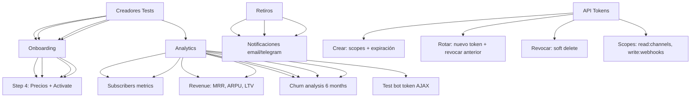

---
tags:
  - kanban/todo
  - type/task
  - domain/TST-F
  - priority/P0
parent: "[[desarrollo]]"
children: []
depends_on:
  - "[[TST-F-005]]"
  - "[[CRE-001]]"
  - "[[CRE-002]]"
blocks:
  - "[[TST-F-008]]"
status: todo
assignee: "@dev"
created: 2026-08-04
updated: 2026-08-04
---

# [[TST-F-007]] Feature Tests: Creadores (Onboarding, CRUD Canales, Stats, Retiros, API)

## Descripción
Tests de funcionalidad para el panel de creadores: onboarding, CRUD de canales, estadísticas, retiros, API tokens.

## Código de Ejemplo
```php
// tests/Feature/Creadores/OnboardingTest.php
uses()->group('feature', 'creadores', 'onboarding');

test('creador onboarding step 1: datos personales y fiscales', function () {
    $response = $this->actingAs($creador = User::factory()->creador()->create())
                    ->post(route('creadores.onboarding.step1.store'), [
                        'name' => 'Juan Pérez',
                        'taxpayer_type' => 'responsable_inscripto',
                        'cuit_cuil' => '20123456789',
                        'tax_province' => 'CABA',
                        'tax_city' => 'Buenos Aires',
                        'tax_zip_code' => '1414',
                        'tax_address' => 'Av. Corrientes 1234',
                    ]);
    
    $response->assertRedirect(route('creadores.onboarding.step2'));
    expect($creador->fresh()->taxpayer_type)->toBe('responsable_inscripto');
    expect($creador->fresh()->cuit_cuil)->toBe('20123456789');
});

test('creador onboarding step 2: canal y bot', function () {
    $creador = User::factory()->creador()->create(['onboarding_step' => 2]);
    
    $response = $this->actingAs($creador)->post(route('creadores.onboarding.step2.store', $creador), [
        'name' => 'Canal Premium',
        'description' => 'Contenido exclusivo',
        'category_id' => Category::factory()->create()->id,
        'telegram_chat_id' => '-1001234567890',
        'telegram_bot_token' => '123456789:ABCDEFghijklmnop',
        'telegram_bot_username' => 'MiCanalBot',
    ]);
    
    $response->assertRedirect(route('creadores.onboarding.step3'));
    $channel = ChannelPago::where('owner_id', $creador->id)->first();
    expect($channel->telegram_bot_token)->toBeEncrypted();
});

test('creador onboarding step 4: precios y activación', function () {
    $creador = User::factory()->creador()->create(['onboarding_step' => 4]);
    $channel = ChannelPago::factory()->for($creador)->status('pending')->create();
    
    $response = $this->actingAs($creador)->post(route('creadores.onboarding.step4.store', $channel), [
        'price' => 999.99,
        'currency' => 'ARS',
        'billing_cycle' => 'monthly',
        'trial_days' => 7,
    ]);
    
    $response->assertRedirect(route('creadores.dashboard'));
    $channel->refresh();
    expect($channel->status)->toBe('active');
    expect($channel->price)->toBe(999.99);
});
```

```php
// tests/Feature/Creadores/ChannelsTest.php
uses()->group('feature', 'creadores', 'channels');

test('creador can create channel', function () {
    $creador = User::factory()->creador()->create();
    
    $response = $this->actingAs($creador)->post(route('creadores.channels.store'), [
        'name' => 'Mi Canal Premium',
        'description' => 'Contenido exclusivo',
        'category_id' => Category::factory()->create()->id,
        'price' => 499.99,
        'currency' => 'ARS',
        'billing_cycle' => 'monthly',
        'trial_days' => 7,
        'telegram_chat_id' => '-1001234567890',
        'telegram_bot_token' => '123456789:ABCDEFghijklmnop',
        'telegram_bot_username' => 'MiCanalBot',
    ]);
    
    $response->assertRedirect(route('creadores.channels.index'));
    expect(ChannelPago::where('name', 'Mi Canal Premium')->exists())->toBeTrue();
});

test('creador can edit channel', function () {
    $channel = ChannelPago::factory()->for(User::factory()->creador()->create())->create();
    
    $response = $this->actingAs($channel->owner)->put(route('creadores.channels.update', $channel), [
        'name' => 'Canal Actualizado',
        'price' => 1499.99,
    ]);
    
    $response->assertRedirect();
    expect($channel->fresh()->name)->toBe('Canal Actualizado');
});

test('creador can test bot token', function () {
    $channel = ChannelPago::factory()->create([
        'telegram_bot_token' => encrypt('123456789:ABCDEFghijklmnop'),
    ]);
    
    Http::fake([
        'api.telegram.org/bot*' => Http::response([
            'ok' => true,
            'result' => ['first_name' => 'TestBot', 'username' => 'TestBot'],
        ], 200),
    ]);
    
    $response = $this->actingAs($channel->owner)
                    ->postJson(route('creadores.channels.test-bot-token', $channel));
    
    $response->assertJson([
        'success' => true,
        'bot_name' => 'TestBot',
        'username' => 'TestBot',
    ]);
});

test('creador can delete channel', function () {
    $channel = ChannelPago::factory()->for(User::factory()->creador()->create())->create();
    
    $response = $this->actingAs($channel->owner)
                    ->delete(route('creadores.channels.destroy', $channel));
    
    $response->assertRedirect();
    expect(ChannelPago::find($channel->id))->toBeNull();
});
```

```php
// tests/Feature/Creadores/AnalyticsTest.php
uses()->group('feature', 'creadores', 'analytics');

test('creador dashboard shows correct metrics', function () {
    $creador = User::factory()->creador()->create();
    $channel = ChannelPago::factory()->for($creador)->active()->create([
        'price' => 1000,
    ]);
    Subscription::factory()->count(10)->active()->for($creador)->forChannel($channel)->create();
    
    $response = $this->actingAs($creador)->get(route('creadores.dashboard'));
    
    $response->assertStatus(200)
             ->assertSee('10') // suscriptores activos
             ->assertSee('10,000') // MRR
             ->assertSee('0%'); // churn rate
});

test('creador can view channel analytics', function () {
    $channel = ChannelPago::factory()->create([
        'price' => 1000,
    ]);
    Subscription::factory()->count(20)->active()->forChannel($channel)->create();
    
    $response = $this->actingAs($channel->owner)
                    ->get(route('creadores.channels.analytics', $channel));
    
    $response->assertStatus(200)
             ->assertSee('MRR')
             ->assertSee('ARPU')
             ->assertSee('Churn Rate');
});
```

```php
// tests/Feature/Creadores/PayoutTest.php
uses()->group('feature', 'creadores', 'payouts');

test('creador can request payout', function () {
    $creador = User::factory()->creador()->create();
    $channel = ChannelPago::factory()->for($creador)->active()->create([
        'bank_cbu_cvu' => '0070000100000000000000',
        'bank_alias' => 'mi.alias',
    ]);
    Subscription::factory()->count(5)->active()->forChannel($channel)->create();
    
    $response = $this->actingAs($creador)->post(route('creadores.payouts.store', $channel), [
        'amount' => 50000,
        'gateway' => 'bank_transfer',
    ]);
    
    $response->assertRedirect()
             ->assertSessionHas('success');
    
    $payout = Payout::latest()->first();
    expect($payout->amount)->toBe(50000);
    expect($payout->status)->toBe('pending');
});

test('creador cannot request payout below minimum', function () {
    $creador = User::factory()->creador()->create();
    $channel = ChannelPago::factory()->for($creador)->active()->create([
        'payout_schedule' => ['minimum_amount' => 10000],
    ]);
    
    $response = $this->actingAs($creador)->post(route('creadores.payouts.store', $channel), [
        'amount' => 500, // menor al mínimo
        'gateway' => 'bank_transfer',
    ]);
    
    $response->assertSessionHasErrors('amount');
});
```

```php
// tests/Feature/Creadores/ApiTokenTest.php
uses()->group('feature', 'creadores', 'api');

test('creador can create API token', function () {
    $creador = User::factory()->creador()->create();
    $channel = ChannelPago::factory()->for($creador)->create();
    
    $response = $this->actingAs($creador)->post(route('creadores.channels.api-tokens.store', $channel), [
        'name' => 'Mi App',
        'scopes' => ['read:channels', 'write:webhooks'],
        'expires_at' => now()->addYear(),
    ]);
    
    $response->assertRedirect();
    $token = ApiToken::latest()->first();
    expect($token->scopes)->toEqual(['read:channels', 'write:webhooks']);
    expect($token->token)->toBeEncrypted();
});

test('creador can rotate API token', function () {
    $creador = User::factory()->creador()->create();
    $channel = ChannelPago::factory()->for($creador)->create();
    $token = ApiToken::factory()->for($channel)->create(['token' => encrypt('old_token')]);
    
    $response = $this->actingAs($creador)->post(route('creadores.channels.api-tokens.rotate', [$channel, $token]));
    
    $response->assertRedirect();
    $token->refresh();
    expect($token->token)->not->toBe('old_token');
    expect($token->revoked_at)->toBeNull();
});
```

## Diagramas Mermaid


## Criterios de Aceptación
- [ ] Onboarding: 4 pasos completos con validaciones
- [ ] Canales CRUD: crear, editar, eliminar, test bot token
- [ ] Analytics: MRR, ARPU, ARPPU, LTV, funnel, cohort retention, churn
- [ ] Retiros: solicitar, validar mínimo, procesar MP/Stripe/Banco
- [ ] API Tokens: crear, rotar, revocar, scopes
- [ ] Todos los tests usan RefreshDatabase
- [ ] Tests cubren happy path + validaciones + edge cases
- [ ] Factories para User, Channel, Subscription, Payment, Payout

## Notas Técnicas
- Usar `RefreshDatabase` trait
- `actingAs($user)` para autenticación
- Mock APIs externas: `Http::fake()` para Telegram, MP, Stripe
- `Mail::fake()`, `Notification::fake()` para notificaciones
- `Queue::fake()` para jobs
- Factories para todos los modelos

## Enlaces
- [[TST-F-005]] Feature tests Public
- [[TST-F-008]] Feature tests Admin
- [[TST-F-014]] CI Pipeline