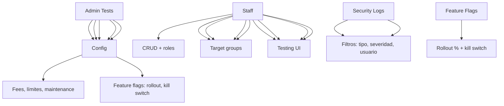

---
tags:
  - kanban/todo
  - type/task
  - domain/TST-F
  - priority/P0
parent: "[[desarrollo]]"
children: []
depends_on:
  - "[[TST-F-007]]"
  - "[[ADM-001]]"
  - "[[ADM-002]]"
  - "[[ADM-003]]"
  - "[[ADM-004]]"
  - "[[ADM-005]]"
  - "[[ADM-006]]"
blocks:
  - "[[TST-F-009]]"
  - "[[TST-F-006]]"
  - "[[TST-F-010]]"
status: todo
assignee: "@dev"
created: 2026-08-04
updated: 2026-08-04
---

# [[TST-F-008]] Feature Tests: Admin (Config, Staff, Transacciones, Logs, Flags)

## Descripción
Tests de funcionalidad para el panel de administración: configuración global, gestión de staff, transacciones, logs de seguridad, feature flags.

## Código de Ejemplo
```php
// tests/Feature/Admin/ConfigTest.php
uses()->group('feature', 'admin', 'config');

test('admin can update global fees', function () {
    $admin = User::factory()->admin()->create();
    
    $response = $this->actingAs($admin)->put(route('admin.config.update'), [
        'platform_fee_percentage' => 7.5,
        'min_withdrawal_amount' => 2000,
        'max_channels_per_creator' => 15,
    ]);
    
    $response->assertRedirect()
             ->assertSessionHas('success');
    
    expect(config('platform.fees.platform_percentage'))->toBe(7.5);
    expect(config('platform.limits.max_channels_per_creator'))->toBe(15);
});

test('admin can toggle maintenance mode', function () {
    $admin = User::factory()->admin()->create();
    
    $response = $this->actingAs($admin)->post(route('admin.config.toggle-maintenance'));
    
    $response->assertRedirect()
             ->assertSessionHas('success');
    
    expect(config('platform.maintenance_mode'))->toBeTrue();
});

test('admin can toggle feature flags', function () {
    $admin = User::factory()->admin()->create();
    
    $response = $this->actingAs($admin)->post(route('admin.config.toggle-feature', 'affiliate_program'));
    
    $response->assertRedirect();
    expect(config('platform.feature_flags.affiliate_program'))->toBeTrue();
});
```

```php
// tests/Feature/Admin/StaffTest.php
uses()->group('feature', 'admin', 'staff');

test('admin can create staff user', function () {
    $admin = User::factory()->admin()->create();
    
    $response = $this->actingAs($admin)->post(route('admin.staff.store'), [
        'name' => 'Staff User',
        'email' => 'staff@test.com',
        'password' => 'password123',
        'role' => 'staff',
    ]);
    
    $response->assertRedirect();
    $staff = User::where('email', 'staff@test.com')->first();
    expect($staff->role)->toBe('staff');
    expect($staff->hasRole('staff'))->toBeTrue();
});

test('admin can assign permissions to staff', function () {
    $admin = User::factory()->admin()->create();
    $staff = User::factory()->staff()->create();
    
    $response = $this->actingAs($admin)->put(route('admin.staff.update', $staff), [
        'permissions' => ['view_tickets', 'manage_tickets', 'view_reports'],
    ]);
    
    $response->assertRedirect();
    expect($staff->fresh()->hasPermissionTo('view_tickets'))->toBeTrue();
});

test('admin cannot delete themselves', function () {
    $admin = User::factory()->admin()->create();
    
    $response = $this->actingAs($admin)->delete(route('admin.staff.destroy', $admin));
    
    $response->assertStatus(403)
             ->assertSessionHas('error');
});
```

```php
// tests/Feature/Admin/TransactionTest.php
uses()->group('feature', 'admin', 'transactions');

test('admin can view transactions with filters', function () {
    $admin = User::factory()->admin()->create();
    Payment::factory()->count(10)->approved()->create();
    Payment::factory()->count(3)->rejected()->create();
    
    $response = $this->actingAs($admin)->get(route('admin.transactions.index'));
    
    $response->assertStatus(200)
             ->assertSee('13'); // total
    
    $response = $this->actingAs($admin)->get(route('admin.transactions.index', ['status' => 'approved']));
    $response->assertSee('10');
});

test('admin can process refund', function () {
    $admin = User::factory()->admin()->create();
    $payment = Payment::factory()->approved()->create(['amount' => 10000]);
    
    Http::fake([
        'api.mercadopago.com/*' => Http::response(['id' => 'refund_123', 'status' => 'approved'], 200),
    ]);
    
    $response = $this->actingAs($admin)->post(route('admin.transactions.refund', $payment), [
        'amount' => 5000,
        'reason' => 'Solicitud de cliente',
    ]);
    
    $response->assertRedirect();
    $payment->refresh();
    expect($payment->status)->toBe('partially_refunded');
});
```

```php
// tests/Feature/Admin/SecurityLogTest.php
uses()->group('feature', 'admin', 'security');

test('admin can view security logs', function () {
    $admin = User::factory()->admin()->create();
    SecurityLog::factory()->count(5)->create(['severity' => 'critical']);
    
    $response = $this->actingAs($admin)->get(route('admin.security-logs.index'));
    
    $response->assertStatus(200)
             ->assertSee('critical', 5);
});

test('admin can filter security logs', function () {
    $admin = User::factory()->admin()->create();
    
    $response = $this->actingAs($admin)->get(route('admin.security-logs.index', [
        'severity' => 'critical',
        'date_from' => now()->subDay()->format('Y-m-d'),
    ]));
    
    $response->assertStatus(200);
});
```

```php
// tests/Feature/Admin/FeatureFlagTest.php
uses()->group('feature', 'admin', 'flags');

test('admin can create feature flag', function () {
    $admin = User::factory()->admin()->create();
    
    $response = $this->actingAs($admin)->post(route('admin.feature-flags.store'), [
        'key' => 'new_feature',
        'name' => 'Nueva Feature',
        'rollout_percentage' => 50,
        'target_groups' => ['beta', 'premium'],
    ]);
    
    $response->assertRedirect();
    $flag = FeatureFlag::where('key', 'new_feature')->first();
    expect($flag->rollout_percentage)->toBe(50);
    expect($flag->target_groups)->toEqual(['beta', 'premium']);
});

test('admin can toggle kill switch', function () {
    $flag = FeatureFlag::factory()->create(['key' => 'test_flag', 'enabled' => true]);
    
    $response = $this->actingAs(User::factory()->admin()->create())
                    ->post(route('admin.feature-flags.toggle-kill', $flag));
    
    $response->assertRedirect();
    expect($flag->fresh()->kill_switch)->toBeTrue();
    expect($flag->fresh()->enabled)->toBeFalse();
});

test('feature flag rollout works correctly', function () {
    $flag = FeatureFlag::factory()->create([
        'key' => 'test_flag',
        'enabled' => true,
        'rollout_percentage' => 50,
    ]);
    
    // Simular 100 usuarios, ~50% debería ver la feature
    $enabledCount = 0;
    for ($i = 0; $i < 100; $i++) {
        $user = User::factory()->make(['id' => $i + 1]);
        if (app(FeatureFlagService::class)->isEnabled('test_flag', $user)) {
            $enabledCount++;
        }
    }
    
    // Con 50% rollout, debería ser aprox 50%
    expect($enabledCount)->toBeBetween(40, 60);
});
```

## Diagramas Mermaid


## Criterios de Aceptación
- [ ] Config: fees, limits, maintenance mode, feature flags
- [ ] Staff: CRUD, roles, permissions, audit log
- [ ] Transacciones: listado, filtros, reembolsos, disputas
- [ ] Logs seguridad: filtros, exportar, alertas
- [ ] Feature flags: CRUD, rollout %, kill switch, A/B testing
- [ ] Tests usan RefreshDatabase
- [ ] Tests cubren happy path + edge cases

## Notas Técnicas
- RefreshDatabase en cada test
- Mock external APIs (Stripe, MP, Telegram)
- Mail::fake(), Notification::fake(), Queue::fake()
- Factory para datos de prueba

## Enlaces
- [[TST-F-007]] Feature tests Creadores
- [[TST-F-009]] Feature tests CRM
- [[TST-F-014]] CI Pipeline