---
tags:
  - kanban/todo
  - type/task
  - domain/TST-F
  - priority/P0
parent: "[[desarrollo]]"
children: []
depends_on:
  - "[[TST-F-008]]"
blocks:
  - "[[TST-F-010]]"
status: todo
assignee: "@dev"
created: 2026-08-04
updated: 2026-08-04
---

# [[TST-F-009]] Feature Tests: CRM (Tickets, Cliente360, KB, Reportes, Automatizaciones)

## Descripción
Tests de funcionalidad para el CRM: ticketing completo, vista 360 del cliente, base de conocimiento, reportes y automatizaciones.

## Código de Ejemplo
```php
// tests/Feature/Crm/TicketTest.php
uses()->group('feature', 'crm', 'tickets');

test('staff can create ticket', function () {
    $staff = User::factory()->staff()->create();
    $client = User::factory()->create();
    $category = TicketCategory::factory()->create();
    
    $response = $this->actingAs($staff)->post(route('crm.tickets.store'), [
        'user_id' => $client->id,
        'category_id' => $category->id,
        'subject' => 'Problema con pago',
        'description' => 'El cliente no puede acceder',
        'priority' => 'high',
    ]);
    
    $response->assertRedirect();
    $ticket = Ticket::latest()->first();
    expect($ticket->status)->toBe('open');
    expect($ticket->priority)->toBe('high');
});

test('ticket assignment works', function () {
    $staff1 = User::factory()->staff()->create();
    $staff2 = User::factory()->staff()->create();
    $ticket = Ticket::factory()->open()->create();
    
    $response = $this->actingAs($staff1)->post(route('crm.tickets.assign', $ticket), [
        'user_id' => $staff2->id,
    ]);
    
    $response->assertRedirect();
    expect($ticket->fresh()->assigned_to)->toBe($staff2->id);
});

test('ticket status transitions work', function () {
    $ticket = Ticket::factory()->open()->create();
    
    $response = $this->actingAs($staff)->put(route('crm.tickets.status', $ticket), [
        'status' => 'pending',
    ]);
    
    $response->assertRedirect();
    expect($ticket->fresh()->status)->toBe('pending');
    expect($ticket->fresh()->sla_deadline)->not->toBeNull();
});
```

```php
// tests/Feature/Crm/Client360Test.php
uses()->group('feature', 'crm', 'client360');

test('client 360 shows health score', function () {
    $client = User::factory()->create(['role' => 'user']);
    Subscription::factory()->count(3)->active()->for($client)->create();
    Ticket::factory()->count(2)->open()->for($client)->create();
    
    $response = $this->actingAs($staff)->get(route('crm.clients.show', $client));
    
    $response->assertStatus(200)
             ->assertSee('Health Score')
             ->assertSee('85'); // Example score
});

test('client 360 shows subscriptions', function () {
    $client = User::factory()->create();
    $subs = Subscription::factory()->count(3)->active()->for($client)->create();
    
    $response = $this->actingAs($staff)->get(route('crm.clients.show', $client));
    
    $response->assertSee('Suscripciones Activas');
    foreach ($subs as $sub) {
        $response->assertSee($sub->channel->name);
    }
});
```

```php
// tests/Feature/Crm/KnowledgeBaseTest.php
uses()->group('feature', 'crm', 'kb');

test('staff can create KB article', function () {
    $staff = User::factory()->staff()->create();
    $category = KnowledgeBaseCategory::factory()->create();
    
    $response = $this->actingAs($staff)->post(route('crm.kb.store'), [
        'category_id' => $category->id,
        'title' => 'Cómo configurar webhook',
        'excerpt' => 'Guía paso a paso',
        'content' => '<p>Contenido completo...</p>',
        'is_published' => true,
        'is_internal' => false,
    ]);
    
    $response->assertRedirect();
    $article = KnowledgeBaseArticle::latest()->first();
    expect($article->title)->toBe('Cómo configurar webhook');
});

test('staff can search KB', function () {
    KnowledgeBaseArticle::factory()->create(['title' => 'Configurar webhook MP']);
    KnowledgeBaseArticle::factory()->create(['title' => 'Configurar Stripe']);
    
    $response = $this->actingAs($staff)->get(route('crm.kb.search', ['q' => 'webhook']));
    
    $response->assertSee('Configurar webhook MP')
             ->assertDontSee('Configurar Stripe');
});
```

## Diagramas Mermaid

```mermaid
graph TD
    A[CRM Tests] --> B[Ticketing]
    A --> B[Client 360]
    A --> C[Knowledge Base]
    A --> D[Reports]
    A --> C[Automations]
    
    B --> B1[Create ticket]
    B --> B2[Assign/Status changes]
    B --> B3[Replies + Internal notes]
    B --> B4[SLA tracking]
    
    C --> C1[Health Score calculation]
    C --> C2[Subscriptions list]
    C --> C3[Tickets history]
    C --> C3[Payments history]
    C --> C4[Notes + Tags]
    
    D --> D1[CRUD articles]
    D --> D2[Categories + Tags]
    D --> D3[Search + Filters]
    D --> D3[Feedback useful/not]
    
    E[Reports] --> E1[Volume/Response/Resolution]
    E --> E2[CSAT/NPS]
    E --> E3[Backlog aging]
    
    F[Automations] --> F1[Rules CRUD]
    F --> F2[Trigger: created/updated/replied]
    F --> F3[Actions: assign/tag/notify]
```


## Criterios de Aceptación
- [ ] Ticket CRUD: create, assign, status changes, replies, SLA
- [ ] Client 360: health score, subscriptions, tickets, payments, notes, tags
- [ ] KB: CRUD articles, categories, search, feedback
- [ ] Reports: volume, response/resolution time, CSAT, backlog
- [ ] Automations: rules CRUD, triggers, conditions, actions
- [ ] All tests use RefreshDatabase
- [ ] Tests cover happy path + edge cases

## Notas Técnicas
- Use RefreshDatabase trait
- Mock external services (Telegram, Email)
- Factories for Ticket, Client, KBArticle, etc.
- Test SLA calculations with Carbon

## Enlaces
- [[CRM-001]] Ticketing base
- [[CRM-002]] Colas
- [[CRM-003]] Respuestas
- [[CRM-004]] Cliente 360
- [[CRM-006]] KB
- [[CRM-007]] Reportes
- [[CRM-008]] Automatizaciones
- [[TST-F-014]] CI Pipeline