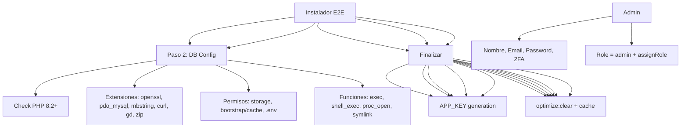

---
tags:
  - kanban/todo
  - type/task
  - domain/TST-F
  - priority/P0
parent: "[[desarrollo]]"
children: []
depends_on:
  - "[[TST-F-008]]"
  - "[[CRE-001]]"
  - "[[CRE-002]]"
  - "[[CRE-003]]"
  - "[[CRE-004]]"
  - "[[CRE-005]]"
  - "[[CRE-006]]"
  - "[[CRE-011]]"
  - "[[CRE-011]]"
blocks:
  - "[[TST-F-012]]"
status: todo
assignee: "@dev"
created: 2026-08-04
updated: 2026-08-04
---

# [[TST-F-010]] Feature Tests: Instalador (E2E 5 Pasos, Edge Cases, Rollback)

## Descripción
Tests de funcionalidad end-to-end para el instalador portable: 5 pasos, casos edge, rollback en fallos.

## Código de Ejemplo
```php
// tests/Feature/Install/InstallationTest.php
uses()->group('feature', 'install', 'e2e');

test('complete installation flow succeeds', function () {
    // Paso 1: Requisitos
    $response = $this->get(route('install.requirements'));
    $response->assertStatus(200);
    $response->assertSee('PHP >= 8.2');
    
    // Paso 2: Base de Datos
    $response = $this->post(route('install.database.test'), [
        'db_connection' => 'sqlite',
        'db_database' => ':memory:',
    ]);
    $response->assertJson(['success' => true]);
    
    // Paso 3: Migraciones
    $response = $this->post(route('install.migrate.run'));
    $response->assertJson(['success' => true]);
    
    // Paso 4: Admin
    $response = $this->post(route('install.admin.store'), [
        'name' => 'Admin User',
        'email' => 'admin@test.com',
        'password' => 'password123',
        'password_confirmation' => 'password123',
    ]);
    $response->assertRedirect();
    
    // Paso 5: Finalizar
    $response = $this->post(route('install.complete'));
    $response->assertRedirect(route('home'));
    $this->assertTrue(Installation::isInstalled());
});

test('installation fails gracefully on invalid DB', function () {
    $response = $this->post(route('install.database.test'), [
        'db_connection' => 'mysql',
        'db_host' => 'invalid-host',
        'db_database' => 'nonexistent',
        'db_username' => 'user',
        'db_password' => 'wrong',
    ]);
    
    $response->assertJson(['success' => false]);
    $response->assertJsonPath('message', '*');
});

test('installation rollback on migration failure', function () {
    // Simular fallo en migración
    Schema::dropIfExists('migrations'); // Romper migraciones
    
    $response = $this->post(route('install.migrate.run'));
    
    $response->assertJson(['success' => false]);
    $response->assertJsonPath('message', '*');
    
    // Verificar que no se marcó como instalado
    expect(Installation::isInstalled())->toBeFalse();
});

test('installer prevents re-access after completion', function () {
    Installation::markInstalled();
    
    $response = $this->get(route('install.requirements'));
    $response->assertRedirect(route('home'));
    $response->assertSessionHas('error');
});

test('installer validates PHP version', function () {
    // Mock PHP version < 8.2
    $this->app['config']->set('php.version', '8.1');
    
    $response = $this->get(route('install.requirements'));
    $response->assertSee('PHP >= 8.2');
    // Verificar que se muestra error
});
```

## Diagramas Mermaid


## Criterios de Aceptación
- [ ] Flujo completo 5 pasos funciona end-to-end
- [ ] Validaciones en cada paso (DB, admin, etc.)
- [ ] Rollback en fallo de migración (no marca installed)
- [ ] Previene re-instalación si ya instalado
- [ ] Validaciones: PHP version, extensiones, permisos, funciones
- [ ] Test DB connection AJAX funciona
- [ ] Migraciones + seeders ejecutan correctamente
- [ ] Admin creado con role=admin, email_verified_at, role=admin
- [ ] 2FA opcional en admin
- [ ] .env final escrito, APP_KEY generada, storage/installed creado
- [ ] optimize:clear ejecutado al finalizar
- [ ] Middleware RedirectIfNotInstalled probado
- [ ] Honeypot field en formularios
- [ ] Rate limiting en endpoints críticos

## Notas Técnicas
- SQLite en memoria para tests de instalador
- `RefreshDatabase` trait en tests
- Middleware `EnsureNotInstalled` probado
- Honeypot field en formularios
- Rate limiting en endpoints críticos

## Enlaces
- [[INS-001]] Middleware RedirectIfNotInstalled
- [[INS-002]] Helper Installation::isInstalled()
- [[INS-003]] Rutas routes/install.php
- [[INS-004]] Paso 1: Requisitos
- [[INS-005]] Paso 2: Base de Datos
- [[INS-006]] Paso 3: Migraciones
- [[INS-007]] Paso 4: Admin Inicial
- [[INS-008]] Paso 5: Finalizar
- [[INS-009]] Seguridad instalador
- [[INS-011]] Paso 2.5: Pasarelas de Pago
- [[INS-012]] Paso 2.6: Configuración Fiscal