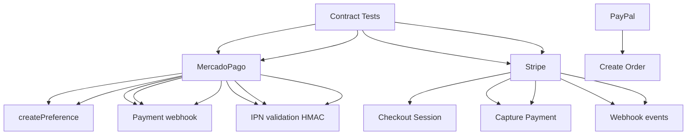

---
tags:
  - kanban/todo
  - type/task
  - domain/TST-F
  - priority/P0
parent: "[[desarrollo]]"
children: []
depends_on:
  - "[[TST-F-010]]"
blocks:
  - "[[TST-F-012]]"
status: todo
assignee: "@dev"
created: 2026-08-04
updated: 2026-08-04
---

# [[TST-F-011]] Contract Tests: Webhooks Telegram + Pasarelas (Pact/Mockery)

## Descripción
Tests de contrato para webhooks: validar que los payloads de Telegram, MercadoPago, Stripe, PayPal cumplen los contratos esperados.

## Código de Ejemplo
```php
// tests/Contracts/TelegramWebhookContractTest.php
uses()->group('contract', 'telegram');

use Pact\Consumer\Dsl\PactBuilder;
use Pact\Consumer\Dsl\Provider;

uses()->group('contract', 'telegram');

beforeEach(function () {
    $this->pact = new PactBuilder();
    $this->provider = $this->pact->given('Telegram Bot API');
});

test('createChatInviteLink contract', function () {
    $this->provider
        ->uponReceiving('A request to create chat invite link')
        ->withRequest('POST', '/bot{token}/createChatInviteLink')
        ->withBody([
            'chat_id' => -1001234567890,
            'member_limit' => 1,
            'expire_date' => Matcher::integer(),
            'creates_join_request' => false,
        ])
        ->willRespondWith()
        ->status(200)
        ->withHeader('Content-Type', 'application/json')
        ->withBody([
            'ok' => true,
            'result' => [
                'invite_link' => Matcher::regex('https://t\.me/\+.*'),
                'expire_date' => Matcher::integer(),
                'member_limit' => 1,
            ],
        ]);
    
    // Ejecutar test
    $result = $this->telegramService->createInviteLink(-1001234567890, 'token');
    
    $this->provider->verify();
});

test('sendMessage contract', function () {
    $this->provider
        ->uponReceiving('A request to send message')
        ->withRequest('POST', '/bot{token}/sendMessage')
        ->withBody([
            'chat_id' => 123456789,
            'text' => 'Test message',
            'parse_mode' => 'HTML',
        ])
        ->willRespondWith()
        ->status(200)
        ->withBody([
            'ok' => true,
            'result' => [
                'message_id' => Matcher::integer(),
                'date' => Matcher::integer(),
            ],
        ]);
    
    $this->provider->verify();
});
```

```php
// tests/Contracts/MercadoPagoContractTest.php
uses()->group('contract', 'mercadopago');

test('createPreference contract', function () {
    $this->provider
        ->uponReceiving('A request to create checkout preference')
        ->withRequest('POST', '/checkout/preferences')
        ->withHeader('Authorization', 'Bearer {access_token}')
        ->withBody([
            'items' => [
                [
                    'title' => 'Suscripción Premium',
                    'quantity' => 1,
                    'currency_id' => 'ARS',
                    'unit_price' => 999.99,
                ],
            ],
            'payer' => [
                'email' => 'user@test.com',
                'name' => 'Juan',
            ],
            'back_urls' => [
                'success' => 'https://app.com/success',
                'failure' => 'https://app.com/failure',
            ],
            'auto_return' => 'approved',
            'notification_url' => 'https://app.com/webhooks/mp',
            'external_reference' => 'sub_123',
        ])
        ->willRespondWith()
        ->status(201)
        ->withBody([
            'id' => Matcher::uuid(),
            'init_point' => Matcher::regex('https://www.mercadopago.com/checkout/v1/redirect/.*'),
        ]);
});

test('payment webhook contract', function () {
    $this->provider
        ->uponReceiving('A payment approved webhook')
        ->withRequest('POST', '/webhooks/mercadopago/{channel_id}')
        ->withHeader('x-signature', Matcher::regex('sha256=.+'))
        ->withHeader('x-request-id', Matcher::uuid())
        ->withBody([
            'topic' => 'payment',
            'data' => ['id' => 123456789],
        ])
        ->willRespondWith()
        ->status(200)
        ->withBody(['status' => 'ok']);
});
```

```php
// tests/Contracts/StripeContractTest.php
uses()->group('contract', 'stripe');

test('checkout session contract', function () {
    $this->provider
        ->uponReceiving('A request to create checkout session')
        ->withRequest('POST', '/v1/checkout/sessions')
        ->withHeader('Authorization', 'Bearer {secret_key}')
        ->withBody([
            'payment_method_types[]' => 'card',
            'line_items[0][price_data][currency]' => 'ars',
            'line_items[0][price_data][product_data][name]' => 'Suscripción Premium',
            'line_items[0][price_data][unit_amount]' => 99999,
            'mode' => 'subscription',
            'success_url' => 'https://app.com/success?session_id={CHECKOUT_SESSION_ID}',
            'cancel_url' => 'https://app.com/cancel',
            'client_reference_id' => 'sub_123',
        ])
        ->willRespondWith()
        ->status(200)
        ->withBody([
            'id' => Matcher::regex('cs_test_.+'),
            'url' => Matcher::regex('https://checkout.stripe.com/pay/.*'),
        ]);
});

test('stripe webhook contract', function () {
    $this->provider
        ->uponReceiving('A checkout.session.completed event')
        ->withRequest('POST', '/webhooks/stripe')
        ->withHeader('stripe-signature', Matcher::regex('t=.+,v1=.+'))
        ->withBody([
            'id' => 'evt_123',
            'type' => 'checkout.session.completed',
            'data' => [
                'object' => [
                    'id' => 'cs_123',
                    'client_reference_id' => 'sub_123',
                    'payment_status' => 'paid',
                ],
            ],
        ])
        ->willRespondWith()
        ->status(200);
});
```

```php
// tests/Contracts/PayPalContractTest.php
uses()->group('contract', 'paypal');

test('create order contract', function () {
    $this->provider
        ->uponReceiving('A request to create PayPal order')
        ->withRequest('POST', '/v2/checkout/orders')
        ->withHeader('Authorization', 'Bearer {access_token}')
        ->withBody([
            'intent' => 'CAPTURE',
            'purchase_units' => [[
                'amount' => ['currency_code' => 'USD', 'value' => '99.99'],
                'description' => 'Suscripción Premium',
            ]],
            'application_context' => [
                'return_url' => 'https://app.com/success',
                'cancel_url' => 'https://app.com/cancel',
            ],
        ])
        ->willRespondWith()
        ->status(201)
        ->withBody([
            'id' => Matcher::regex('^[0-9A-Z]{17}$'),
            'status' => 'CREATED',
            'links' => [
                ['rel' => 'approve', 'href' => Matcher::regex('https://.*')],
            ],
        ]);
});
```

## Diagramas Mermaid


## Criterios de Aceptación
- [ ] Pact contracts para: Telegram (createChatInviteLink, sendMessage), MercadoPago (preference, webhook), Stripe (checkout, webhook), PayPal (order, webhook)
- [ ] Provider states definidos para cada endpoint
- [ ] Matchers flexibles: regex, uuid, integer, regex patterns
- [ ] Provider states: given/when/then structure
- [ ] Tests se ejecutan en CI con `pest --group=contract`
- [ ] Pact broker opcional para compartir contratos

## Notas Técnicas
- Usar `pact-foundation/pact-php` o `pact-foundation/pact-php`
- Matchers: `Matcher::regex()`, `Matcher::uuid()`, `Matcher::integer()`, `Matcher::like()`
- Provider states para precondiciones
- Verification en CI con `pact-broker` opcional
- Mock HTTP clients con `Http::fake()` en tests unitarios

## Enlaces
- [[TST-F-001]] Config Pest
- [[TST-F-005]] Feature tests Public
- [[TST-F-007]] Feature tests Creadores
- [[PUB-007]] Webhook Handler
- [[PUB-014]] MercadoPago webhook
- [[DOC-007]] Spec API Telegram
- [[DOC-008]] Spec Pasarelas Pago