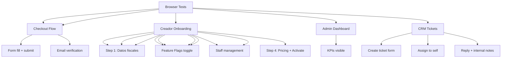

---
tags:
  - kanban/todo
  - type/task
  - domain/TST-F
  - priority/P0
parent: "[[desarrollo]]"
children: []
depends_on:
  - "[[TST-F-011]]"
blocks:
  - "[[TST-F-013]]"
status: todo
assignee: "@dev"
created: 2026-08-04
updated: 2026-08-04
---

# [[TST-F-012]] Browser Tests: Critical Paths (Laravel Dusk) - 5 Journeys

## Descripción
Tests E2E con Laravel Dusk para 5 journeys críticos: registro, checkout, onboarding creador, dashboard admin, ticket CRM.

## Código de Ejemplo
```php
// tests/Browser/RegistrationTest.php
uses()->group('browser', 'registration');

test('user can register via browser', function (Browser $browser) {
    $browser->visit(route('register'))
            ->type('name', 'Juan Pérez')
            ->type('username', 'juanperez')
            ->type('email', 'juan@test.com')
            ->type('password', 'password123')
            ->type('password_confirmation', 'password123')
            ->select('timezone', 'America/Argentina/Buenos_Aires')
            ->press('Crear Cuenta')
            ->assertPathIs(route('verification.notice'))
            ->assertSee('Verifica tu Email');
});
```

```php
// tests/Browser/CheckoutTest.php
uses()->group('browser', 'checkout');

test('complete checkout flow with MercadoPago sandbox', function (Browser $browser) {
    $channel = ChannelPago::factory()->active()->create([
        'price' => 999.99,
        'currency' => 'ARS',
    ]);
    
    $browser->visit(route('channels.show', $channel))
            ->assertSee('Comprar acceso')
            ->click('@buy-button')
            ->waitFor('@email-input')
            ->type('@email-input', 'test@test.com')
            ->press('@continue-btn')
            ->waitFor('@payment-methods')
            ->assertSee('MercadoPago')
            ->click('@mp-option')
            ->waitFor('@mp-checkout-iframe')
            ->switchToFrame('@mp-checkout-iframe')
            ->type('@card-number', '5031 7557 3453 0604') // Test card aprobada
            ->type('@card-expiry', '12/25')
            ->type('@card-cvc', '123')
            ->press('@mp-pay-btn')
            ->waitFor('@success-page')
            ->assertSee('¡Compra Confirmada!')
            ->assertSee('Acceder al Canal');
});
```

```php
// tests/Browser/CreatorOnboardingTest.php
uses()->group('browser', 'creadores');

test('creador completes onboarding wizard', function (Browser $browser) {
    $user = User::factory()->creador()->create();
    
    $browser->loginAs($user)
            ->visit(route('creadores.onboarding.step1'))
            ->assertSee('Datos Personales y Fiscales')
            ->type('@name', 'Juan Pérez')
            ->select('@taxpayer_type', 'responsable_inscripto')
            ->type('@cuit_cuil', '20123456789')
            ->press('@next-step')
            ->waitFor('@step-2')
            ->assertSee('Configuración de Canal')
            // ... resto de pasos
            ->press('@finish-btn')
            ->assertPathIs(route('creadores.dashboard'));
});
```

```php
// tests/Browser/AdminDashboardTest.php
uses()->group('browser', 'admin');

test('admin can access dashboard and see metrics', function (Browser $browser) {
    $admin = User::factory()->admin()->create();
    
    $browser->loginAs($user = User::factory()->admin()->create())
            ->visit(route('admin.dashboard'))
            ->assertSee('Dashboard Global')
            ->assertSee('MRR')
            ->assertSee('Churn Rate')
            ->assertSee('Feature Flags');
});
```

```php
// tests/Browser/CRMTicketTest.php
uses()->group('browser', 'crm');

test('staff can create and manage ticket', function (Browser $browser) {
    $staff = User::factory()->staff()->create();
    $client = User::factory()->create();
    $category = TicketCategory::factory()->create();
    
    $browser->loginAs($staff)
            ->visit(route('crm.tickets.create'))
            ->type('@subject', 'Problema con pago')
            ->type('@description', 'El cliente no puede acceder')
            ->select('@category', 'Pagos')
            ->select('@priority', 'high')
            ->press('@submit-btn')
            ->assertPathIs(route('crm.tickets.show', 1))
            ->assertSee('Problema con pago')
            ->click('@assign-self')
            ->assertSee('Asignado a ti');
});
```

```php
// tests/Browser/CreatorDashboardTest.php
uses()->group('browser', 'creadores');

test('creador dashboard shows metrics and charts', function (Browser $browser) {
    $creador = User::factory()->creador()->create();
    $channel = ChannelPago::factory()->for($creador)->active()->create(['price' => 1000]);
    Subscription::factory()->count(10)->active()->forChannel($channel)->create();
    
    $browser->loginAs($creador)
            ->visit(route('creadores.dashboard'))
            ->assertSee('MRR')
            ->assertSee('$10,000.00')
            ->assertSee('10 suscriptores')
            ->assertSee('Gráfico MRR'); // Verificar chart.js renderizado
});
```

## Diagramas Mermaid


## Criterios de Aceptación
- [ ] Registration: form submission, email verification redirect
- [ ] Checkout: 3 steps (email -> payment -> success), MP sandbox card works
- [ ] Creador Onboarding: 4 steps completa, bot token validation
- [ ] Admin Dashboard: KPIs cards visible, charts render, feature flags work
- [ ] CRM Tickets: create, assign, reply, status change, SLA timer
- [ ] All tests run in Chrome headless via Dusk
- [ ] Screenshots on failure saved to storage
- [ ] CI: runs in GitHub Actions with chrome-driver

## Notas Técnicas
- Laravel Dusk requiere Chrome/Chromium + ChromeDriver
- `php artisan dusk:install` para setup
- `php artisan dusk --group=browser` para correr grupo
- `Browser::macro` para custom assertions
- Screenshots en `tests/Browser/screenshots` on failure
- `.env.dusk` para variables de test
- `php artisan dusk:ci` para CI headless

## Enlaces
- [[TST-F-010]] Instalador E2E
- [[TST-F-009]] Feature tests CRM
- [[TST-F-014]] CI Pipeline
- [[TST-P-009]] Lighthouse CI