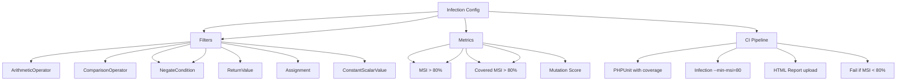

---
tags:
  - kanban/todo
  - type/task
  - domain/TST-F
  - priority/P0
parent: "[[desarrollo]]"
children: []
depends_on:
  - "[[TST-F-012]]"
blocks:
  - "[[TST-F-014]]"
status: todo
assignee: "@dev"
created: 2026-08-04
updated: 2026-08-04
---

# [[TST-F-013]] Mutation Testing: Infection (Target >80% MSI)

## Descripción
Configurar y ejecutar Mutation Testing con Infection para medir la calidad de los tests (target >80% MSI - Mutation Score Indicator).

## Código de Ejemplo
```bash
# Instalación
composer require --dev infection/infection --dev

# Configuración
# infection.json
{
    "source": {
        "directories": ["app", "app/Domains"]
    },
    "mutators": [
        "ArithmeticOperator",
        "ArrayAssignment",
        "Assignment",
        "BinaryOperator",
        "BooleanOperator",
        "ComparisonOperator",
        "ConstantScalarValue",
        "ConstantScalarValueArray",
        "ConstantScalarValueBoolean",
        "ConstantScalarValueFloat",
        "ConstantScalarValueInteger",
        "ConstantScalarValueNull",
        "ConstantScalarValueString",
        "IncrementInteger",
        "InstanceCreation",
        "LogicalNot",
        "NegateCondition",
        "NegateInteger",
        "NumberConstants",
        "ObjectInstantiation",
        "PostDecrement",
        "PostIncrement",
        "PreDecrement",
        "PreIncrement",
        "ReturnValue",
        "StringConcatenation",
        "StringLowercase",
        "StringUppercase",
        "Variable"
    ],
    "metrics": {
        "covered_code_msi": true,
        "mutant_coverage_msi": true,
        "covered_code_msi_per_file": true
    },
    "min_msi": 80,
    "min_covered_msi": 80,
    "threads": 4,
    "timeout": 300,
    "logs": {
        "text": "infection.log",
        "progress": "infection-progress.log"
    },
    "filter": {
        "exclude": ["*Test.php", "*TestCase.php", "*Test.php", "tests/*", "database/*", "vendor/*"]
    }
}
```

```bash
# Comandos útiles
# Ejecutar infection completo
php vendor/bin/infection --configuration infection.json

# Solo mutadores específicos
php vendor/bin/infection --filter="ArithmeticOperator,ComparisonOperator"

# Solo coverage (sin mutaciones)
php vendor/bin/infection --only-covered

# Generar reporte HTML
php vendor/bin/infection --report=html --report-directory=build/infection

# Solo mutadores específicos para debugging
php vendor/bin/infection --filter="ComparisonOperator,ArithmeticOperator"

# Ver reporte
cat build/infection/index.html
```

```xml
<!-- phpunit.xml additions for infection -->
<phpunit>
    <!-- ... existing config ... -->
    <logging>
        <log type="coverage-xml" target="build/coverage.xml"/>
        <log type="coverage-clover" target="build/clover.xml"/>
    </logging>
</phpunit>
```

```yaml
# .github/workflows/mutation-testing.yml
name: Mutation Testing

on:
  push:
    branches: [main, develop]
  pull_request:
    branches: [main, develop]

jobs:
  mutation-testing:
    runs-on: ubuntu-latest
    timeout-minutes: 60
    
    steps:
      - uses: actions/checkout@v4
      
      - name: Setup PHP
        uses: shivammathur/setup-php@v2
        with:
          php-version: '8.2'
          extensions: pcntl, posix
          coverage: xdebug
      
      - name: Install dependencies
        run: composer install --prefer-dist --no-progress
      
      - name: Run tests with coverage
        run: |
          php vendor/bin/phpunit --coverage-xml=build/coverage.xml
      
      - name: Run Infection
        run: |
          php vendor/bin/infection \
            --configuration=infection.json \
            --min-msi=80 \
            --min-covered-msi=80 \
            --threads=4 \
            --show-mutations \
            --show-mutations
      
      - name: Upload Infection Report
        uses: actions/upload-artifact@v4
        if: always()
        with:
          name: infection-report
          path: build/infection/
          retention-days: 7
```

```bash
# Script para ejecutar localmente
# scripts/mutation-test.sh
#!/bin/bash
set -e

echo "🧬 Running Mutation Testing..."

# 1. Run tests with coverage
echo "📊 Running tests with coverage..."
php vendor/bin/phpunit --coverage-xml=build/coverage.xml --coverage-clover=build/clover.xml

# 2. Run infection
echo "🧬 Running Infection..."
php vendor/bin/infection \
    --configuration=infection.json \
    --min-msi=80 \
    --min-covered-msi=80 \
    --threads=4 \
    --show-mutations \
    --show-mutations

# 3. Generate report
if [ -f build/infection/index.html ]; then
    echo "📊 Report generated at build/infection/index.html"
fi
```

```php
// tests/Feature/MutationTest.php (para verificar mutaciones específicas)
uses()->group('mutation');

test('mutations are killed in critical services', function () {
    // Este test existe solo para documentar que infection
    // debería matar mutaciones en servicios críticos
    
    $service = new \App\Services\ArgentineTaxService();
    
    // Ejemplo: mutación en operador aritmético debería ser detectada
    $result = $service->calculateVAT(10000, 'general');
    expect($result)->toBe(2100.00);
    
    // Si Infection funciona, una mutación como:
    // return $amount * 0.21; -> return $amount * 0.22;
    // debería ser detectada y "matada" por los tests
});

test('mutation in validation logic is detected', function () {
    // Mutación en validación de email debería ser detectada
    $request = Request::create('/register', 'POST', [
        'email' => 'invalid-email',
        'password' => 'password123',
        'password_confirmation' => 'password123',
    ]);
    
    $response = $this->post(route('register'), $request->all());
    $response->assertSessionHasErrors('email');
});
```

## Diagramas Mermaid


## Criterios de Aceptación
- [ ] Infection instalado y configurado (`infection.json`)
- [ ] MSI (Mutation Score Indicator) > 80%
- [ ] Covered MSI > 80%
- [ ] Mutators configurados: Arithmetic, Comparison, Logical, Negation, etc.
- [ ] Exclusiones: tests/, vendor/, *Test.php, database/
- [ ] Target: MSI > 80%, Covered MSI > 80%
- [ ] CI Pipeline: PHPUnit -> Infection -> Report HTML
- [ ] Reporte HTML generado en `build/infection/index.html`
- [ ] CI falla si MSI < 80%
- [ ] Threads: 4 (configurable)

## Notas Técnicas
- Infection requiere PCNTL y POSIX extensions
- Usar `--threads=4` para paralelismo
- `--show-mutations` para ver mutaciones vivas/muertas
- `--only-covered` para solo código cubierto
- `--filter` para mutadores específicos
- Xdebug requerido para coverage
- Timeout: 300s para suites grandes
- `infection.json` en root del proyecto

## Enlaces
- [[TST-F-001]] Config Pest
- [[TST-F-002]] Unit Tests
- [[TST-F-014]] CI Pipeline