---
tags:
  - kanban/todo
  - type/task
  - domain/TST-F
  - priority/P0
parent: "[[desarrollo]]"
children: []
depends_on:
  - "[[TST-F-013]]"
blocks:
  - "[[TST-P-001]]"
  - "[[TST-S-001]]"
status: todo
assignee: "@dev"
created: 2026-08-04
updated: 2026-08-04
---

# [[TST-F-014]] CI Pipeline: GitHub Actions (Lint, PHPStan, Test, Coverage)

## Descripción
Configurar pipeline CI completo en GitHub Actions: lint, static analysis, tests, coverage, artifact upload.

## Código de Ejemplo
```yaml
# .github/workflows/ci.yml
name: CI Pipeline

on:
  push:
    branches: [main, develop]
  pull_request:
    branches: [main, develop]

env:
  PHP_VERSION: '8.2'
  NODE_VERSION: '20'

jobs:
  lint:
    name: Lint & Code Style
    runs-on: ubuntu-latest
    steps:
      - uses: actions/checkout@v4
      
      - name: Setup PHP
        uses: shivammathur/setup-php@v2
        with:
          php-version: '8.2'
          extensions: mbstring, pdo_mysql, curl, gd, zip
          ini-values: post_max_size=256M
      
      - name: Install dependencies
        run: composer install --prefer-dist --no-progress --no-interaction
      
      - name: Run Laravel Pint
        run: ./vendor/bin/pint --test
      
      - name: Run PHPStan
        run: ./vendor/bin/phpstan analyse --memory-limit=512M
      
      - name: Run Psalm (opcional)
        run: ./vendor/bin/psalm --no-progress

  static-analysis:
    name: Static Analysis
    runs-on: ubuntu-latest
    steps:
      - uses: actions/checkout@v4
      - uses: shivammathur/setup-php@v2
        with:
          php-version: '8.2'
          extensions: mbstring, pdo_mysql, curl, gd, zip
      
      - name: Install dependencies
        run: composer install --prefer-dist --no-progress --no-interaction
      
      - name: PHPStan Level 5
        run: ./vendor/bin/phpstan analyse --memory-limit=512M --level=5
      
      - name: Psalm (opcional)
        run: ./vendor/bin/psalm --no-progress --show-info=false

  test:
    name: Tests
    runs-on: ubuntu-latest
    needs: [lint, static-analysis]
    strategy:
      matrix:
        php-version: ['8.2', '8.3']
      fail-fast: false
    steps:
      - uses: actions/checkout@v4
      
      - name: Setup PHP
        uses: shivammathur/setup-php@v2
        with:
          php-version: ${{ matrix.php-version }}
          extensions: mbstring, pdo_mysql, curl, gd, zip, pcntl, posix
          coverage: xdebug
      
      - name: Install dependencies
        run: composer install --prefer-dist --no-progress --no-interaction
      
      - name: Setup Database
        run: |
          php artisan migrate --force --database=sqlite --path=database/migrations
          php artisan db:seed --force
      
      - name: Run Tests
        run: |
          ./vendor/bin/pest --parallel --coverage --min=80
      
      - name: Upload Coverage
        uses: actions/upload-artifact@v4
        with:
          name: coverage-${{ matrix.php-version }}
          path: build/coverage/
          retention-days: 7

  coverage-report:
    name: Coverage Report
    runs-on: ubuntu-latest
    needs: test
    if: github.event_name == 'push' && github.ref == 'refs/heads/main'
    steps:
      - uses: actions/download-artifact@v4
        with:
          name: coverage-8.2
          path: build/coverage
      
      - name: Generate Coverage Report
        run: |
          php vendor/bin/phpcov merge --clover build/clover.xml build/coverage/
      
      - name: Upload to Codecov
        uses: codecov/codecov-action@v4
        with:
          files: build/clover.xml
          flags: unittests
          fail_ci_if_error: true

  mutation-testing:
    name: Mutation Testing
    runs-on: ubuntu-latest
    needs: test
    if: github.event_name == 'push' && github.ref == 'refs/heads/main'
    timeout-minutes: 60
    steps:
      - uses: actions/checkout@v4
      - uses: shivammathur/setup-php@v2
        with:
          php-version: '8.2'
          extensions: pcntl, posix
          coverage: xdebug
      
      - name: Install dependencies
        run: composer install --prefer-dist --no-progress
      
      - name: Run Infection
        run: |
          php vendor/bin/infection \
            --min-msi=80 \
            --min-covered-msi=80 \
            --threads=4 \
            --show-mutations \
            --show-mutations
      
      - name: Upload Infection Report
        uses: actions/upload-artifact@v4
        if: always()
        with:
          name: infection-report
          path: build/infection/
          retention-days: 7

  visual-regression:
    name: Visual Regression
    runs-on: ubuntu-latest
    needs: test
    if: github.event_name == 'pull_request'
    steps:
      - uses: actions/checkout@v4
      - uses: shivammathur/setup-php@v2
        with:
          php-version: '8.2'
          extensions: mbstring, pdo_mysql, curl, gd, zip
      
      - name: Install dependencies
        run: |
          composer install --prefer-dist --no-progress
          npm ci
      
      - name: Build assets
        run: npm run build
      
      - name: Start server
        run: php artisan serve --port=8000 &
      
      - name: Run Playwright tests
        run: npx playwright test --project=chromium
      
      - name: Upload Playwright Report
        uses: actions/upload-artifact@v4
        if: always()
        with:
          name: playwright-report
          path: playwright-report/
          retention-days: 7

  deploy-staging:
    name: Deploy Staging
    runs-on: ubuntu-latest
    needs: [test, mutation-testing, visual-regression]
    if: github.ref == 'refs/heads/develop'
    environment: staging
    steps:
      - uses: actions/checkout@v4
      - name: Deploy to Staging
        run: |
          # Deploy via Laravel Forge / Laravel Vapor / Custom script
          echo "Deploying to staging..."
      
      - name: Run Smoke Tests
        run: |
          curl -f https://staging.tgp.test/health || exit 1
      
      - name: Notify
        run: |
          curl -X POST $SLACK_WEBHOOK -d '{"text":"✅ Staging deployed successfully"}'

  deploy-production:
    name: Deploy Production
    runs-on: ubuntu-latest
    needs: [test, mutation-testing, visual-regression]
    if: github.ref == 'refs/heads/main'
    environment: production
    steps:
      - uses: actions/checkout@v4
      - name: Deploy to Production
        run: |
          # Deploy via Laravel Forge / Vapor / Custom
          echo "Deploying to production..."
      
      - name: Run Smoke Tests
        run: |
          curl -f https://tgpagate.com/health || exit 1
      
      - name: Notify
        run: |
          curl -X POST $SLACK_WEBHOOK -d '{"text":"🚀 Production deployed successfully"}'
```

## Diagramas Mermaid

```mermaid
graph TD
    A[CI Pipeline] --> B[Lint & Style]
    A --> B[Static Analysis]
    A --> C[Tests]
    A --> D[Coverage]
    A --> E[Mutation Testing]
    A --> F[Visual Regression]
    A --> G[Deploy Staging]
    A --> H[Deploy Production]
    
    B --> B1[Pint Code Style]
    B --> B2[PHPStan Level 5]
    B --> B3[Psalm]
    
    C[Static Analysis] --> C1[PHPStan Level 5]
    C --> C2[Psalm]
    
    D[Tests] --> D1[Pest Parallel]
    D --> D2[Coverage >= 80%]
    D --> D3[PHP 8.2 + 8.3]
    
    E[Coverage] --> E1[Codecov Upload]
    E --> E2[Min 80%]
    
    E[Mutation] --> E1[Infection MSI > 80%]
    E --> E2[Covered MSI > 80%]
    E --> E3[HTML Report]
    
    F[Visual] --> F1[Playwright Tests]
    F --> F2[5 Journeys]
    F --> F3[Chromium/Firefox/Webkit]
    
    G[Deploy Staging] --> G1[Auto on develop]
    G --> G2[Smoke Tests]
    
    H[Deploy Prod] --> H1[Manual Approval]
    H --> H2[Smoke Tests]
    H --> H3[Rollback Plan]
```


## Criterios de Aceptación
- [ ] Lint: Pint + PHPStan Level 5 + Psalm pasan
- [ ] Tests: Pest parallel, PHP 8.2 y 8.3, coverage >= 80%
- [ ] Static Analysis: PHPStan Level 5 + Psalm pasan
- [ ] Coverage: >= 80%, subido a Codecov
- [ ] Mutation Testing: Infection MSI > 80%, Covered MSI > 80%
- [ ] Visual Regression: Playwright 5 journeys, Chromium/Firefox/Webkit
- [ ] Staging Deploy: Auto en develop branch, smoke tests
- [ ] Production Deploy: Manual approval, smoke tests, rollback plan
- [ ] Artifacts: Coverage, Mutation, Playwright reports subidos
- [ ] Notificaciones: Slack/Discord en cada stage

## Notas Técnicas
- Cache composer dependencies entre runs
- Cache npm/node_modules para visual tests
- SQLite en memoria para tests unitarios
- MySQL/PostgreSQL para tests de integración (services containers)
- Parallel jobs donde posible
- Cache composer/vendor y node_modules
- Timeout mutation testing: 60 min
- Artefactos retenidos 7 días

## Enlaces
- [[TST-F-001]] Config Pest
- [[TST-F-013]] Mutation Testing
- [[TST-F-012]] Browser Tests
- [[TST-P-009]] Lighthouse CI
- [[TST-S-001]] SAST