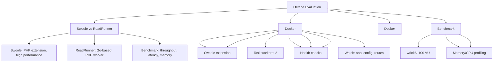

---
tags:
  - kanban/todo
  - type/task
  - domain/TST-P
  - priority/P1
parent: "[[desarrollo]]"
children: []
depends_on:
  - "[[TST-F-014]]"
blocks: []
status: todo
assignee: "@dev"
created: 2026-08-04
updated: 2026-08-04
---

# [[TST-P-001]] Baseline: Laravel Octane (Swoole/RoadRunner) Eval + Config

## Descripción
Evaluar y configurar Laravel Octane con Swoole o RoadRunner para mejorar performance en producción.

## Código de Ejemplo
```bash
# Instalación
composer require laravel/octane

# Instalación Swoole
pecl install swoole
# O RoadRunner
composer require spiral/roadrunner-laravel
./vendor/bin/rr get-binary

# Publicar config
php artisan octane:install
```

```php
// config/octane.php
return [
    'server' => env('OCTANE_SERVER', 'swoole'), // swoole | roadrunner
    'host' => env('OCTANE_HOST', '0.0.0.0'),
    'port' => env('OCTANE_PORT', 8000),
    'workers' => env('OCTANE_WORKERS', 4),
    'task_workers' => env('OCTANE_TASK_WORKERS', 2),
    'max_requests' => 500,
    'ssl' => [
        'cert' => env('OCTANE_SSL_CERT'),
        'key' => env('OCTANE_SSL_KEY'),
    ],
    'watch' => [
        base_path('app'),
        base_path('config'),
        base_path('routes'),
    ],
    'cache' => [
        'routes' => true,
        'config' => true,
        'views' => true,
    ],
    'cache_drivers' => ['redis'],
    'cache_prefix' => 'octane_',
];
```

```dockerfile
# Dockerfile.octane
FROM php:8.2-cli

# Instalar Swoole
RUN pecl install swoole && docker-php-ext-enable swoole

# O RoadRunner
RUN wget -O /usr/local/bin/rr https://github.com/roadrunner-server/roadrunner/releases/latest/download/rr_linux_amd64 && chmod +x /usr/local/bin/rr

# Configurar supervisor
COPY supervisord.conf /etc/supervisor/conf.d/octane.conf

CMD ["supervisord", "-c", "/etc/supervisor/supervisord.conf"]
```

```ini
# supervisord.conf
[program:octane]
command=php artisan octane:start --server=swoole --host=0.0.0.0 --port=8000 --workers=4
process_name=octane
numprocs=1
autostart=true
autorestart=true
redirect_stderr=true
stdout_logfile=/var/log/octane.log
```

## Diagramas Mermaid


## Criterios de Aceptación
- [ ] Octane instalado con Swoole O RoadRunner
- [ ] Config octane.php con workers = CPU cores x 2
- [ ] Dockerfile con Swoole extension o RoadRunner binary
- [ ] Supervisor config para production
- [ ] Benchmark: wrk/k6 comparando baseline vs Octane
- [ ] Target: >2x throughput, <50% latency reduction
- [ ] Memory leak testing: 24h soak test
- [ ] Health check endpoint para load balancer

## Notas Técnicas
- Swoole: requiere extensión PHP, mejor para CPU-bound
- RoadRunner: Go-based, mejor para I/O bound, más fácil debugging
- Octane cache: routes, config, views en memoria
- Workers: reiniciar cada 500 requests (memory leaks)
- Task workers: para jobs pesados (emails, reports)
- Cache drivers: Redis para session/cache
- SSL termination: en load balancer (nginx)

## Enlaces
- [[TST-P-002]] Load test
- [[TST-P-003]] Stress test
- [[TST-P-004]] Soak test
- [[TST-P-010]] Profiling