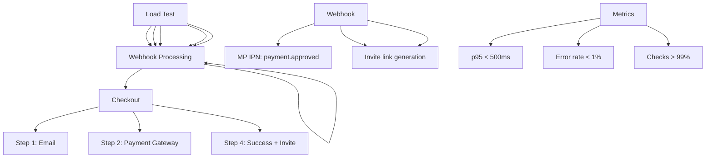

---
tags:
  - kanban/todo
  - type/task
  - domain/TST-P
  - priority/P1
parent: "[[desarrollo]]"
children: []
depends_on:
  - "[[TST-P-001]]"
blocks:
  - "[[TST-P-003]]"
  - "[[TST-P-004]]"
  - "[[TST-P-005]]"
  - "[[TST-P-006]]"
  - "[[TST-P-007]]"
  - "[[TST-P-008]]"
  - "[[TST-P-009]]"
  - "[[TST-P-010]]"
status: todo
assignee: "@dev"
created: 2026-08-04
updated: 2026-08-04
---

# [[TST-P-002]] Load test: k6/Gatling - 100 VU checkout + webhook (target <500ms p95)

## Descripción
Ejecutar test de carga con 100 usuarios virtuales concurrentes simulando checkout completo + webhook processing, target p95 < 500ms.

## Código de Ejemplo
```javascript
// tests/performance/checkout-load.js (k6)
import http from 'k6/http';
import { check, sleep } from 'k6';
import { Rate } from 'k6/metrics';

export const options = {
  stages: [
    { duration: '2m', target: 20 },  // Ramp up
    { duration: '5m', target: 100 }, // Stay at 100 VU
    { duration: '2m', target: 20 },  // Ramp down
    { duration: '1m', target: 0 },   // Cool down
  ],
  thresholds: {
    http_req_duration: ['p(95)<500'], // p95 < 500ms
    http_req_failed: ['rate<0.01'],  // <1% errors
    checks: ['rate>0.99'],           // 99% checks pass
  },
};

const BASE_URL = __ENV.BASE_URL || 'https://staging.tgpagate.com';
const CHECKOUT_ENDPOINT = '/checkout';
const WEBHOOK_ENDPOINT = '/webhooks/mercadopago';

const errorRate = new Rate('errors');

export default function () {
  // 1. Obtener canal aleatorio
  const channelsRes = http.get(`${BASE_URL}/api/channels?status=active`);
  const channels = channelsRes.json();
  const channel = channels[Math.floor(Math.random() * channels.length)];
  
  // 1. Step 1: Iniciar checkout (email)
  const checkoutStart = http.post(`${BASE_URL}/checkout`, {
    email: `test${__VU}@loadtest.com`,
    channel_id: channel.id,
  }, { headers: { 'Content-Type': 'application/json' } });
  
  const checkoutSuccess = check(checkoutStart, {
    'checkout started': (r) => r.status === 200 || r.status === 302,
  });
  errorRate.add(!checkoutSuccess);
  
  if (!checkoutSuccess) return;
  
  // 2. Simular pago (mock webhook)
  const paymentData = {
    external_reference: `loadtest_${__VU}_${__ITER}`,
    status: 'approved',
    amount: 999.99,
    currency: 'ARS',
    payment_method_id: 'master',
  };
  
  const webhookRes = http.post(`${BASE_URL}/webhooks/mercadopago/test`, {
    topic: 'payment',
    data: { id: `loadtest_${__VU}_${__ITER}` }
  }, {
    headers: {
      'Content-Type': 'application/json',
      'x-signature': 'mock_signature',
      'x-request-id': `loadtest_${__VU}_${__ITER}`,
    },
  });
  
  const webhookSuccess = check(webhookRes, {
    'webhook processed': (r) => r.status === 200,
  });
  errorRate.add(!webhookSuccess);
  
  // 3. Verificar suscripción activada
  sleep(1);
  const verifyRes = http.get(`${BASE_URL}/api/subscriptions/verify`, {
    params: { external_ref: `loadtest_${__VU}_${__ITER}` },
  });
  
  check(verifyRes, {
    'subscription activated': (r) => r.json().status === 'active',
  });
  
  sleep(Math.random() * 2 + 1);
}

export function handleSummary(data) {
  return {
    'stdout': textSummary(data, { indent: ' ', enableColors: true }),
    'summary.json': JSON.stringify(data),
  };
}
```

```bash
# Ejecutar
k6 run --out json=results.json tests/performance/checkout-load.js

# Con variables de entorno
BASE_URL=https://staging.tgpagate.com k6 run tests/performance/checkout-load.js
```

```yaml
# .github/workflows/load-test.yml
name: Load Test

on:
  workflow_dispatch:
    inputs:
      vus:
        description: 'Virtual Users'
        required: true
        default: '100'
      duration:
        description: 'Duration (minutes)'
        required: true
        default: '10'

jobs:
  load-test:
    runs-on: ubuntu-latest
    steps:
      - uses: actions/checkout@v4
      
      - name: Setup k6
        uses: grafana/setup-k6@v1
      
      - name: Run Load Test
        run: |
          k6 run --out json=results.json \
            --env BASE_URL=${{ secrets.STAGING_URL }} \
            tests/performance/checkout-load.js
      
      - name: Upload Results
        uses: actions/upload-artifact@v4
        with:
          name: load-test-results
          path: results.json
          
      - name: Check Thresholds
        run: |
          k6 run --summary-export=summary.json tests/performance/checkout-load.js
          cat summary.json | jq '.metrics.http_req_duration.values.p95'
```

## Diagramas Mermaid


## Criterios de Aceptación
- [ ] 100 VU concurrentes sostenidos por 5 min
- [ ] p95 latency < 500ms para checkout + webhook
- [ ] Error rate < 1%
- [ ] Checks pass rate > 99%
- [ ] Reporte JSON + HTML generado
- [ ] CI/CD integration en GitHub Actions
- [ ] Alertas Slack si thresholds fallan
- [ ] Reporte HTML con gráficos p95, p99, throughput

## Notas Técnicas
- Usar `k6` v0.47+ para mejor performance
- Mock MercadoPago webhook con `Http::fake()` en staging
- Tarjetas de prueba MP: 5031 7557 3453 0604 (aprobada)
- Base URL configurable via ENV
- Métricas custom: `checkout_duration`, `webhook_latency`, `invite_generation_time`
- Thresholds: p95 < 500ms, error_rate < 1%, checks > 99%

## Enlaces
- [[TST-P-001]] Baseline Octane
- [[TST-P-003]] Stress test
- [[TST-P-004]] Soak test
- [[TST-P-010]] Profiling