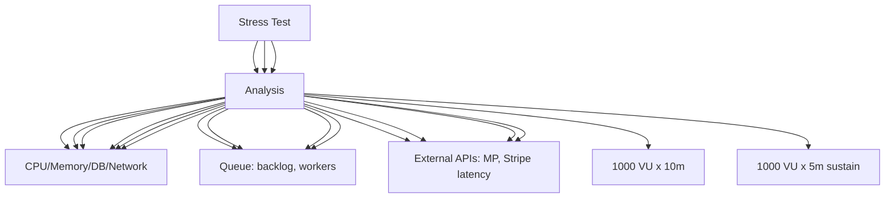

---
tags:
  - kanban/todo
  - type/task
  - domain/TST-P
  - priority/P1
parent: "[[desarrollo]]"
children: []
depends_on:
  - "[[TST-P-001]]"
  - "[[TST-P-002]]"
blocks: []
status: todo
assignee: "@dev"
created: 2026-08-04
updated: 2026-08-04
---

# [[TST-P-003]] Stress test: Ramp to breaking point (identificar bottlenecks)

## Descripción
Ejecutar test de estrés aumentando carga progresivamente hasta encontrar el punto de quiebre del sistema e identificar bottlenecks.

## Código de Ejemplo
```javascript
// tests/performance/stress-test.js (k6)
import http from 'k6/http';
import { check, sleep } from 'k6';
import { Trend, Rate, Counter } from 'k6/metrics';

export const options = {
  stages: [
    { duration: '5m', target: 50 },   // Warm up
    { duration: '10m', target: 200 }, // Ramp to 200
    { duration: '10m', target: 400 }, // Ramp to 400
    { duration: '10m', target: 600 }, // Ramp to 600
    { duration: '10m', target: 800 }, // Ramp to 800
    { duration: '10m', target: 1000 }, // Ramp to 1000
    { duration: '5m', target: 1000 }, // Sustain at max
    { duration: '5m', target: 0 },    // Cool down
  ],
  thresholds: {
    http_req_duration: ['p(99)<2000'], // p99 < 2s under stress
    http_req_failed: ['rate<0.05'],    // <5% errors acceptable under stress
    checks: ['rate>0.95'],             // 95% checks pass
  },
};

const BASE_URL = __ENV.BASE_URL || 'https://staging.tgpagate.com';

const errorRate = new Rate('errors');
const latencyTrend = new Trend('latency');
const throughputCounter = new Counter('throughput');

export default function () {
  const channelId = getRandomChannel();
  
  // Simular flujo completo de compra
  const startTime = new Date();
  
  // 1. Iniciar checkout
  const checkoutRes = http.post(`${BASE_URL}/checkout`, {
    email: `stress${__VU}@test.com`,
    channel_id: channelId,
  }, { headers: { 'Content-Type': 'application/json' } });
  
  const checkoutOk = check(checkoutRes, {
    'checkout initiated': (r) => r.status === 200 || r.status === 302,
  });
  errorRate.add(!checkoutOk);
  
  if (!checkoutOk) return;
  
  // Simular pago (webhook mock)
  const paymentRes = http.post(`${BASE_URL}/webhooks/test`, {
    external_reference: `stress_${__VU}_${__ITER}`,
    status: 'approved',
    amount: Math.floor(Math.random() * 5000) + 100,
  }, {
    headers: { 'Content-Type': 'application/json' },
  });
  
  const webhookOk = check(webhookRes, { 'webhook ok': (r) => r.status === 200 });
  errorRate.add(!webhookOk);
  
  // Métricas
  const latency = new Date() - startTime;
  latencyTrend.add(latency);
  throughputCounter.add(1);
  
  sleep(Math.random() * 3 + 1);
}

export function handleSummary(data) {
  const summary = `
STRESS TEST RESULTS
===================
Duration: ${data.state.testRunDurationMs}ms
Total Requests: ${data.metrics.http_reqs.values.count}
Throughput: ${data.metrics.http_reqs.values.rate.toFixed(2)} req/s
Error Rate: ${(data.metrics.errors.values.rate * 100).toFixed(2)}%
p50: ${data.metrics.http_req_duration.values['p(50)']}ms
p90: ${data.metrics.http_req_duration.values['p(90)']}ms
p95: ${data.metrics.http_req_duration.values['p(95)']}ms
p99: ${data.metrics.http_req_duration.values['p(99)']}ms
Max: ${data.metrics.http_req_duration.values['max']}ms
Throughput: ${data.metrics.throughput.values.rate.toFixed(2)} req/s
Error Rate: ${(data.metrics.errors.values.rate * 100).toFixed(2)}%
  `;
  
  console.log(summary);
  
  return {
    'stdout': textSummary(data, { indent: ' ', enableColors: true }),
    'summary.json': JSON.stringify(data),
  };
}
```

```bash
# Ejecutar stress test
k6 run --out json=stress-results.json tests/performance/stress-test.js

# Con variables de entorno
BASE_URL=https://staging.tgpagate.com k6 run tests/performance/stress-test.js

# Con reporte HTML
k6 run --out html=stress-report.html tests/performance/stress-test.js
```

```yaml
# .github/workflows/stress-test.yml
name: Stress Test

on:
  workflow_dispatch:
    inputs:
      target_vus:
        description: 'Target VUs'
        required: true
        default: '1000'
      duration:
        description: 'Duration (minutes)'
        required: true
        default: '60'

jobs:
  stress-test:
    runs-on: ubuntu-latest
    timeout-minutes: 90
    steps:
      - uses: actions/checkout@v4
      
      - name: Setup k6
        uses: grafana/setup-k6@v1
      
      - name: Run Stress Test
        run: |
          k6 run --out json=results.json \
            --env BASE_URL=${{ secrets.STAGING_URL }} \
            --env TARGET_VUS=${{ github.event.inputs.target_vus }} \
            tests/performance/stress-test.js
      
      - name: Analyze Results
        run: |
          cat results.json | jq '.metrics.http_req_duration.values'
          
      - name: Check Breaking Point
        run: |
          # Analizar dónde empieza a degradarse
          python3 scripts/analyze_breaking_point.py results.json
      
      - name: Upload Results
        uses: actions/upload-artifact@v4
        with:
          name: stress-test-results
          path: |
            results.json
            stress-report.html
```

## Diagramas Mermaid


## Criterios de Aceptación
- [ ] Ramp progresivo: 50 → 200 → 400 → 600 → 800 → 1000 VU
- [ ] Sostenido en punto de quiebre 5 min
- [ ] Identificar breaking point (VU donde p95 > 2s o error > 5%)
- [ ] Identificar bottlenecks: DB, Queue, Cache, External APIs, CPU, Memory
- [ ] Métricas: p50/p90/p95/p99/max latency, error rate, throughput
- [ ] Gráficos: latency vs VU, error rate vs VU, throughput vs VU
- [ ] Identificar bottleneck principal: DB, Redis, Queue, External API, CPU
- [ ] Reporte HTML + JSON + recomendaciones
- [ ] CI/CD integration con artifact upload

## Notas Técnicas
- Ejecutar en staging con datos reales (anonymized)
- Isolar entorno de pruebas (DB separada)
- Monitoreo: htop, iotop, pg_stat_activity, redis-cli INFO
- APM: New Relic / DataDog / Laravel Telescope
- DB: pg_stat_statements, pg_stat_activity
- Redis: INFO memory, CLIENT LIST
- Colas: horizon/failed jobs count
- Externos: MP/Stripe mock en staging
- Breakpoint detection: automatizado + manual review

## Enlaces
- [[TST-P-001]] Baseline Octane
- [[TST-P-002]] Load test
- [[TST-P-004]] Soak test
- [[TST-P-010]] Profiling