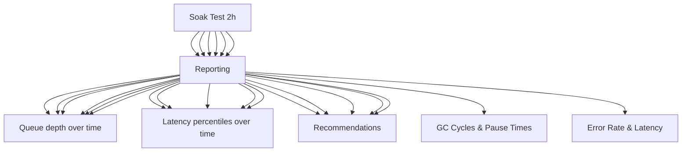

---
tags:
  - kanban/todo
  - type/task
  - domain/TST-P
  - priority/P1
parent: "[[desarrollo]]"
children: []
depends_on:
  - "[[TST-P-001]]"
  - "[[TST-P-002]]"
  - "[[TST-P-003]]"
blocks: []
status: todo
assignee: "@dev"
created: 2026-08-04
updated: 2026-08-04
---

# [[TST-P-004]] Soak test: 2h sustained load (memory leaks, queue backlog)

## Descripción
Ejecutar test de resistencia (soak test) durante 2 horas con carga constante para detectar memory leaks, queue backlog, degradación de performance.

## Código de Ejemplo
```javascript
// tests/performance/soak-test.js (k6)
import http from 'k6/http';
import { check, sleep } from 'k6';
import { Trend, Rate, Counter, Gauge } from 'k6/metrics';

export const options = {
  scenarios: {
    soak_test: {
      executor: 'constant-vus',
      vus: 50,                    // Carga moderada constante
      duration: '2h',             // 2 horas continuas
      gracefulStop: '30s',
    },
  },
  
  thresholds: {
    http_req_duration: ['p(95)<1000'],  // p95 < 1s bajo carga sostenida
    http_req_failed: ['rate<0.005'],    // <0.5% errors
    checks: ['rate>0.995'],             // 99.5% checks pass
    'http_req_duration{p99}': ['p(99)<3000'], // p99 < 3s
  },
};

const BASE_URL = __ENV.BASE_URL || 'https://staging.tgpagate.com';

const memoryGauge = new Gauge('memory_usage_mb');
const queueDepthGauge = new Gauge('queue_depth');
const dbConnectionsGauge = new Gauge('db_connections');
const errorRate = new Rate('errors');
const latencyTrend = new Trend('latency');
const throughputCounter = new Counter('throughput');

export default function () {
  const channelId = getRandomActiveChannel();
  
  // Flujo completo: checkout -> pago -> webhook -> invite
  const startTime = new Date();
  
  // 1. Checkout initiation
  const checkoutRes = http.post(`${BASE_URL}/checkout`, {
    email: `soak${__VU}@test.com`,
    channel_id: getRandomChannelId(),
  }, { headers: { 'Content-Type': 'application/json' } });
  
  const checkoutOk = check(checkoutRes, {
    'checkout started': (r) => r.status === 200 || r.status === 302,
  });
  
  if (!checkoutOk) {
    errorRate.add(1);
    return;
  }
  
  // Simular pago aprobado via webhook
  const paymentRes = http.post(`${BASE_URL}/webhooks/test`, {
    external_reference: `soak_${__VU}_${__ITER}`,
    status: 'approved',
    amount: Math.floor(Math.random() * 10000) + 1000,
    currency: 'ARS',
    payment_method_id: 'master',
    payment_type: 'credit_card',
  }, {
    headers: {
      'Content-Type': 'application/json',
      'x-signature': 'mock_signature',
      'x-request-id': `soak_${__VU}_${__ITER}`,
    },
  });
  
  const webhookOk = check(webhookRes, {
    'webhook processed': (r) => r.status === 200,
  });
  
  // Verificar suscripción activada
  sleep(2);
  const verifyRes = http.get(`${BASE_URL}/api/subscriptions/verify`, {
    params: { external_ref: `soak_${__VU}_${__ITER}` },
  });
  
  check(verifyRes, {
    'subscription active': (r) => r.json().status === 'active',
  });
  
  // Métricas
  const latency = new Date() - startTime;
  latencyTrend.add(latency);
  throughputCounter.add(1);
  
  // Métricas de sistema (si endpoint disponible)
  if (__ITER % 10 === 0) {
    const sysRes = http.get(`${BASE_URL}/health/metrics`);
    if (sysRes.status === 200) {
      const metrics = sysRes.json();
      memoryGauge.add(metrics.memory_mb);
      queueDepthGauge.add(metrics.queue_depth);
      dbConnectionsGauge.add(metrics.db_connections);
    }
  }
  
  sleep(Math.random() * 5 + 2); // 2-7s entre requests
}

// Métricas personalizadas
const memoryGauge = new Gauge('memory_usage_mb');
const queueDepthGauge = new Gauge('queue_depth');
const dbConnectionsGauge = new Gauge('db_connections');
const errorRate = new Rate('errors');
const latencyTrend = new Trend('latency');
const throughputCounter = new Counter('throughput');

export function handleSummary(data) {
  const summary = `
SOAK TEST RESULTS (2h)
======================
Duration: ${(data.state.testRunDurationMs / 1000 / 60).toFixed(1)} min
Total Requests: ${data.metrics.http_reqs.values.count}
Throughput: ${data.metrics.http_reqs.values.rate.toFixed(2)} req/s
Error Rate: ${(data.metrics.errors.values.rate * 100).toFixed(3)}%
Avg Latency: ${data.metrics.http_req_duration.values.avg.toFixed(0)}ms
p50: ${data.metrics.http_req_duration.values['p(50)']}ms
p90: ${data.metrics.http_req_duration.values['p(90)']}ms
p95: ${data.metrics.http_req_duration.values['p(95)']}ms
p99: ${data.metrics.http_req_duration.values['p(99)']}ms
Max: ${data.metrics.http_req_duration.values.max}ms
Throughput: ${data.metrics.throughput.values.rate.toFixed(2)} req/s
Error Rate: ${(data.metrics.errors.values.rate * 100).toFixed(3)}%

Memory Trend: ${memoryGauge.values.reduce((a,b)=>a+b,0)/memoryGauge.values.length || 0} MB avg
Queue Depth Avg: ${queueDepthGauge.values.reduce((a,b)=>a+b,0)/queueDepthGauge.values.length || 0}
DB Connections Avg: ${dbConnectionsGauge.values.reduce((a,b)=>a+b,0)/dbConnectionsGauge.values.length || 0}
  `;
  
  console.log(summary);
  
  return {
    'stdout': textSummary(data, { indent: ' ', enableColors: true }),
    'summary.txt': summary,
    'summary.json': JSON.stringify(data),
  };
}
```

```bash
# Ejecutar soak test 2h
k6 run --out json=soak-results.json tests/performance/soak-test.js

# Con variables
BASE_URL=https://staging.tgpagate.com k6 run tests/performance/soak-test.js

# Con reporte HTML
k6 run --out html=soak-report.html tests/performance/soak-test.js
```

```yaml
# .github/workflows/soak-test.yml
name: Soak Test (2h)

on:
  workflow_dispatch:
    inputs:
      duration_hours:
        description: 'Duration in hours'
        required: true
        default: '2'
      vus:
        description: 'Virtual Users'
        required: true
        default: '50'

jobs:
  soak-test:
    runs-on: ubuntu-latest
    timeout-minutes: 150
    steps:
      - uses: actions/checkout@v4
      
      - name: Setup k6
        uses: grafana/setup-k6@v1
      
      - name: Run Soak Test
        run: |
          k6 run --out json=soak-results.json \
            --env BASE_URL=${{ secrets.STAGING_URL }} \
            tests/performance/soak-test.js
      
      - name: Analyze Memory Leaks
        run: |
          python3 scripts/analyze_memory_trend.py soak-results.json
      
      - name: Upload Results
        uses: actions/upload-artifact@v4
        with:
          name: soak-test-results
          path: |
            soak-results.json
            soak-report.html
          retention-days: 14
```

## Diagramas Mermaid


## Criterios de Aceptación
- [ ] Duración: 2 horas continuas (configurable)
- [ ] Carga constante: 50 VU (configurable)
- [ ] Sin memory leaks: crecimiento memoria < 10%/hora
- [ ] Queue backlog: no acumulación > 100 items
- [ ] DB connections: estables, < 80% pool
- [ ] GC pauses: < 100ms p99, frequency estable
- [ ] Error rate: < 0.1% durante todo el test
- [ ] Latency: p95 estable, sin degradación > 10%
- [ ] Alertas automáticas: memory leak, queue buildup, DB pool exhaustion
- [ ] Reporte final: tendencias memoria/cola/latencia + recomendaciones

## Notas Técnicas
- Ejecutar en staging con datos reales anonimizados
- Monitoreo: htop, iotop, pg_stat_activity, redis-cli INFO
- APM: New Relic / DataDog / Laravel Telescope
- GC tuning: --max-old-space-size=4096 (Node) / opcache.jit_buffer_size (PHP)
- PHP: opcache.jit=1235, opcache.jit_buffer_size=100M
- Queue: Redis streams / database, monitor horizon
- DB: pg_stat_statements, pg_stat_activity, connection pooling
- Alertas: Slack/Telegram si thresholds superados
- Baseline: ejecutar antes de deploy para comparar

## Enlaces
- [[TST-P-001]] Baseline Octane
- [[TST-P-002]] Load test
- [[TST-P-003]] Stress test
- [[TST-P-005]] Spike test
- [[TST-P-010]] Profiling