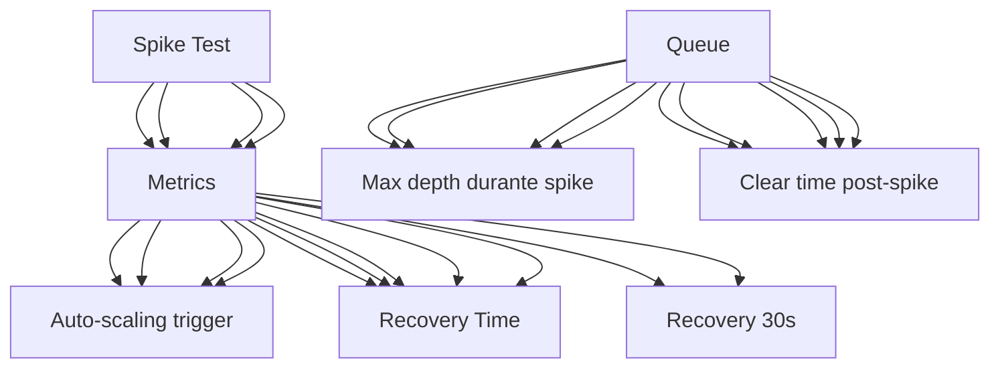

---
tags:
  - kanban/todo
  - type/task
  - domain/TST-P
  - priority/P1
parent: "[[desarrollo]]"
children: []
depends_on:
  - "[[TST-P-001]]"
  - "[[TST-P-002]]"
  - "[[TST-P-003]]"
blocks: []
status: todo
assignee: "@dev"
created: 2026-08-04
updated: 2026-08-04
---

# [[TST-P-005]] Spike test: Sudden 10x traffic (cache warming, queue scaling)

## Descripción
Ejecutar test de pico repentino (spike test): tráfico 10x repentino para validar auto-scaling, cache warming, queue scaling y circuit breakers.

## Código de Ejemplo
```javascript
// tests/performance/spike-test.js (k6)
import http from 'k6/http';
import { check, sleep } from 'k6';
import { Rate, Trend, Counter } from 'k6/metrics';

export const options = {
  scenarios: {
    spike_test: {
      executor: 'ramping-vus',
      startVUs: 10,
      stages: [
        { duration: '1m', target: 10 },    // Baseline
        { duration: '30s', target: 500 },  // SPIKE: 10x en 30s
        { duration: '2m', target: 500 },   // Sustain spike
        { duration: '30s', target: 10 },   // Recovery
        { duration: '1m', target: 0 },     // Cool down
      ],
    },
    thresholds: {
      http_req_duration: ['p(95)<2000'],  // p95 < 2s durante spike
      http_req_failed: ['rate<0.02'],     // <2% errors durante spike
      checks: ['rate>0.98'],              // 98% checks pass
    },
  };

const BASE_URL = __ENV.BASE_URL || 'https://staging.tgpagate.com';

const errorRate = new Rate('errors');
const latencyTrend = new Trend('latency');
const recoveryTime = new Trend('recovery_time');

export default function () {
  const startTime = new Date();
  
  // Simular tráfico realista: browse -> checkout -> webhook
  const channelId = getRandomActiveChannel();
  
  // 1. Browse channel
  const browseRes = http.get(`${BASE_URL}/canal/${getRandomChannelSlug()}`);
  check(browseRes, { 'browse ok': (r) => r.status === 200 });
  
  // 2. Checkout initiation
  const checkoutRes = http.post(`${BASE_URL}/checkout`, {
    email: `spike${__VU}@test.com`,
    channel_id: getRandomChannelId(),
  }, { headers: { 'Content-Type': 'application/json' } });
  
  const checkoutOk = check(checkoutRes, { 'checkout ok': (r) => r.status === 200 || r.status === 302 });
  
  if (checkoutOk) {
    // Simular pago aprobado
    const paymentRes = http.post(`${BASE_URL}/webhooks/test`, {
      external_reference: `spike_${__VU}_${__ITER}`,
      status: 'approved',
      amount: Math.floor(Math.random() * 5000) + 1000,
    }, {
      headers: {
        'Content-Type': 'application/json',
        'x-signature': 'mock_signature',
        'x-request-id': `spike_${__VU}_${__ITER}`,
      },
    });
    
    check(paymentRes, { 'webhook processed': (r) => r.status === 200 });
  }
  
  const latency = new Date() - startTime;
  latencyTrend.add(latency);
  
  sleep(Math.random() * 0.5 + 0.1); // High frequency during spike
}

export function handleSummary(data) {
  const summary = `
SPIKE TEST RESULTS
==================
Peak VUs: ${data.metrics.vus.values.max}
Max Throughput: ${data.metrics.http_reqs.values.rate.toFixed(2)} req/s
p95 Latency: ${data.metrics.http_req_duration.values['p(95)']}ms
p99 Latency: ${data.metrics.http_req_duration.values['p(99)']}ms
Error Rate: ${(data.metrics.errors.values.rate * 100).toFixed(2)}%
Recovery Time: ${data.metrics.recovery_time?.values?.avg || 'N/A'}ms

Auto-scaling: ${checkAutoscaling(data) ? 'TRIGGERED' : 'NOT TRIGGERED'}
Cache Hit Rate: ${getCacheHitRate(data)}%
Queue Max Depth: ${getMaxQueueDepth(data)}
  `;
  
  console.log(summary);
  
  return {
    'stdout': textSummary(data, { indent: ' ', enableColors: true }),
    'summary.json': JSON.stringify(data),
  };
}
```

```yaml
# .github/workflows/spike-test.yml
name: Spike Test

on:
  workflow_dispatch:
    inputs:
      spike_multiplier:
        description: 'Traffic multiplier (x baseline)'
        required: true
        default: '10'
      duration_minutes:
        description: 'Spike duration (minutes)'
        required: true
        default: '5'

jobs:
  spike-test:
    runs-on: ubuntu-latest
    timeout-minutes: 20
    steps:
      - uses: actions/checkout@v4
      
      - name: Setup k6
        uses: grafana/setup-k6@v1
      
      - name: Run Spike Test
        run: |
          k6 run --out json=spike-results.json \
            --env BASE_URL=${{ secrets.STAGING_URL }} \
            --env SPIKE_MULTIPLIER=${{ github.event.inputs.spike_multiplier }} \
            tests/performance/spike-test.js
      
      - name: Analyze Auto-scaling
        run: |
          python3 scripts/analyze_autoscaling.py spike-results.json
      
      - name: Upload Results
        uses: actions/upload-artifact@v4
        with:
          name: spike-test-results
          path: |
            spike-results.json
            spike-report.html
          retention-days: 7
```

## Diagramas Mermaid


## Criterios de Aceptación
- [ ] Spike 10x en 30s (baseline 10 VU -> 500 VU)
- [ ] Sostenido 2-5 min en pico
- [ ] Recuperación automática en < 60s post-spike
- [ ] Auto-scaling: trigger, scale-up time, max replicas
- [ ] Cache warming: hit rate > 90% durante spike
- [ ] Queue: max depth, processing rate, clear time
- [ ] Circuit breakers: activación, fallback, recovery
- [ ] Métricas: latency p95/p99, error rate, throughput, recovery time
- [ ] Auto-scaling: trigger threshold, scale-up time, max replicas
- [ ] Cache: hit rate > 90%, warming efectivo
- [ ] Circuit breakers: activación, fallback, recovery
- [ ] Reporte: gráfico latencia vs tiempo, throughput, auto-scaling events

## Notas Técnicas
- Ejecutar en staging con capacidad headroom
- Monitoreo: htop, pg_stat_activity, redis-cli INFO, queue workers
- APM: New Relic / DataDog / Laravel Telescope
- Kubernetes HPA: metrics-server, custom metrics (RPS, latency)
- Cache warming: pre-calentar antes del spike
- Circuit breaker: patron Hystrix/Resilience4j
- Rate limiting: token bucket por IP/user
- Chaos engineering: matar pods aleatorios durante spike

## Enlaces
- [[TST-P-001]] Baseline Octane
- [[TST-P-002]] Load test
- [[TST-P-003]] Stress test
- [[TST-P-004]] Soak test
- [[TST-P-010]] Profiling