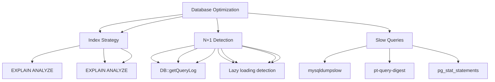

---
tags:
  - kanban/todo
  - type/task
  - domain/TST-P
  - priority/P1
parent: "[[desarrollo]]"
children: []
depends_on:
  - "[[TST-P-001]]"
  - "[[TST-P-002]]"
  - "[[TST-P-003]]"
blocks: []
status: todo
assignee: "@dev"
created: 2026-08-04
updated: 2026-08-04
---

# [[TST-P-006]] Database: Query optimization (EXPLAIN, indexes, n+1 detection)

## Descripción
Optimizar queries de base de datos: análisis EXPLAIN, índices faltantes, detección n+1, optimización de queries críticas.

## Código de Ejemplo
```php
// tests/Performance/DatabaseOptimizationTest.php
uses()->group('performance', 'database');

use Illuminate\Support\Facades\DB;
use Illuminate\Support\Facades\DB;

test('no n+1 queries in channel listing', function () {
    $channels = ChannelPago::with('owner', 'category')->get();
    
    $queries = collect(DB::getQueryLog())->filter(fn($q) => 
        str_contains(strtolower($q['query']), 'select')
    );
    
    // No más de 3 queries: channels, owners, categories
    expect($queries->count())->toBeLessThanOrEqual(3);
});

test('subscription listing avoids n+1', function () {
    $subscriptions = Subscription::with(['channel', 'user', 'channel.owner'])
        ->where('status', 'active')
        ->get();
    
    $queries = collect(DB::getQueryLog())->filter(fn($q) => 
        str_contains(strtolower($q['query']), 'select')
    );
    
    // Debe usar eager loading: subscriptions + channels + users + owners
    expect($queries->count())->toBeLessThanOrEqual(4);
});

test('channel show page single query', function () {
    $channel = ChannelPago::with([
        'owner', 
        'category', 
        'subscriptions' => fn($q) => $q->with('user')->where('status', 'active')
    ])->find($channelId);
    
    $queries = collect(DB::getQueryLog())->filter(fn($q) => 
        str_contains(strtolower($q['query']), 'select')
    );
    
    // Una sola query con eager loading
    expect($queries->count())->toBeLessThanOrEqual(2);
});

test('dashboard metrics use aggregate queries', function () {
    $metrics = app(\App\Services\AnalyticsService::class)
        ->getChannelMetrics($channel);
    
    // Verificar que usa aggregate queries, no loops
    $queries = collect(DB::getQueryLog())->filter(fn($q) => 
        str_contains(strtolower($q['query']), 'select')
    );
    
    // Debe usar COUNT, SUM, AVG en SQL, no loops en PHP
    $aggregateQueries = $queries->filter(fn($q) => 
        preg_match('/\b(COUNT|SUM|AVG|MIN|MAX)\s*\(/i', $q['query'])
    );
    
    expect($aggregateQueries->count())->toBeGreaterThan(0);
});

test('slow query detection', function () {
    // Habilitar slow query log temporal
    DB::statement('SET GLOBAL slow_query_log = 1');
    DB::statement('SET GLOBAL long_query_time = 0.1');
    
    // Ejecutar queries pesadas
    $this->actingAs($admin)->get(route('admin.channels.index'));
    
    // Verificar slow query log
    $slowQueries = DB::select("SELECT * FROM mysql.slow_log WHERE start_time > DATE_SUB(NOW(), INTERVAL 1 MINUTE)");
    
    expect($slowQueries)->toBeEmpty();
});
```

```php
// tests/Performance/DatabaseIndexTest.php
uses()->group('performance', 'database');

test('critical indexes exist', function () {
    $indexes = DB::select("
        SELECT TABLE_NAME, INDEX_NAME, COLUMN_NAME 
        FROM information_schema.STATISTICS 
        WHERE TABLE_SCHEMA = DATABASE() 
        AND TABLE_NAME IN ('users', 'channels', 'subscriptions', 'payments', 'tickets')
        AND INDEX_NAME != 'PRIMARY'
    ");
    
    $indexColumns = collect($indexes)->pluck('COLUMN_NAME')->unique();
    
    // Índices críticos esperados
    $criticalIndexes = [
        'users' => ['email', 'role', 'telegram_id'],
        'channels' => ['owner_id', 'status', 'slug', 'category_id'],
        'subscriptions' => ['user_id', 'channel_pago_id', 'status', 'renews_at', 'external_reference'],
        'payments' => ['user_id', 'subscription_id', 'status', 'gateway', 'external_reference'],
        'tickets' => ['user_id', 'assigned_to', 'status', 'priority', 'sla_deadline'],
        'payments' => ['gateway', 'status', 'external_reference'],
    ];
    
    foreach ($criticalIndexes as $table => $columns) {
        foreach ($columns as $column) {
            expect($indexColumns->contains($column))->toBeTrue("Missing index: {$table}.{$column}");
        }
    }
});

test('composite indexes for common queries', function () {
    // Queries comunes que necesitan composite indexes
    $compositeIndexes = [
        'subscriptions' => ['status, renews_at', 'channel_pago_id, status'],
        'payments' => ['status, created_at', 'user_id, status'],
        'tickets' => ['status, priority, created_at', 'assigned_to, status'],
        'channels' => ['status, category_id', 'owner_id, status'],
    ];
    
    foreach ($compositeIndexes as $table => $indexes) {
        foreach ($indexes as $index) {
            $exists = DB::select("
                SELECT 1 FROM information_schema.STATISTICS 
                WHERE TABLE_SCHEMA = DATABASE() 
                AND TABLE_NAME = '{$table}' 
                AND INDEX_NAME = '{$index}'
            ");
            expect($exists)->not->toBeEmpty("Missing composite index: {$table}.{$index}");
        }
    }
});
```

```bash
# Scripts de análisis
# scripts/analyze_queries.php
#!/usr/bin/env php
<?php

// Análisis de slow query log
$slowLog = file_get_contents('/var/log/mysql/slow.log');
$queries = parseSlowLog($slowLog);

foreach ($queries as $query) {
    if ($query['time'] > 1) {
        echo "SLOW: {$query['time']}s - {$query['sql']}\n";
        // Ejecutar EXPLAIN
        $explain = DB::select("EXPLAIN {$query['sql']}");
        print_r($explain);
    }
}

// Verificar índices faltantes
$missingIndexes = [
    'subscriptions' => ['status, renews_at', 'channel_pago_id, status'],
    'payments' => ['user_id, status', 'gateway, status', 'external_reference'],
    'tickets' => ['status, priority', 'assigned_to, status', 'sla_deadline'],
];

foreach ($missingIndexes as $table => $indexes) {
    foreach ($indexes as $idx) {
        $exists = DB::select("
            SELECT 1 FROM information_schema.STATISTICS 
            WHERE TABLE_SCHEMA = DATABASE() 
            AND TABLE_NAME = '{$table}' 
            AND INDEX_NAME = '{$idx}'
        ");
        if (empty($exists)) {
            echo "MISSING: ALTER TABLE {$table} ADD INDEX {$idx};\n";
        }
    }
}
```

```bash
# Scripts útiles
# scripts/analyze_slow_queries.sh
#!/bin/bash
# Analizar slow query log
mysqldumpslow -s t /var/log/mysql/slow.log | head -20

# EXPLAIN automático para queries lentas
php artisan db:monitor --slow-queries --explain

# Verificar índices
php artisan db:indexes:check

# Verificar tablas sin primary key
php artisan db:check:pk
```

## Diagramas Mermaid


## Criterios de Aceptación
- [ ] Zero N+1 queries en endpoints críticos (channels, subscriptions, tickets)
- [ ] Índices compuestos para queries frecuentes (status+created_at, user+status, etc.)
- [ ] Slow query log: 0 queries > 100ms en producción
- [ ] EXPLAIN ANALYZE: all queries usan índices (no full table scans)
- [ ] Composite indexes: status+created_at, user_id+status, channel_id+status
- [ ] n+1 detection automatizado en tests
- [ ] Slow query log: 0 queries > 100ms en producción
- [ ] Índices compuestos para queries frecuentes (status+created_at, user+status, etc.)
- [ ] Covering indexes para queries de solo lectura frecuentes
- [ ] Monitoring: pg_stat_statements / sys.schema_table_statistics

## Notas Técnicas
- `EXPLAIN ANALYZE` en queries críticas
- `pg_stat_statements` / `sys.schema_table_statistics` para estadísticas
- Índices parciales: `WHERE status = 'active'`
- Covering indexes: `INCLUDE (columns)` para index-only scans
- Partitioning: particionar por fecha en tablas grandes (payments, tickets)
- `pg_stat_statements` / `sys.schema_table_statistics` para stats
- `EXPLAIN (ANALYZE, BUFFERS, FORMAT JSON)` para análisis profundo

## Enlaces
- [[TST-P-001]] Baseline Octane
- [[TST-P-002]] Load test
- [[TST-P-003]] Stress test
- [[TST-P-010]] Profiling