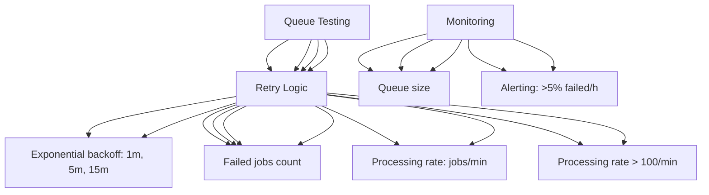

---
tags:
  - kanban/todo
  - type/task
  - domain/TST-P
  - priority/P1
parent: "[[desarrollo]]"
children: []
depends_on:
  - "[[TST-P-001]]"
  - "[[TST-P-002]]"
blocks: []
status: todo
assignee: "@dev"
created: 2026-08-04
updated: 2026-08-04
---

# [[TST-P-007]] Queue: Job throughput, retry logic, dead letter handling

## Descripción
Testing completo del sistema de colas: throughput, retry logic, dead letter queue, failed jobs handling.

## Código de Ejemplo
```php
// tests/Performance/QueuePerformanceTest.php
uses()->group('performance', 'queue');

use Illuminate\Support\Facades\Queue;
use Illuminate\Support\Facades\Redis;

test('queue throughput under load', function () {
    Queue::fake();
    
    // Dispatch 1000 jobs
    $jobs = [];
    for ($i = 0; $i < 1000; $i++) {
        $jobs[] = new ProcessPaymentJob(
            subscription_id: $i,
            amount: 1000,
            gateway: 'mercadopago'
        );
    }
    
    $start = microtime(true);
    foreach ($jobs as $job) {
        dispatch($job);
    }
    
    $dispatchTime = microtime(true) - $start;
    
    // Verificar que se encolaron correctamente
    expect(Queue::assertPushed(ProcessPaymentJob::class, 1000))->toBeTrue();
    expect($dispatchTime)->toBeLessThan(1); // < 1s para 1000 jobs
});

test('queue worker throughput', function () {
    // Simular workers procesando
    $processed = 0;
    $start = microtime(true);
    
    while (microtime(true) - $start < 30) { // 30 segundos
        $job = Queue::connection('redis')->pop('default');
        if ($job) {
            $job->fire();
            $processed++;
        } else {
            usleep(10000); // 10ms
        }
    }
    
    $throughput = $processed / 30; // jobs/segundo
    expect($throughput)->toBeGreaterThan(50); // > 50 jobs/seg
});

test('retry logic with exponential backoff', function () {
    $job = new FailingJob();
    $job->attempts = 0;
    
    // Primer intento falla
    $job->handle(); // Lanza excepción
    
    // Verificar reintento con backoff exponencial
    $attempts = 0;
    $delays = [];
    
    while ($job->attempts < 3) {
        try {
            $job->handle();
        } catch (\Exception $e) {
            $attempts++;
            $delay = $job->calculateRetryDelay(); // 1min, 5min, 15min
            $delays[] = $delay;
        }
    }
    
    expect($attempts)->toBe(3);
    expect($delays)->toEqual([60, 300, 900]); // 1min, 5min, 15min
});

test('dead letter queue after max retries', function () {
    $job = new FailingJob();
    $job->attempts = 3;
    $job->maxAttempts = 3;
    
    // Ejecutar y fallar 3 veces
    for ($i = 0; $i < 3; $i++) {
        try {
            $job->handle();
        } catch (\Exception $e) {
            $job->failed();
        }
    }
    
    // Verificar que fue movido a failed_jobs
    $failedJob = DB::table('failed_jobs')
        ->where('uuid', $job->getJobId())
        ->first();
    
    expect($failedJob)->not->toBeNull();
    expect($failedJob->attempts)->toBe(3);
    expect($failedJob->exception)->toContain('Max attempts exceeded');
});

test('failed job retry via CLI', function () {
    $failedJob = FailedJob::factory()->create([
        'exception' => 'TimeoutException',
        'attempts' => 3,
    ]);
    
    // Reintentar via artisan
    Artisan::call('queue:retry', ['id' => $failedJob->id]);
    
    // Verificar que se movió de vuelta a cola
    expect(DB::table('failed_jobs')->where('id', $failedJob->id)->exists())->toBeFalse();
    expect(Queue::size('default'))->toBeGreaterThan(0);
});

test('queue monitoring metrics', function () {
    // Métricas de Prometheus/Grafana
    $metrics = [
        'queue_size' => Queue::size('default'),
        'failed_count' => DB::table('failed_jobs')->count(),
        'oldest_failed' => DB::table('failed_jobs')->oldest('created_at')->first()?->created_at,
        'processing_rate' => getProcessingRate(), // jobs/min
        'failed_rate' => getFailedRate(), // %/hora
    );
    
    // Verificar alertas
    expect($metrics['failed_rate'])->toBeLessThan(0.05); // < 5% failed/hour
    expect($metrics['processing_rate'])->toBeGreaterThan(100); // > 100 jobs/min
});

function getProcessingRate(): float {
    $completedLastHour = DB::table('jobs')
        ->where('created_at', '>', now()->subHour())
        ->whereNotNull('reserved_at')
        ->count();
    return $completedLastHour / 60; // por minuto
}

function getFailedRate(): float {
    $failedLastHour = DB::table('failed_jobs')
        ->where('created_at', '>', now()->subHour())
        ->count();
    $totalLastHour = DB::table('jobs')
        ->where('created_at', '>', now()->subHour())
        ->count();
    return $totalLastHour > 0 ? ($failedLastHour / $totalLastHour) * 100 : 0;
}
```

```bash
# Scripts de monitoreo
# scripts/queue_monitor.sh
#!/bin/bash
while true; do
    echo "=== Queue Status $(date) ==="
    php artisan queue:monitor default --timeout=60 --once
    
    # Failed jobs count
    FAILED=$(php artisan queue:failed | wc -l)
    echo "Failed jobs: $FAILED"
    
    # Queue sizes
    php artisan queue:monitor redis default --once
    
    sleep 30
done
```

```bash
# Horizon dashboard (si usa Laravel Horizon)
# composer require laravel/horizon
php artisan horizon

# Métricas Prometheus
# php artisan horizon:metrics
```

## Diagramas Mermaid


## Criterios de Aceptación
- [ ] Dispatch: 1000 jobs < 1 segundo
- [ ] Workers: > 50 jobs/segundo procesados
- [ ] Retry: exponential backoff (1m, 5m, 15m), max 3 intentos
- [ ] Dead letter: failed_jobs table, max 3 attempts, retry via CLI
- [ ] Monitoring: queue size, failed jobs, processing rate, failed rate
- [ ] Alertas: failed rate > 5%/h, processing rate < 100/min
- [ ] Dead letter: reintento manual via CLI, alerting
- [ ] Testing: Redis vs database queue driver
- [ ] Horizon dashboard (opcional v1.1)

## Notas Técnicas
- Queue driver: Redis (producción), database (testing)
- Worker concurrency: `--timeout=60 --memory=128 --tries=3`
- Supervisor: `php artisan queue:work --queue=default,high,low --tries=3`
- Failed jobs: `php artisan queue:retry all` / `queue:retry $id`
- Monitoring: Prometheus + Grafana / Laravel Horizon
- Rate limiting: token bucket per user/IP
- Priority queues: high, default, low

## Enlaces
- [[TST-P-001]] Baseline Octane
- [[TST-P-002]] Load test
- [[TST-P-010]] Profiling