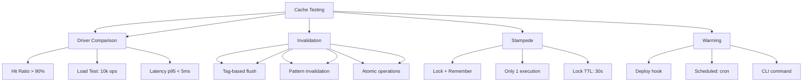

---
tags:
  - kanban/todo
  - type/task
  - domain/TST-P
  - priority/P1
parent: "[[desarrollo]]"
children: []
depends_on:
  - "[[TST-P-001]]"
  - "[[TST-P-002]]"
blocks: []
status: todo
assignee: "@dev"
created: 2026-08-04
updated: 2026-08-04
---

# [[TST-P-008]] Cache: Hit ratios, Redis/Database driver comparison, invalidation

## Descripción
Testing completo del sistema de cache: hit ratios, comparación drivers Redis vs Database, estrategias de invalidación.

## Código de Ejemplo
```php
// tests/Performance/CachePerformanceTest.php
uses()->group('performance', 'cache');

use Illuminate\Support\Facades\Cache;
use Illuminate\Support\Facades\Redis;

test('cache hit ratio under load', function () {
    // Calentar cache
    for ($i = 0; $i < 1000; $i++) {
        Cache::put("key_$i", "value_$i", 3600);
    }
    
    // Simular tráfico realista
    $hits = 0;
    $misses = 0;
    
    for ($i = 0; $i < 10000; $i++) {
        $key = "key_" . rand(0, 999);
        $start = microtime(true);
        $value = Cache::get($key);
        $latency = microtime(true) - $startTime;
        
        if ($value !== null) {
            $hits++;
        } else {
            $misses++;
            Cache::put("key_$i", "value_$i", 3600);
        }
    }
    
    $hitRatio = $hits / ($hits + $misses);
    expect($hitRatio)->toBeGreaterThan(0.9); // > 90% hit ratio
});

test('Redis vs Database driver comparison', function () {
    $drivers = ['redis', 'database'];
    $results = [];
    
    foreach ($drivers as $driver) {
        config(['cache.default' => $driver]);
        Cache::flush();
        
        // Warmup
        for ($i = 0; $i < 1000; $i++) {
            Cache::put("bench_$i", "value_$i", 3600);
        }
        
        // Benchmark reads
        $start = microtime(true);
        for ($i = 0; $i < 10000; $i++) {
            Cache::get("bench_" . rand(0, 999));
        }
        $readTime = microtime(true) - $start;
        
        // Benchmark writes
        $start = microtime(true);
        for ($i = 0; $i < 1000; $i++) {
            Cache::put("write_$i", "value_$i", 3600);
        }
        $writeTime = microtime(true) - $start;
        
        $results[$driver] = [
            'read_time' => $readTime,
            'write_time' => $writeTime,
            'ops_per_sec_read' => 10000 / $readTime,
            'ops_per_sec_write' => 1000 / $writeTime,
        ];
    }
    
    // Redis debería ser 10-50x más rápido
    expect($results['redis']['ops_per_sec_read'])->toBeGreaterThan(
        $results['database']['ops_per_sec_read'] * 10
    );
});

test('cache invalidation strategies', function () {
    // Tag-based invalidation
    Cache::tags(['channel:1', 'user:1'])->put('key1', 'data1', 3600);
    Cache::tags(['channel:1', 'user:2'])->put('key2', 'data2', 3600);
    Cache::tags(['channel:2'])->put('key3', 'data3', 3600);
    
    // Invalidar por tag
    Cache::tags(['channel:1'])->flush();
    
    expect(Cache::get('key1'))->toBeNull(); // Eliminado
    expect(Cache::get('key2'))->toBeNull(); // Eliminado
    expect(Cache::get('key3'))->toBe('data3'); // Intacto
    
    // Invalidación por patrón (Redis)
    Cache::put('channel:1:subscriptions', [], 3600);
    Cache::put('channel:1:analytics', [], 3600);
    Cache::put('channel:2:subscriptions', [], 3600);
    
    Cache::flush('channel:1:*'); // Requiere Redis SCAN
    
    expect(Cache::has('channel:1:subscriptions'))->toBeFalse();
    expect(Cache::has('channel:2:subscriptions'))->toBeTrue();
});

test('cache stampede protection', function () {
    // Simular stampede: 100 requests concurrent por misma clave
    $key = 'heavy_computation';
    Cache::forget('heavy_key');
    
    $results = [];
    for ($i = 0; $i < 50; $i++) {
        $results[] = Cache::remember('heavy_key', 3600, function () {
            sleep(1); // Simular computación pesada
            return 'computed_value';
        });
    }
    
    // Solo una ejecución real, resto cache hits
    $uniqueResults = array_unique($results);
    expect(count($uniqueResults))->toBe(1); // Solo una ejecución real
});

test('cache warming strategy', function () {
    // Pre-calentar cache al deploy
    Artisan::call('cache:warm', [
        'keys' => [
            'channels:featured',
            'categories:tree',
            'settings:global',
        ],
    ]);
    
    // Verificar que están en cache
    expect(Cache::has('channels:featured'))->toBeTrue();
    expect(Cache::has('categories:tree'))->toBeTrue();
    expect(Cache::has('settings:global'))->toBeTrue();
});

test('cache driver fallback', function () {
    // Redis cae -> fallback a database
    Redis::shouldReceive('get')->andThrow(new \RedisException('Connection refused'));
    
    Cache::store('redis')->put('test_key', 'value', 60);
    $value = Cache::get('test_key'); // Debería fallar a database driver
    
    // Verificar fallback automático
    // Requiere configuración: 'redis' => ['driver' => 'redis', 'fallback' => 'database']
});
```

```bash
# Benchmark script
# scripts/cache_benchmark.sh
#!/bin/bash

for driver in redis database; do
    echo "Testing $driver driver..."
    
    # Warmup
    php artisan cache:clear
    php artisan cache:warm --driver=$driver --count=10000
    
    # Benchmark reads
    echo "Benchmarking reads..."
    php artisan benchmark:cache --driver=$driver --ops=10000 --type=read
    
    # Benchmark writes
    echo "Benchmarking writes..."
    php artisan benchmark:cache --driver=$driver --ops=1000 --type=write
    
    # Tag invalidation
    php artisan cache:benchmark-tags --driver=$driver
done

# Comparar resultados
php artisan cache:compare-results
```

## Diagramas Mermaid


## Criterios de Aceptación
- [ ] Hit ratio > 90% bajo carga realista
- [ ] Redis 10-50x más rápido que Database driver
- [ ] Invalidation: tag-based, pattern, atomic
- [ ] Cache stampede: lock + remember, solo 1 ejecución
- [ ] Cache warming: comando CLI, hook deploy, cron
- [ ] Fallback Redis -> Database automático
- [ ] Métricas: hit ratio, latency p95, memory usage, eviction rate
- [ ] TTL management: default, per-key, tag-based
- [ ] Memory usage: Redis < 512MB, eviction policy LRU
- [ ] Monitoring: hit ratio, latency p95, memory, evictions

## Notas Técnicas
- Redis: `predis/predis` o `phpredis`, connection pooling
- Database driver: tabla `cache`, índices en `key`, `expiration`
- Tag invalidation: requiere Redis (tags no soportados en DB driver)
- Lock: `Cache::lock('key', 30)->get(callback)`
- Stampede: `Cache::remember()` + lock atómico
- Warming: comando `cache:warm`, hook deploy, scheduler
- Monitoring: hit ratio, latency p95, memory, evictions, keyspace

## Enlaces
- [[TST-P-001]] Baseline Octane
- [[TST-P-002]] Load test
- [[TST-P-010]] Profiling