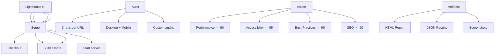

---
tags:
  - kanban/todo
  - type/task
  - domain/TST-P
  - priority/P1
parent: "[[desarrollo]]"
children: []
depends_on:
  - "[[TST-P-001]]"
  - "[[TST-P-002]]"
  - "[[TST-P-003]]"
  - "[[TST-P-004]]"
blocks:
  - "[[TST-P-011]]"
status: todo
assignee: "@dev"
created: 2026-08-04
updated: 2026-08-04
---

# [[TST-P-009]] Frontend: Lighthouse CI (Performance >90, Accessibility >95)

## Descripción
Integrar Lighthouse CI en el pipeline CI/CD para validar métricas de performance, accesibilidad, SEO y best practices en cada PR.

## Código de Ejemplo
```yaml
# .github/workflows/lighthouse.yml
name: Lighthouse CI

on:
  pull_request:
    branches: [main, develop]
  push:
    branches: [main, develop]

jobs:
  lighthouse:
    name: Lighthouse CI
    runs-on: ubuntu-latest
    steps:
      - uses: actions/checkout@v4
      
      - name: Setup Node
        uses: actions/setup-node@v4
        with:
          node-version: '20'
          cache: 'npm'
      
      - name: Install dependencies
        run: npm ci
      
      - name: Build assets
        run: npm run build
      
      - name: Start preview server
        run: |
          php artisan serve --port=8000 &
          sleep 5
      
      - name: Run Lighthouse CI
        uses: treosh/lighthouse-ci-action@v11
        with:
          urls: |
            http://localhost:8000
            http://localhost:8000/creadores
            http://localhost:8000/canales
            http://localhost:8000/checkout
          configPath: './lighthouserc.json'
          uploadArtifacts: true
      
      - name: Check thresholds
        run: |
          cat lighthouse-report.json | jq '.categories.performance.score'
          cat lighthouse-report.json | jq '.categories.accessibility.score'
          cat lighthouse-report.json | jq '.categories.seo.score'
          cat lighthouse-report.json | jq '.categories.best-practices.score'
```

```json
// lighthouserc.json
{
  "ci": {
    "collect": {
      "numberOfRuns": 3,
      "startServerCommand": "php artisan serve --port=8000",
      "url": [
        "http://localhost:8000",
        "http://localhost:8000/creadores",
        "http://localhost:8000/canales",
        "http://localhost:8000/checkout"
      ],
      "settings": {
        "headless": true,
        "preset": "desktop",
        "formFactor": "desktop",
        "screenEmulation": {
          "mobile": false,
          "width": 1350,
          "height": 940,
          "deviceScaleFactor": 1,
          "disabled": false
        }
      }
    },
    "assert": {
      "assertions": {
        "categories:performance": ["error", { "minScore": 0.9 }],
        "categories:accessibility": ["error", { "minScore": 0.95 }],
        "categories:best-practices": ["warn", { "minScore": 0.9 }],
        "categories:seo": ["warn", { "minScore": 0.9 }],
        "categories:pwa": ["off"]
      }
    },
    "upload": {
      "target": "temporary-public-storage"
    }
  }
}
```

```javascript
// tests/lighthouse/custom-audits.js
module.exports = {
  // Custom audit: Critical CSS inlined
  'critical-css': {
    title: 'Critical CSS is inlined',
    failureDescription: 'Critical CSS should be inlined in <head>',
    required: true,
    audit: async (artifacts) => {
      const html = artifacts.HTML;
      const criticalCss = html.match(/<style[^>]*>[\s\S]*?<\/style>/);
      return {
        score: criticalCss ? 1 : 0,
        displayValue: criticalCss ? 'Critical CSS inlined' : 'Critical CSS missing',
      };
    },
  },
  
  // Custom audit: Font display swap
  'font-display-swap': {
    title: 'Font display swap used',
    failureDescription: 'Fonts should use font-display: swap',
    required: true,
    audit: async (artifacts) => {
      const css = artifacts.CSS;
      const hasSwap = css.some(sheet => sheet.includes('font-display: swap'));
      return {
        score: hasSwap ? 1 : 0,
        displayValue: hasSwap ? 'font-display: swap used' : 'font-display: swap missing',
      };
    },
  },
  
  // Custom audit: No layout shift
  'cls-threshold': {
    title: 'Cumulative Layout Shift < 0.1',
    failureDescription: 'CLS should be less than 0.1',
    required: true,
    audit: async (artifacts) => {
      const cls = artifacts.LayoutShifts?.reduce((sum, shift) => sum + shift.value, 0) || 0;
      return {
        score: cls < 0.1 ? 1 : 0,
        displayValue: `CLS: ${cls.toFixed(3)}`,
      };
    },
  },
}
```

## Diagramas Mermaid


## Criterios de Aceptación
- [ ] Lighthouse CI configurado en GitHub Actions
- [ ] 4 URLs auditadas: home, creadores, canales, checkout
- [ ] 3 runs por URL, mediana usada para score
- [ ] Thresholds: Performance >= 90, Accessibility >= 95
- [ ] Best Practices >= 90, SEO >= 90 (warn only)
- [ ] Custom audits: Critical CSS, font-display: swap, CLS < 0.1
- [ ] 3 runs por URL, mediana usada para score
- [ ] Artifacts: HTML report, JSON, screenshots subidos
- [ ] Fallan PRs si thresholds no se cumplen
- [ ] Reportes HTML/JSON subidos como artifacts

## Notas Técnicas
- `treosh/lighthouse-ci-action@v11` para GitHub Actions
- `lighthouserc.json` en root del proyecto
- 3 runs por URL para estabilidad
- Headless Chrome en CI
- Server: `php artisan serve --port=8000`
- Build assets: `npm run build` antes de auditoría
- Thresholds: performance=0.9, accessibility=0.95, best-practices=0.9, seo=0.9
- Custom audits: critical CSS, font-display: swap, CLS < 0.1
- Reports: HTML + JSON + screenshots como artifacts

## Enlaces
- [[TST-P-001]] Baseline Octane
- [[TST-P-002]] Load test
- [[TST-P-011]] Benchmarks