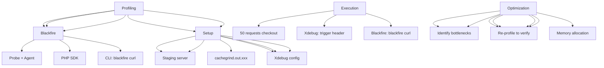

---
tags:
  - kanban/todo
  - type/task
  - domain/TST-P
  - priority/P1
parent: "[[desarrollo]]"
children: []
depends_on:
  - "[[TST-P-001]]"
  - "[[TST-P-002]]"
blocks: []
status: todo
assignee: "@dev"
created: 2026-08-04
updated: 2026-08-04
---

# [[TST-P-010]] Profiling: Blackfire/Xdebug en staging (hot paths)

## Descripción
Configurar y ejecutar profiling con Blackfire o Xdebug en entorno staging para identificar hot paths y optimizar código crítico.

## Código de Ejemplo
```bash
# Blackfire Setup
# 1. Instalar Blackfire PHP probe
# Ubuntu/Debian:
wget -q -O - https://packages.blackfire.io/gpg.key | sudo apt-key add -
echo "deb http://packages.blackfire.io/debian any main" | sudo tee /etc/apt/sources.list.d/blackfire.list
sudo apt update && sudo apt install blackfire-php

# Configurar
blackfire-agent --register --server-id=xxx --server-token=xxx
blackfire config --client-id=xxx --client-token=xxx

# php.ini
extension=blackfire.so
blackfire.agent_socket=unix:///var/run/blackfire/agent.sock
blackfire.server_id=xxx
blackfire.server_token=xxx

# Xdebug Setup (alternativa)
# php.ini
zend_extension=xdebug.so
xdebug.mode=profile
xdebug.output_dir=/tmp/xdebug
xdebug.profiler_output_name=cachegrind.out.%p
xdebug.start_with_request=trigger
```

```yaml
# .github/workflows/profiling.yml
name: Profiling

on:
  workflow_dispatch:
    inputs:
      profile_type:
        description: 'Profiling type'
        required: true
        type: choice
        options: [blackfire, xdebug]
      target_url:
        description: 'Target URL'
        required: true
        default: 'https://staging.tgpagate.com'

jobs:
  profiling:
    runs-on: ubuntu-latest
    timeout-minutes: 60
    steps:
      - uses: actions/checkout@v4
      
      - name: Setup PHP
        uses: shivammathur/setup-php@v2
        with:
          php-version: '8.2'
          extensions: xdebug, pcntl, posix
      
      - name: Install dependencies
        run: composer install --prefer-dist --no-progress
      
      - name: Start Staging Server
        run: |
          php artisan serve --host=0.0.0.0 --port=8000 &
          sleep 10
      
      - name: Run Blackfire Profiling
        if: github.event.inputs.profile_type == 'blackfire'
        run: |
          for i in {1..10}; do
            blackfire curl --url="${{ github.event.inputs.target_url }}/checkout" \
              --header="Authorization: Bearer ${{ secrets.TEST_TOKEN }}" \
              --header="Content-Type: application/json" \
              --data '{"email":"test@test.com","channel_id":1}' \
              --method=POST \
              --data='{"email":"test@test.com","channel_id":1}'
          done
      
      - name: Run Xdebug Profiling
        if: github.event.inputs.profile_type == 'xdebug'
        run: |
          # Trigger Xdebug profiling via XDEBUG_TRIGGER
          for i in {1..10}; do
            curl -H "XDEBUG_TRIGGER: profile" \
              -X POST "${{ github.event.inputs.target_url }}/checkout" \
              -H "Content-Type: application/json" \
              -d '{"email":"test@test.com","channel_id":1}'
          done
      
      - name: Download Profiles
        run: |
          # Blackfire: descargar desde API
          # Xdebug: descargar cachegrind files
          mkdir -p profiles
          # Blackfire: blackfire download ...
          # Xdebug: cp /tmp/xdebug/cachegrind.* profiles/
      
      - name: Upload Profiles
        uses: actions/upload-artifact@v4
        with:
          name: profiles
          path: profiles/
          retention-days: 7

```

```php
// scripts/profile-checkout.php
<?php
// Script para profiling automatizado

require 'vendor/autoload.php';

use Symfony\Component\Process\Process;

$iterations = 50;
$url = $argv[1] ?? 'https://staging.tgpagate.com/checkout';
$token = $argv[1] ?? 'test_token';

$results = [];

for ($i = 0; $i < 50; $i++) {
    $start = microtime(true);
    
    $response = Http::withToken($token)->post('/checkout', [
        'email' => "loadtest{$i}@test.com",
        'channel_id' => 1,
    ]);
    
    $duration = microtime(true) - $start;
    $results[] = $duration;
    
    echo "Iteration " . ($i+1) . ": " . ($duration * 1000) . "ms\n";
}

// Estadísticas
$times = array_column($results, 0);
sort($results);

echo "Iterations: " . count($results) . "\n";
echo "Avg: " . (array_sum($results) / count($results) * 1000) . "ms\n";
echo "P50: " . percentile($results, 50) . "ms\n";
echo "P95: " . percentile($results, 95) . "ms\n";
echo "P99: " . percentile($results, 99) . "ms\n";

function percentile(array $data, int $percentile): float {
    $index = ceil(count($data) * $percentile / 100) - 1;
    return $data[$index] * 1000;
}
```

## Diagramas Mermaid


## Criterios de Aceptación
- [ ] Blackfire configurado: probe, agent, credentials
- [ ] Xdebug configurado: trigger mode, cachegrind output
- [ ] 50 requests de profiling en checkout
- [ ] Análisis: wall time, CPU time, memory, call graph
- [ ] Identificar top 10 funciones por tiempo CPU
- [ ] Identificar queries lentas (N+1, missing indexes)
- [ ] Identificar memory leaks / allocations excesivas
- [ ] Generar reporte: top 20 funciones, flame graph
- [ ] Comparar antes/después de optimizaciones
- [ ] Documentar hallazgos en `docu/especificaciones/profiling-report.md`

## Notas Técnicas
- Blackfire: probe PHP + agent daemon, requiere cuenta
- Xdebug 3: mode=profile, trigger=profile, cachegrind output
- Trigger Xdebug: header `XDEBUG_TRIGGER=profile`
- Blackfire: `blackfire curl` o SDK PHP
- Perfilado: 50+ requests para significancia estadística
- Comparar antes/después de optimizaciones
- Flame graphs: speedscope, flamegraph.pl

## Enlaces
- [[TST-P-001]] Baseline Octane
- [[TST-P-002]] Load test
- [[TST-P-011]] Benchmarks