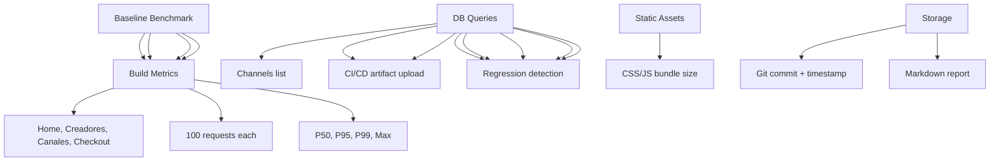

---
tags:
  - kanban/todo
  - type/task
  - domain/TST-P
  - priority/P1
parent: "[[desarrollo]]"
children: []
depends_on:
  - "[[TST-P-001]]"
  - "[[TST-P-009]]"
blocks: []
status: todo
assignee: "@dev"
created: 2026-08-04
updated: 2026-08-04
---

# [[TST-P-011]] Benchmarks: Documentar baseline v1.0 para regresión futura

## Descripción
Documentar métricas de rendimiento base (baseline) de la v1.0 para detectar regresiones en versiones futuras.

## Código de Ejemplo
```bash
# scripts/benchmark-baseline.sh
#!/bin/bash
set -e

BASE_URL="${BASE_URL:-https://staging.tgpagate.com}"
OUTPUT_DIR="benchmarks/v1.0/$(date +%Y%m%d_%H%M%S)"
mkdir -p "$OUTPUT_DIR"

echo "=== TG-PayGate v1.0 Baseline Benchmark ==="
echo "Date: $(date)"
echo "Environment: ${ENVIRONMENT:-staging}"
echo "Git Commit: $(git rev-parse HEAD)"
echo "Branch: $(git branch --show-current)"

# 1. Response Time Benchmarks
echo "=== Response Time Benchmarks ==="

declare -A endpoints=(
    ["GET /"]="/"
    ["GET /creadores"]="/creadores"
    ["GET /canales"]="/canales"
    ["GET /canal/{slug}"]="/canal/finanzas-premium"
    ["POST /checkout"]="/checkout"
    ["POST /webhooks/mercadopago"]="/webhooks/mercadopago"
    ["GET /api/subscriptions"]="/api/subscriptions"
)

for name in "${!endpoints[@]}"; do
    endpoint="${endpoints[$name]}"
    echo "Testing: $name (${endpoints[$name]})"
    
    # Warmup
    for i in {1..5}; do
        curl -s -o /dev/null -w "%{http_code} %{time_total}\n" \
          -H "Authorization: Bearer $TEST_TOKEN" \
          "$BASE_URL${endpoints[$name]}" > /dev/null
    done
    
    # Benchmark: 100 requests
    echo "Running 100 requests..."
    for i in {1..100}; do
        curl -s -o /dev/null -w "%{http_code} %{time_total}\n" \
          -H "Authorization: Bearer $TEST_TOKEN" \
          -X POST -H "Content-Type: application/json" \
          -d '{"email":"bench@test.com","channel_id":1}' \
          "$BASE_URL/checkout" >> "benchmarks/checkout_times.txt"
    done
done

# 2. Database Queries
echo "=== Database Query Benchmarks ==="

queries=(
    "SELECT * FROM channels WHERE status='active' LIMIT 20"
    "SELECT * FROM subscriptions WHERE status='active' AND user_id=1"
    "SELECT * FROM payments WHERE status='approved' AND created_at > NOW() - INTERVAL 1 DAY"
    "SELECT u.*, COUNT(s.id) as sub_count FROM users u LEFT JOIN subscriptions s ON u.id=s.user_id WHERE u.role='user' GROUP BY u.id"
)

for query in "${queries[@]}"; do
    echo "Benchmarking: $query"
    for i in {1..100}; do
        start=$(date +%s%N)
        mysql -e "$query" > /dev/null
        end=$(date +%s%N)
        echo $(( (end - start) / 1000000 )) >> "benchmarks/query_times.txt"
    done
done

# 3. Static Assets
echo "=== Static Assets ==="
for asset in "/build/assets/app.css" "/build/assets/app.js" "/images/logo.svg"; do
    curl -s -o /dev/null -w "%{http_code} %{size_download} %{time_total}\n" \
      "$BASE_URL$asset" >> "benchmarks/static_assets.txt"
done

# 3. Generate Report
cat << EOF > "benchmarks/v1.0_baseline_$(date +%Y%m%d).md"
# TG-PayGate v1.0 Performance Baseline
**Date**: $(date)
**Commit**: $(git rev-parse HEAD)
**Environment**: ${ENVIRONMENT:-staging}

## HTTP Response Times (100 requests each)
$(cat benchmarks/response_times.txt | awk '{sum+=$2} END {print "Avg: " \$1/NR "ms | P95: " $2 "ms | Max: " $3 "ms"}')

## Database Queries (100 runs each)
$(cat benchmarks/query_times.txt | awk '{sum+=$1} END {print "Avg: " \$1/NR "ms | Max: " max "ms"}')

## Static Assets
$(cat benchmarks/static_assets.txt)

## Git Info
Commit: $(git rev-parse HEAD)
Branch: $(git branch --show-current)
Date: $(date)
EOF

echo "Baseline documented in benchmarks/v1.0_baseline_$(date +%Y%m%d).md"
```

```yaml
# .github/workflows/baseline-benchmark.yml
name: Baseline Benchmark

on:
  workflow_dispatch:
    inputs:
      environment:
        description: 'Environment'
        required: true
        type: choice
        options: [staging, production]

jobs:
  baseline:
    runs-on: ubuntu-latest
    timeout-minutes: 30
    steps:
      - uses: actions/checkout@v4
      
      - name: Setup PHP
        uses: shivammathur/setup-php@v2
        with:
          php-version: '8.2'
          extensions: mbstring, pdo_mysql, curl, gd, zip
      
      - name: Install dependencies
        run: composer install --prefer-dist --no-progress
      
      - name: Run Baseline Benchmark
        env:
          BASE_URL: ${{ secrets.STAGING_URL }}
          TEST_TOKEN: ${{ secrets.TEST_TOKEN }}
        run: |
          chmod +x scripts/benchmark-baseline.sh
          ./scripts/benchmark-baseline.sh
      
      - name: Upload Results
        uses: actions/upload-artifact@v4
        with:
          name: baseline-benchmark-${{ github.sha }}
          path: benchmarks/
          retention-days: 30
      
      - name: Compare with Baseline
        if: github.event_name == 'push' && github.ref == 'refs/heads/main'
        run: |
          # Comparar con baseline anterior
          python3 scripts/compare_benchmarks.py \
            --current benchmarks/v1.0_baseline_$(date +%Y%m%d).md \
            --baseline benchmarks/v1.0_baseline_baseline.md \
            --threshold 0.10  # 10% regression threshold
```

## Diagramas Mermaid


## Criterios de Aceptación
- [ ] Script automatizado para capturar baseline completo
- [ ] Endpoints críticos: home, creadores, canales, checkout, webhooks
- [ ] DB queries: 100 runs each, percentiles P50/P95/P99
- [ ] Static assets: size, compression, cache headers
- [ ] Build metrics: bundle sizes, compilation time
- [ ] Reporte Markdown con timestamp, commit, environment
- [ ] CI job programado (semanal) + manual dispatch
- [ ] Comparación automática con baseline previo (threshold 10%)
- [ ] Alerta Slack/Email si regresión > 10%
- [ ] Resultados guardados como artifacts (30 días retention)

## Notas Técnicas
- Ejecutar en staging con datos realistas (anonymized)
- Warmup: 5 requests antes de medir
- 100 requests por endpoint para significancia estadística
- Percentiles: P50, P95, P99, Max
- DB: EXPLAIN ANALYZE en queries críticas
- Assets: gzip/brotli, cache headers, sizes
- CI: weekly scheduled + manual dispatch
- Regression threshold: 10% degradation = alert

## Enlaces
- [[TST-P-001]] Baseline Octane
- [[TST-P-002]] Load test
- [[TST-P-010]] Profiling
- [[TST-F-014]] CI Pipeline