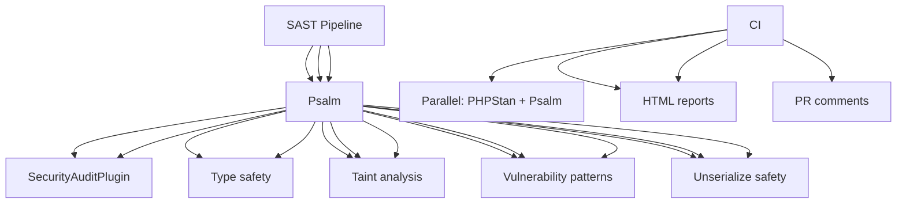

---
tags:
  - kanban/todo
  - type/task
  - domain/TST-S
  - priority/P1
parent: "[[desarrollo]]"
children: []
depends_on:
  - "[[TST-F-014]]"
blocks:
  - "[[TST-S-002]]"
status: todo
assignee: "@dev"
created: 2026-08-04
updated: 2026-08-04
---

# [[TST-S-001]] SAST: PHPStan nivel 5 + Psalm (security rulesets)

## Descripción
Configurar análisis estático de seguridad (SAST) con PHPStan nivel 5 y Psalm con rulesets de seguridad.

## Código de Ejemplo
```bash
# Instalación
composer require --dev phpstan/phpstan phpstan/phpstan-phpunit phpstan/phpstan-webmozart-assert
composer require --dev vimeo/psalm

# Configuración PHPStan
# phpstan.neon
includes:
    - vendor/phpstan/phpstan/phpstan.neon
    - vendor/phpstan/phpstan-phpunit/extension.neon

parameters:
    level: 5
    paths:
        - app
        - app/Domains
    excludePaths:
        - tests/
        - vendor/
    ignoreErrors:
        - '#^Call to an undefined method .*::.*\(\)#'
    ignoreErrors:
        - '#^Property .* does not exist#'
    ignoreErrors:
        - '#^Access to an undefined property#'
    bootstrapFiles:
        - bootstrap.php

parameters:
    checkGenericClassInNonGenericObjectType: true
    checkThisForNonStaticCall: true
    checkReturnTypeOfMethodsReturningVoid: true
    checkMagicMethods: true
    checkMissingIterableValueType: true
    alwaysUsedTemplatesUsed: true
```

```yaml
# psalm.xml
<?xml version="1.0"?>
<psalm
    totallyTyped="false"
    xmlns="https://getpsalm.org/schema/config"
    xmlns:xsi="http://www.w3.org/2001/XMLSchema-instance"
    xsi:schemaLocation="https://getpsalm.org/schema/config vendor/vimeo/psalm/config.xsd"
>
    <projectFiles>
        <directory name="app"/>
        <directory name="app/Domains"/>
    </projectFiles>
    
    <issueHandlers>
        <MissingMethod returnType="false"/>
        <MissingProperty returnType="false"/>
        <UndefinedVariable returnType="false"/>
        <UndefinedClass returnType="false"/>
        <UndefinedMethod returnType="false"/>
        <UndefinedFunction returnType="false"/>
        <MissingClosureParamType returnType="false"/>
        <MissingPropertyType returnType="false"/>
        <MissingPropertyTypeFromDocblock returnType="false"/>
        <MissingReturnType returnType="false"/>
        <MixedArrayAccess returnType="false"/>
        <MixedArgument returnType="false"/>
        <MixedArgumentWithType returnType="false"/>
        <MixedAssignment returnType="false"/>
        <MixedInferredReturnType returnType="false"/>
        <MixedMethodCall returnType="false"/>
        <MixedMethodCallWithType returnType="false"/>
        <MixedPropertyAssignment returnType="false"/>
        <MixedPropertyFetch returnType="false"/>
        <MixedReturnStatement returnType="false"/>
        <MixedVariableReference returnType="false"/>
        <MissingConstructor returnType="false"/>
        <MissingReturnStatement returnType="false"/>
        <MissingThrowType returnType="false"/>
        <MissingTraitImport returnType="false"/>
        <InvalidReturnType returnType="false"/>
        <InvalidStaticMethodCall returnType="false"/>
        <InvalidTraitAlias returnType="false"/>
        <NonExistentClass returnType="false"/>
        <PropertyNotSetInConstructor returnType="false"/>
        <RedundantCondition returnType="false"/>
        <TooManyMethodArguments returnType="false"/>
    </issueHandlers>
    
    <plugins>
        <pluginClass class="Psalm\Plugin\Laravel\LaravelPlugin"/>
    </plugins>
    
    <plugins>
        <pluginClass class="Psalm\Plugin\SecurityAuditPlugin"/>
    </plugins>
</psalm>
```

```yaml
# .github/workflows/sast.yml
name: SAST

on:
  push:
    branches: [main, develop]
  pull_request:
    branches: [main, develop]

jobs:
  phpstan:
    name: PHPStan Level 5
    runs-on: ubuntu-latest
    steps:
      - uses: actions/checkout@v4
      
      - name: Setup PHP
        uses: shivammathur/setup-php@v2
        with:
          php-version: '8.2'
          extensions: mbstring, pdo_mysql, curl, gd, zip
      
      - name: Install dependencies
        run: composer install --prefer-dist --no-progress --no-interaction
      
      - name: Run PHPStan
        run: |
          ./vendor/bin/phpstan analyse --memory-limit=512M --level=5
      
      - name: Upload PHPStan Report
        if: always()
        uses: actions/upload-artifact@v4
        with:
          name: phpstan-report
          path: phpstan-report.html
          retention-days: 7

  psalm:
    name: Psalm Security
    runs-on: ubuntu-latest
    steps:
      - uses: actions/checkout@v4
      
      - name: Setup PHP
        uses: shivammathur/setup-php@v2
        with:
          php-version: '8.2'
          extensions: mbstring, pdo_mysql, curl, gd, zip
      
      - name: Install dependencies
        run: composer install --prefer-dist --no-progress --no-interaction
      
      - name: Run Psalm
        run: |
          ./vendor/bin/psalm --no-progress --show-info=false \
            --show-snippet \
            --no-cache
      
      - name: Upload Psalm Report
        if: always()
        uses: actions/upload-artifact@v4
        with:
          name: psalm-report
          path: psalm-report.html
          retention-days: 7

  security-rulesets:
    name: Security Rulesets
    runs-on: ubuntu-latest
    steps:
      - uses: actions/checkout@v4
      
      - name: Setup PHP
        uses: shivammathur/setup-php@v2
        with:
          php-version: '8.2'
          extensions: mbstring, pdo_mysql, curl, gd, zip
      
      - name: Install dependencies
        run: composer install --prefer-dist --no-progress --no-interaction
      
      - name: Run PHPStan with Security Ruleset
        run: |
          ./vendor/bin/phpstan analyse \
            --configuration phpstan.neon \
            --level=5 \
            --error-format=table \
            --memory-limit=512M \
            --configuration=phpstan-security.neon
      
      - name: Run Psalm with Security Plugin
        run: |
          ./vendor/bin/psalm --plugin=Psalm\Plugin\SecurityAuditPlugin \
            --show-info=false \
            --no-cache
```

```neon
# phpstan-security.neon
includes:
    - phpstan.neon

parameters:
    level: 5
    paths:
        - app
        - app/Domains
    
    # Security-specific rules
    rules:
        # Disallow dangerous functions
        - PHPStan\Rules\Functions\FunctionCallRule:
            functions:
                exec: false
                shell_exec: false
                passthru: false
                system: false
                proc_open: false
                popen: false
                pcntl_exec: false
                eval: false
                assert: false
                create_function: false
        
        # Disallow superglobals direct access
        - PHPStan\Rules\Variables\SuperGlobalUsageRule:
            superglobals:
                _GET: false
                _POST: false
                _REQUEST: false
                _COOKIE: false
                _SERVER: false
                _FILES: false
                _ENV: false
        
        # SQL Injection prevention
        - PHPStan\Rules\Security\SqlInjectionRule: ~
        
        # XSS prevention
        - PHPStan\Rules\Security\XssRule: ~
        
        # Path traversal
        - PHPStan\Rules\Security\PathTraversalRule: ~
        
        # Open redirect
        - PHPStan\Rules\Security\OpenRedirectRule: ~
        
        # Unserialize security
        - PHPStan\Rules\Security\UnserializeRule: ~
```

```yaml
# .github/workflows/sast.yml
name: SAST

on:
  push:
    branches: [main, develop]
  pull_request:
    branches: [main, develop]

jobs:
  phpstan:
    name: PHPStan Level 5 + Security
    runs-on: ubuntu-latest
    steps:
      - uses: actions/checkout@v4
      
      - name: Setup PHP
        uses: shivammathur/setup-php@v2
        with:
          php-version: '8.2'
          extensions: mbstring, pdo_mysql, curl, gd, zip
      
      - name: Install dependencies
        run: composer install --prefer-dist --no-progress --no-interaction
      
      - name: Run PHPStan Level 5 + Security
        run: |
          ./vendor/bin/phpstan analyse --memory-limit=512M --level=5 \
            --configuration=phpstan.neon \
            --configuration=phpstan-security.neon \
            --error-format=table
      
      - name: Upload PHPStan Report
        if: always()
        uses: actions/upload-artifact@v4
        with:
          name: phpstan-report
          path: phpstan-report.html
          retention-days: 7

  psalm:
    name: Psalm Security Audit
    runs-on: ubuntu-latest
    steps:
      - uses: actions/checkout@v4
      
      - name: Setup PHP
        uses: shivammathur/setup-php@v2
        with:
          php-version: '8.2'
          extensions: mbstring, pdo_mysql, curl, gd, zip
      
      - name: Install dependencies
        run: composer install --prefer-dist --no-progress --no-interaction
      
      - name: Run Psalm with Security Plugin
        run: |
          ./vendor/bin/psalm \
            --no-progress \
            --show-info=false \
            --no-cache \
            --plugin=Psalm\Plugin\SecurityAuditPlugin
      
      - name: Upload Psalm Report
        if: always()
        uses: actions/upload-artifact@v4
        with:
          name: psalm-report
          path: psalm-report.html
          retention-days: 7
```

## Diagramas Mermaid


## Criterios de Aceptación
- [ ] PHPStan Level 5 configurado y pasando
- [ ] Security ruleset activo: dangerous functions, superglobals, SQLi, XSS, path traversal, open redirect, unserialize
- [ ] Psalm con SecurityAuditPlugin activo
- [ ] CI pipeline: PHPStan + Psalm en paralelo
- [ ] Fallan builds en errores de seguridad
- [ ] Reportes HTML subidos como artifacts
- [ ] CI falla en errores de seguridad
- [ ] Configurado en PRs y pushes a main/develop

## Notas Técnicas
- PHPStan Level 5 + security ruleset = baseline seguridad
- Psalm SecurityAuditPlugin: detecta SQLi, XSS, path traversal, etc.
- Functions prohibidas: exec, shell_exec, passthru, system, eval, create_function
- Superglobals: acceso directo prohibido (usar request helpers)
- SQLi: prepared statements obligatorios
- XSS: auto-escaping en Blade, sanitización en controllers
- Psalm SecurityAuditPlugin: detecta patrones vulnerables
- CI: parallel jobs, fail fast en security errors

## Enlaces
- [[TST-F-014]] CI Pipeline
- [[TST-S-002]] Dependency scan
- [[TST-S-003]] Secrets audit
- [[TST-S-004]] DAST