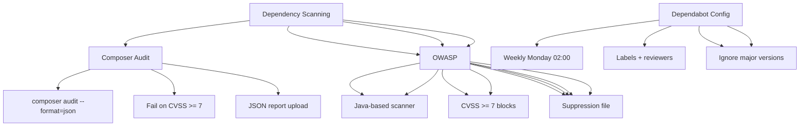

---
tags:
  - kanban/todo
  - type/task
  - domain/TST-S
  - priority/P1
parent: "[[desarrollo]]"
children: []
depends_on:
  - "[[TST-S-001]]"
blocks:
  - "[[TST-S-003]]"
status: todo
assignee: "@dev"
created: 2026-08-04
updated: 2026-08-04
---

# [[TST-S-002]] Dependency Scan: Composer Audit + GitHub Dependabot + OWASP Dependency Check

## Descripción
Configurar escaneo de dependencias vulnerables: Composer audit, GitHub Dependabot, OWASP Dependency Check.

## Código de Ejemplo
```yaml
# .github/workflows/dependency-scan.yml
name: Dependency Security Scan

on:
  push:
    branches: [main, develop]
  pull_request:
    branches: [main, develop]
  schedule:
    - cron: '0 2 * * 1'  # Weekly Monday 2 AM

jobs:
  composer-audit:
    name: Composer Audit
    runs-on: ubuntu-latest
    steps:
      - uses: actions/checkout@v4
      
      - name: Setup PHP
        uses: shivammathur/setup-php@v2
        with:
          php-version: '8.2'
      
      - name: Install dependencies
        run: composer install --prefer-dist --no-progress --no-interaction
      
      - name: Run Composer Audit
        run: |
          composer audit --format=json --no-dev > composer-audit.json || true
          cat composer-audit.json | jq '.'
      
      - name: Fail on vulnerabilities
        run: |
          if jq -e '.locked[].advisory' composer-audit.json > /dev/null; then
            echo "Vulnerabilities found!"
            exit 1
          fi
      
      - name: Upload Audit Report
        if: always()
        uses: actions/upload-artifact@v4
        with:
          name: composer-audit
          path: composer-audit.json
          retention-days: 7

  dependabot:
    name: Dependabot Alerts
    runs-on: ubuntu-latest
    steps:
      - uses: actions/checkout@v4
      
      - name: Check Dependabot Alerts
        run: |
          gh api repos/${{ github.repository }}/dependabot/alerts \
            --jq '.[] | select(.state == "open") | {package: .dependency.package.name, severity: .security_advisory.severity, url: .security_advisory.url}' \
            > dependabot-alerts.json || true
          
          if [ -s dependabot-alerts.json ]; then
            cat dependabot-alerts.json | jq -r '. | "\(.package) \(.severity) \(.url)"'
            echo "::warning::Dependabot alerts found"
          fi
      
      - name: Upload Dependabot Report
        if: always()
        uses: actions/upload-artifact@v4
        with:
          name: dependabot-alerts
          path: dependabot-alerts.json
          retention-days: 7

  owasp-dependency-check:
    name: OWASP Dependency Check
    runs-on: ubuntu-latest
    steps:
      - uses: actions/checkout@v4
      
      - name: Setup Java
        uses: actions/setup-java@v4
        with:
          distribution: 'temurin'
          java-version: '17'
      
      - name: Run OWASP Dependency Check
        run: |
          wget -q https://github.com/jeremylong/DependencyCheck/releases/download/v8.4.0/dependency-check-8.4.0-release.zip
          unzip -q dependency-check-8.4.0-release.zip
          ./dependency-check/bin/dependency-check.sh \
            --project "TG-PayGate" \
            --scan "." \
            --format "ALL" \
            --out "dependency-check-report" \
            --failOnCVSS 7 \
            --failOnCVSS 7 \
            --suppression suppressed-vulnerabilities.xml \
            --format "HTML,JSON,XML" \
            --out "dependency-check-report"
      
      - name: Upload OWASP Report
        uses: actions/upload-artifact@v4
        if: always()
        with:
          name: owasp-dependency-check
          path: dependency-check-report/
          retention-days: 7

  suppressions:
    name: Manage Suppressions
    runs-on: ubuntu-latest
    steps:
      - uses: actions/checkout@v4
      
      - name: Review Suppressions
        run: |
          # Review suppressed-vulnerabilities.xml
          # Ensure suppressions are justified and documented
          cat suppressed-vulnerabilities.xml | xmllint --format -
```

```bash
# .github/dependabot.yml
version: 2
updates:
  - package-ecosystem: "composer"
    directory: "/"
    schedule:
      interval: "weekly"
      day: "monday"
      time: "02:00"
    open-pull-requests-limit: 10
    labels:
      - "dependencies"
      - "composer"
    reviewers:
      - "dev-team"
    assignees:
      - "dev-team"
    commit-message:
      prefix: "deps(composer): "
    groups:
      laravel:
        patterns:
          - "laravel/*"
      symfony:
        patterns:
          - "symfony/*"
    allow:
      - dependency-type: "direct"
      - dependency-type: "indirect"
    ignore:
      - dependency-name: "laravel/framework"
        versions: ["10.x"]  # Wait for major version testing
    allow:
      - dependency-type: "all"
    auto-merge: false
```

```bash
# suppressed-vulnerabilities.xml
<?xml version="1.0" encoding="UTF-8"?>
<suppressions>
  <!-- Example suppression with justification -->
  <suppress>
    <cve>CVE-2023-XXXXX</cve>
    <reason>False positive: library not used in production code paths</reason>
    <expires>2025-12-31</expires>
    <approved-by>security-team</approved-by>
  </suppress>
</suppressions>
```

## Diagramas Mermaid


## Criterios de Aceptación
- [ ] Composer audit en CI: falla si CVSS >= 7
- [ ] Dependabot: weekly, auto-PR, labels, reviewers
- [ ] OWASP Dependency Check: Java-based, CVSS >= 7 block
- [ ] Suppressions: XML documentado, justificado, expiración
- [ ] CI pipeline: composer audit + dependabot + OWASP en paralelo
- [ ] Artefactos: reportes JSON/HTML subidos
- [ ] Suppressions: XML documentado, justificado, expiración, aprobado
- [ ] Notificaciones: Slack/Email en vulnerabilidades críticas

## Notas Técnicas
- Composer audit: nativo en Composer 2.2+
- Dependabot: nativo en GitHub, configuración en .github/dependabot.yml
- OWASP Dependency Check: Java-based, más completo que composer audit
- Suppressions: XML con justificación, expiración, aprobador
- CVSS >= 7 = High/Critical = bloquea build
- Composer audit: solo direct dependencies (opcional --no-dev)
- OWASP: más completo, incluye transitive dependencies

## Enlaces
- [[TST-S-001]] SAST
- [[TST-S-003]] Secrets audit
- [[TST-S-004]] DAST