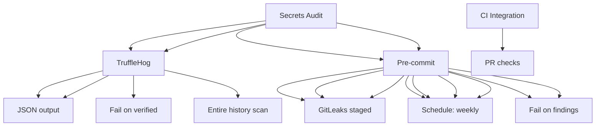

---
tags:
  - kanban/todo
  - type/task
  - domain/TST-S
  - priority/P1
parent: "[[desarrollo]]"
children: []
depends_on:
  - "[[TST-S-002]]"
blocks:
  - "[[TST-S-004]]"
status: todo
assignee: "@dev"
created: 2026-08-04
updated: 2026-08-04
---

# [[TST-S-003]] Secrets Audit: TruffleHog/GitLeaks en CI + pre-commit hook

## Descripción
Configurar detección de secretos en CI/CD y pre-commit hooks: TruffleHog y GitLeaks.

## Código de Ejemplo
```yaml
# .github/workflows/secrets-audit.yml
name: Secrets Audit

on:
  push:
    branches: [main, develop]
  pull_request:
    branches: [main, develop]
  schedule:
    - cron: '0 3 * * 0'  # Weekly Sunday 3 AM

jobs:
  trufflehog:
    name: TruffleHog
    runs-on: ubuntu-latest
    steps:
      - uses: actions/checkout@v4
        with:
          fetch-depth: 0  # Full history for TruffleHog
      
      - name: Run TruffleHog
        uses: trufflesecurity/trufflehog@main
        with:
          path: .
          extra_args: --json --fail --fail-on-verified-only
      
      - name: Upload TruffleHog Results
        if: always()
        uses: actions/upload-artifact@v4
        with:
          name: trufflehog-results
          path: trufflehog-results.json
          retention-days: 7

  gitleaks:
    name: GitLeaks
    runs-on: ubuntu-latest
    steps:
      - uses: actions/checkout@v4
        with:
          fetch-depth: 0
      
      - name: Run GitLeaks
        uses: gitleaks/gitleaks-action@v2
        with:
          args: --verbose --report-format json --report-path gitleaks-report.json
      
      - name: Upload GitLeaks Report
        if: always()
        uses: actions/upload-artifact@v4
        with:
          name: gitleaks-report
          path: gitleaks-report.json
          retention-days: 7

  pre-commit:
    name: Pre-commit Hooks
    runs-on: ubuntu-latest
    steps:
      - uses: actions/checkout@v4
      
      - name: Install pre-commit
        run: pip install pre-commit
      
      - name: Run pre-commit
        run: pre-commit run --all-files
        env:
          SKIP: no-commit-to-branch
```

```yaml
# .pre-commit-config.yaml
repos:
  - repo: https://github.com/gitleaks/gitleaks
    rev: v8.18.0
    hooks:
      - id: gitleaks
        name: gitleaks
        entry: gitleaks protect
        args: ['--staged', '--verbose']
        stages: [pre-commit]
        language: system
  
  - repo: https://github.com/trufflesecurity/trufflehog
    rev: v3.80.0
    hooks:
      - id: trufflehog
        name: trufflehog
        entry: trufflehog filesystem
        args: ['--fail', '--no-verification']
        stages: [pre-commit]
        language: system

  - repo: https://github.com/pre-commit/pre-commit-hooks
    rev: v4.6.0
    hooks:
      - id: trailing-whitespace
      - id: end-of-file-fixer
      - id: check-yaml
      - id: check-added-large-files
      - id: check-merge-conflict
      - id: detect-private-key
      - id: detect-aws-credentials
      - id: detect-private-key
```

```bash
# .gitignore - Excluir archivos sensibles
# Secrets
*.key
*.pem
*.p12
*.pfx
*.crt
*.crt
*.pem
*.key
*.p12

# Config con secrets
.env
.env.local
.env.*.local
*.env
*.env.*

# IDE/Editor
.idea/
.vscode/
*.swp
*.swo

# Logs
*.log
logs/
*.log

# OS
.DS_Store
Thumbs.db

# Testing
.phpunit.result.cache
coverage/
```

```yaml
# .github/workflows/secrets-audit.yml
name: Secrets Audit

on:
  push:
    branches: [main, develop]
  pull_request:
    branches: [main, develop]
  schedule:
    - cron: '0 4 * * 0'  # Weekly Sunday 4 AM

jobs:
  trufflehog:
    name: TruffleHog
    runs-on: ubuntu-latest
    steps:
      - uses: actions/checkout@v4
        with:
          fetch-depth: 0
      
      - name: Run TruffleHog
        uses: trufflesecurity/trufflehog@main
        with:
          path: .
          extra_args: --json --fail --fail-on-verified-only
      
      - name: Upload Results
        if: always()
        uses: actions/upload-artifact@v4
        with:
          name: trufflehog-results
          path: trufflehog-results.json
          retention-days: 7

  gitleaks:
    name: GitLeaks
    runs-on: ubuntu-latest
    steps:
      - uses: actions/checkout@v4
        with:
          fetch-depth: 0
      
      - name: Run GitLeaks
        uses: gitleaks/gitleaks-action@v2
        with:
          args: --verbose --report-format json --report-path gitleaks-report.json
      
      - name: Upload GitLeaks Report
        if: always()
        uses: actions/upload-artifact@v4
        with:
          name: gitleaks-report
          path: gitleaks-report.json
          retention-days: 7

  pre-commit:
    name: Pre-commit Hooks
    runs-on: ubuntu-latest
    steps:
      - uses: actions/checkout@v4
      
      - name: Install pre-commit
        run: pip install pre-commit
      
      - name: Run pre-commit
        run: pre-commit run --all-files
        env:
          SKIP: no-commit-to-branch
```

```bash
# Instalar pre-commit hooks localmente
pip install pre-commit
pre-commit install
pre-commit install --hook-type pre-push

# Ejecutar manualmente
pre-commit run --all-files
pre-commit run --all-files --verbose
```

```yaml
# .github/workflows/pre-commit.yml
name: Pre-commit Validation

on:
  pull_request:
    branches: [main, develop]

jobs:
  pre-commit:
    name: Pre-commit Checks
    runs-on: ubuntu-latest
    steps:
      - uses: actions/checkout@v4
      
      - name: Setup pre-commit
        run: pip install pre-commit
      
      - name: Run pre-commit
        run: pre-commit run --all-files
        env:
          SKIP: no-commit-to-branch
```

## Diagramas Mermaid


## Criterios de Aceptación
- [ ] TruffleHog: escaneo completo historial, solo verified secrets, JSON output
- [ ] GitLeaks: config .gitleaks.toml, JSON report, fail on findings
- [ ] Pre-commit hooks: gitleaks + trufflehog + basic checks
- [ ] CI integration: PR checks fallan si hay secrets
- [ ] Schedule: semanal domingo 4 AM
- [ ] Reportes: JSON artifacts subidos
- [ ] Pre-commit hooks locales instalables
- [ ] Config .gitleaks.toml personalizado
- [ ] Exclusions: falsos positivos documentados

## Notas Técnicas
- TruffleHog: `trufflesecurity/trufflehog@main`, verified-only, full history
- GitLeaks: `gitleaks/gitleaks-action@v2`, config `.gitleaks.toml`
- Pre-commit: `pre-commit` framework, hooks locales + CI
- Exclusiones documentadas en `.gitleaksignore` / `trufflehog.yaml`
- CI: falla build si hay secretos verificados
- Rate limiting: GitHub API limits para escaneos completos

## Enlaces
- [[TST-S-001]] SAST
- [[TST-S-002]] Dependency scan
- [[TST-S-004]] DAST