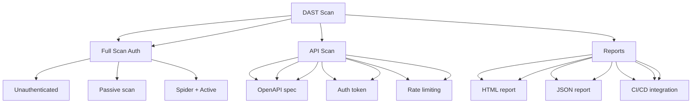

---
tags:
  - kanban/todo
  - type/task
  - domain/TST-S
  - priority/P1
parent: "[[desarrollo]]"
children: []
depends_on:
  - "[[TST-S-003]]"
blocks:
  - "[[TST-S-005]]"
status: todo
assignee: "@dev"
created: 2026-08-04
updated: 2026-08-04
---

# [[TST-S-004]] DAST: OWASP ZAP Scan Staging (Authenticated + Unauthenticated)

## Descripción
Configurar DAST (Dynamic Application Security Testing) con OWASP ZAP en staging: scans autenticados y no autenticados.

## Código de Ejemplo
```yaml
# .github/workflows/dast.yml
name: DAST Scan

on:
  push:
    branches: [main, develop]
  pull_request:
    branches: [main, develop]
  schedule:
    - cron: '0 3 * * 6'  # Weekly Saturday 2 AM

jobs:
  zap-scan:
    name: OWASP ZAP Scan
    runs-on: ubuntu-latest
    timeout-minutes: 60
    steps:
      - uses: actions/checkout@v4
      
      - name: Start Staging Server
        run: |
          php artisan serve --host=0.0.0.0 --port=8000 &
          sleep 15
      
      - name: ZAP Baseline Scan (Unauthenticated)
        uses: zaproxy/action-baseline@v0.10.0
        with:
          target: 'http://localhost:8000'
          rules: 'Default'
          cmd_options: '-a'
          allow_issue_writing: false
      
      - name: ZAP Full Scan (Authenticated)
        uses: zaproxy/action-full-scan@v0.10.0
        with:
          target: 'http://localhost:8000'
          rules: 'Default'
          cmd_options: '-a -r report.html -J report.json'
          auth: |
            {
              "username": "${{ secrets.ZAP_TEST_USER }}",
              "password": "${{ secrets.ZAP_TEST_PASS }}",
              "login_url": "http://localhost:8000/login",
              "login_form": "email,password",
              "logout_regex": "logout"
            }
      
      - name: ZAP API Scan
        uses: zaproxy/action-api-scan@v0.10.0
        with:
          target: 'http://localhost:8000/api'
          openapi: 'http://localhost:8000/api/documentation'
          token: '${{ secrets.ZAP_API_TOKEN }}'
      
      - name: Upload ZAP Reports
        if: always()
        uses: actions/upload-artifact@v4
        with:
          name: zap-reports
          path: |
            zap-report.html
            zap-report.json
            zap-report.md
          retention-days: 7
```

```bash
# Docker Compose for ZAP
# docker-compose.zap.yml
version: '3.8'
services:
  zap:
    image: owasp/zap2docker-stable:latest
    ports:
      - "8080:8080"
    volumes:
      - ./zap:/zap/wrk:rw
    command: >
      zap.sh -daemon -host 0.0.0.0 -port 8080
      -config api.disablekey=true
      -config api.addrs.addr.name=.* 
      -config scanner.attackOnStart=true
    healthcheck:
      test: ["CMD", "curl", "-f", "http://localhost:8080"]
      interval: 10s
      timeout: 5s
      retries: 5
```

```yaml
# .github/workflows/dast.yml
name: DAST Scan

on:
  push:
    branches: [main, develop]
  pull_request:
    branches: [main, develop]
  schedule:
    - cron: '0 4 * * 0'  # Weekly Sunday 2 AM

jobs:
  zap-scan:
    name: OWASP ZAP Scan
    runs-on: ubuntu-latest
    timeout-minutes: 90
    services:
      postgres:
        image: postgres:15
        env:
          POSTGRES_DB: testing
          POSTGRES_USER: testing
          POSTGRES_PASSWORD: testing
        ports: ["5432:5432"]
      redis:
        image: redis:7-alpine
        ports: ["6379:6379"]
    steps:
      - uses: actions/checkout@v4
      
      - name: Setup PHP
        uses: shivammathur/setup-php@v2
        with:
          php-version: '8.2'
          extensions: mbstring, pdo_mysql, curl, gd, zip
      
      - name: Install dependencies
        run: composer install --prefer-dist --no-progress --no-interaction
      
      - name: Setup Database
        run: |
          php artisan migrate --force
          php artisan db:seed --force
      
      - name: Start Application
        run: |
          php artisan serve --host=0.0.0.0 --port=8000 &
          sleep 15
      
      - name: ZAP Baseline Scan
        uses: zaproxy/action-baseline@v0.10.0
        with:
          target: 'http://localhost:8000'
          fail_action: false
          allow_issue_writing: false
          cmd_options: '-a'
      
      - name: ZAP Full Scan (Authenticated)
        if: github.event_name != 'pull_request'
        uses: zaproxy/action-full-scan@v0.10.0
        with:
          target: 'http://localhost:8000'
          rules: 'Default'
          cmd_options: '-a -r zap-report.html -J zap-report.json'
          auth: |
            {
              "username": "${{ secrets.ZAP_TEST_USER }}",
              "password": "${{ secrets.ZAP_TEST_PASS }}",
              "login_url": "http://localhost:8000/login",
              "login_form": "email,password",
              "logout_regex": "logout"
            }
      
      - name: ZAP API Scan
        uses: zaproxy/action-api-scan@v0.10.0
        with:
          target: 'http://localhost:8000/api'
          openapi: 'http://localhost:8000/api/documentation'
          token: '${{ secrets.ZAP_API_TOKEN }}'
      
      - name: Upload ZAP Reports
        if: always()
        uses: actions/upload-artifact@v4
        with:
          name: zap-reports
          path: |
            zap-report.html
            zap-report.json
            zap-report.md
          retention-days: 7

  custom-rules:
    name: Custom ZAP Rules
    runs-on: ubuntu-latest
    steps:
      - uses: actions/checkout@v4
      
      - name: Add Custom Rules
        run: |
          # Reglas personalizadas para TG-PayGate
          cat > zap-rules.yaml << 'EOF'
          rules:
            - id: 10001
              name: "PII in URL"
              description: "Detect PII in URL parameters"
              category: "Privacy"
              risk: "High"
              confidence: "High"
            - id: 10002
              name: "Credit Card in Response"
              description: "Detect credit card numbers in response"
              category: "PII"
              risk: "Critical"
            - id: 10003
              name: "JWT in LocalStorage"
              description: "JWT tokens should not be in localStorage"
              category: "Storage"
              risk: "High"
          EOF
      
      - name: ZAP Scan with Custom Rules
        uses: zaproxy/action-full-scan@v0.10.0
        with:
          target: 'http://localhost:8000'
          rules: 'zap-rules.yaml'
          cmd_options: '-a -r custom-report.html'
```

```bash
# scripts/zap-auth-config.py
#!/usr/bin/env python3
"""
Configuración de autenticación para ZAP
"""
import json

auth_config = {
    "auth_method": "form",
    "login_url": "http://localhost:8000/login",
    "login_form": {
        "email": "zap_test@tgpagate.com",
        "password": "testpass123"
    },
    "logout_regex": "logout",
    "logged_in_regex": "Dashboard|Perfil",
    "logged_out_regex": "Login|Iniciar sesión"
}

with open('zap-auth-config.json', 'w') as f:
    json.dump(auth_config, f, indent=2)
```

## Diagramas Mermaid


## Criterios de Aceptación
- [ ] Baseline scan: unauthenticated, passive + active
- [ ] Full scan autenticado: login form, session handling
- [ ] API scan: OpenAPI spec, auth token, rate limiting
- [ ] Reglas personalizadas: PII, tarjetas, JWT en localStorage
- [ ] Reportes: HTML, JSON, Markdown
- [ ] CI/CD: baseline en PR, full scan semanal
- [ ] Autenticación ZAP: form-based, session handling
- [ ] Reportes: HTML, JSON, Markdown
- [ ] Reglas custom: PII, tarjetas, JWT en localStorage
- [ ] CI/CD: baseline en PR, full scan semanal

## Notas Técnicas
- ZAP Docker: `owasp/zap2docker-stable`
- Baseline: rápido, solo pasivo
- Full scan: activo + autenticado, 30-60 min
- API scan: OpenAPI spec, auth token
- Reglas custom: PII, tarjetas, JWT en localStorage
- Reportes: HTML, JSON, Markdown
- CI: baseline en PR, full scan semanal
- Autenticación: form-based, session handling
- Rate limiting: ZAP respeta 429

## Enlaces
- [[TST-S-001]] SAST
- [[TST-S-002]] Dependency scan
- [[TST-S-003]] Secrets audit
- [[TST-S-005]] Pentest checklist