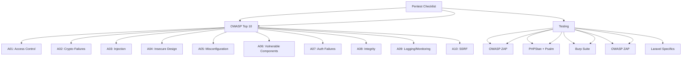

---
tags:
  - kanban/todo
  - type/task
  - domain/TST-S
  - priority/P1
parent: "[[desarrollo]]"
children: []
depends_on:
  - "[[TST-S-004]]"
blocks:
  - "[[TST-S-006]]"
status: todo
assignee: "@dev"
created: 2026-08-04
updated: 2026-08-04
---

# [[TST-S-005]] Pentest Checklist: OWASP Top 10 + Laravel Specific (Mass Assignment, SQLi, XSS, CSRF)

## Descripción
Checklist completo de pentesting basado en OWASP Top 10 + vulnerabilidades específicas de Laravel.

## Código de Ejemplo
```markdown
# Pentest Checklist - TG-PayGate

## OWASP Top 10 (2021)

### A01: Broken Access Control
- [ ] Verificar autorización en todas las rutas (Policy + Gates)
- [ ] Probar IDOR en: `/api/channels/{id}`, `/api/subscriptions/{id}`, `/api/payouts/{id}`
- [ ] Probar acceso a recursos de otros usuarios (IDOR)
- [ ] Verificar que `Gate::allows()` / `$this->authorize()` en todos los controllers
- [ ] Probar bypass de middleware `EnsureCorrectSubdomain`

### A02: Cryptographic Failures
- [ ] Verificar TLS 1.2+ en producción
- [ ] Verificar HSTS, CSP, Secure cookies
- [ ] Validar cifrado AES-256 para tokens Telegram (`encrypted` cast)
- [ ] Verificar que no hay datos sensibles en logs
- [ ] Comprobar HTTPS redirect forzado

### A03: Injection
- [ ] SQLi: Probar en todos los inputs (search, filters, IDs)
- [ ] NoSQL injection (si aplica MongoDB)
- [ ] Command injection: `exec`, `shell_exec`, `passthru`, `system`
- [ ] LDAP injection (si aplica)
- [ ] XPATH injection (si aplica)

### A04: Insecure Design
- [ ] Rate limiting en login, register, password reset, checkout
- [ ] Captcha/honeypot en formularios públicos
- [ ] Validación de business logic (precios negativos, cantidades negativas)
- [ ] Validación de race conditions (pagos concurrentes)

### A05: Security Misconfiguration
- [ ] `APP_DEBUG=false` en producción
- [ ] `APP_DEBUG` no expone stack traces
- [ ] Headers de seguridad: CSP, HSTS, X-Frame-Options
- [ ] `.env` no accesible via web
- [ ] Debugbar/Telescope deshabilitado en prod

### A05: Vulnerable and Outdated Components
- [ ] `composer audit` sin vulnerabilidades críticas
- [ ] `npm audit` sin vulnerabilidades críticas
- [ ] Dependabot configurado y activo
- [ ] OWASP Dependency Check pasado

### A07: Identification and Authentication Failures
- [ ] Rate limiting: login (5/min), register (3/min), password reset (2/hora)
- [ ] 2FA opcional/obligatorio para staff/admin
- [ ] Session timeout configurado (120 min)
- [ ] Password policy: min 8 chars, complejidad
- [ ] Account lockout tras 5 intentos fallidos

### A08: Software and Data Integrity Failures
- [ ] Signed commits (GPG)
- [ ] CI/CD verifica firmas
- [ ] Composer: `composer install --no-dev --no-interaction`
- [ ] NPM: `npm ci` con lockfile
- [ ] CI/CD pipeline verifica integridad

### A09: Security Logging and Monitoring Failures
- [ ] Logs de seguridad: login fallidos, cambios permisos, accesos admin
- [ ] Alertas: 5+ login fallidos/15min, acceso admin fuera horario
- [ ] Retención logs: 90 días mínimo
- [ ] Alertas: Telegram/Email en eventos críticos

### A10: Server-Side Request Forgery (SSRF)
- [ ] Validar URLs en webhooks (allowlist dominios)
- [ ] No fetch arbitrario de URLs user-provided
- [ ] Validar URLs en webhooks MercadoPago/Stripe/PayPal

## Laravel Specific Vulnerabilities

### Mass Assignment
- [ ] `$fillable` / `$guarded` en todos los Models
- [ ] `$request->validated()` usado en controllers
- [ ] `$request->safe()->only([...])` en formularios
- [ ] No `$request->all()` en updates masivos

### SQL Injection
- [ ] Eloquent ORM usado (query builder parameter binding)
- [ ] No `DB::raw()` con input usuario sin sanitizar
- [ ] `whereRaw` / `whereRaw` solo con bindings

### Cross-Site Scripting (XSS)
- [ ] Blade `{{ }}` escapa automáticamente
- [ ] `@verbatim` solo donde necesario
- [ ] `v-html` en Vue/Alpine solo con sanitización
- [ ] CSP header configurado

### Cross-Site Request Forgery (CSRF)
- [ ] `@csrf` en todos los formularios
- [ ] `VerifyCsrfToken` middleware activo
- [ ] API: Sanctum tokens + CSRF token en SPA
- [ ] Exclusiones CSRF solo para webhooks (Stripe, MP, PayPal)

### Laravel Specific
- [ ] `.env` no en repo, `.env.example` sí
- [ ] `APP_KEY` rotada en producción
- [ ] `APP_DEBUG=false` en producción
- [ ] `APP_ENV=production`
- [ ] Queue workers: `--tries=3 --timeout=60 --memory=128`
- [ ] Schedule: `withoutOverlapping()`, `runInBackground()`
- [ ] Policies registradas en `AuthServiceProvider`
- [ ] Gates para permisos complejos
- [ ] Scopes en modelos (query scopes)
- [ ] Observers para auditoría automática
- [ ] Soft deletes donde aplica
- [ ] Encryption: `Crypt::encryptString()` para tokens/secrets
- [ ] Hashing: `Hash::make()` (bcrypt/argon2)
- [ ] Signed URLs para enlaces temporales
- [ ] Signed URLs expiration configurada
```

## Diagramas Mermaid


## Criterios de Aceptación
- [ ] Checklist OWASP Top 10 completo (10 categorías)
- [ ] Checklist Laravel específico: 10+ items
- [ ] Testing tools documentados: OWASP ZAP, Burp Suite, PHPStan, Psalm
- [ ] Checklist ejecutable: checklist interactivo en markdown
- [ ] Evidencias requeridas: capturas, logs, reportes
- [ ] Frecuencia: Pentest completo cada release mayor, trimestral
- [ ] Responsable: Security team / Pentester externo anual
- [ ] Reporte: Ejecutivo + Técnico + Plan de remediación

## Notas Técnicas
- Herramientas: OWASP ZAP, Burp Suite, SQLMap, SQLMap, Nikto
- Laravel: Laravel Security Checker, Laravel Security Auditor
- CI/CD: Integrar en pipeline (SAST, DAST, Dependency Check)
- Frecuencia: Release mayor = pentest completo, Trimestral = scan automatizado
- Reporte: Ejecutivo + Técnico + Plan remediación + Timeline

## Enlaces
- [[TST-S-004]] DAST
- [[TST-S-006]] Auth security
- [[TST-S-007]] API security
- [[TST-S-008]] File upload
- [[TST-S-009]] Encryption