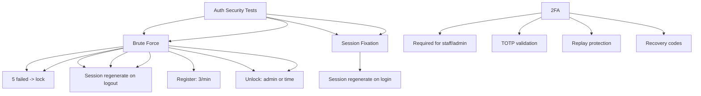

---
tags:
  - kanban/todo
  - type/task
  - domain/TST-S
  - priority/P1
parent: "[[desarrollo]]"
children: []
depends_on:
  - "[[TST-S-005]]"
blocks:
  - "[[TST-S-007]]"
status: todo
assignee: "@dev"
created: 2026-08-04
updated: 2026-08-04
---

# [[TST-S-006]] Auth Security: Rate Limiting, Brute Force, Session Fixation, 2FA Bypass

## Descripción
Tests de seguridad específicos para autenticación: rate limiting, prevención de brute force, protección contra session fixation, bypass de 2FA.

## Código de Ejemplo
```php
// tests/Feature/Security/AuthSecurityTest.php
uses()->group('security', 'auth');

test('rate limiting on login endpoint', function () {
    for ($i = 0; $i < 6; $i++) {
        $response = $this->post(route('login'), [
            'email' => 'test@test.com',
            'password' => 'wrongpassword',
        ]);
    }
    
    // 6th request should be rate limited
    $response = $this->post(route('login'), [
        'email' => 'test@test.com',
        'password' => 'wrongpassword',
    ]);
    
    $response->assertStatus(429)
             ->assertSessionHasErrors('email');
});

test('brute force protection locks account', function () {
    $user = User::factory()->create(['password' => Hash::make('password123')]);
    
    // 5 failed attempts
    for ($i = 0; $i < 5; $i++) {
        $this->post(route('login'), [
            'email' => $user->email,
            'password' => 'wrongpassword',
        ]);
    }
    
    // Account should be locked
    $user->refresh();
    expect($user->locked_until)->not->toBeNull();
    
    // Valid credentials should fail while locked
    $response = $this->post(route('login'), [
        'email' => $user->email,
        'password' => 'correctpassword',
    ]);
    $response->assertSessionHasErrors();
});

test('session fixation prevented on login', function () {
    $user = User::factory()->create();
    
    // Get session before login
    $sessionBefore = session()->getId();
    
    $response = $this->post(route('login'), [
        'email' => $user->email,
        'password' => 'password123',
    ]);
    
    $response->assertRedirect();
    
    // Session should be regenerated
    expect(session()->getId())->not->toBe($sessionBefore);
});

test('2FA bypass attempt blocked', function () {
    $user = User::factory()->create([
        'two_factor_confirmed_at' => now(),
        'two_factor_secret' => encrypt('secret'),
    ]);
    
    // Try login without 2FA code
    $response = $this->post(route('login'), [
        'email' => $user->email,
        'password' => 'password123',
    ]);
    
    // Should ask for 2FA code
    $response->assertSessionHasNoErrors();
    // Should redirect to 2FA challenge
    $response->assertRedirect(route('2fa.challenge'));
});

test('2FA replay attack prevented', function () {
    $user = User::factory()->create([
        'two_factor_confirmed_at' => now(),
        'two_factor_secret' => encrypt('secret'),
    ]);
    
    $code = (new \OTP\TOTP())->create('secret');
    
    // First use - should work
    $response = $this->actingAs($user)->post(route('2fa.verify'), [
        'code' => $code,
    ]);
    $response->assertRedirect();
    
    // Second use of same code - should fail
    $response = $this->actingAs($user)->post(route('2fa.verify'), [
        'code' => $code,
    ]);
    
    $response->assertSessionHasErrors('code');
});
```

```php
// tests/Feature/Auth/RateLimitTest.php
uses()->group('security', 'auth', 'ratelimit');

test('login rate limit: 5 requests per minute', function () {
    for ($i = 0; $i < 5; $i++) {
        $this->post(route('login'), [
            'email' => 'test@test.com',
            'password' => 'wrong',
        ]);
    }
    
    $response = $this->post(route('login'), [
        'email' => 'test@test.com',
        'password' => 'wrong',
    ]);
    
    $response->assertStatus(429);
});

test('password reset rate limit: 2 per hour', function () {
    for ($i = 0; $i < 2; $i++) {
        $this->post(route('password.email'), ['email' => 'test@test.com']);
    }
    
    $response = $this->post(route('password.email'), ['email' => 'test@test.com']);
    $response->assertStatus(429);
});

test('registration rate limit: 3 per minute', function () {
    for ($i = 0; $i < 3; $i++) {
        $this->post(route('register'), [
            'name' => 'Test',
            'email' => "test{$i}@test.com",
            'password' => 'password123',
            'password_confirmation' => 'password123',
        ]);
    }
    
    $response = $this->post(route('register'), [
        'name' => 'Test',
        'email' => 'test3@test.com',
        'password' => 'password123',
        'password_confirmation' => 'password123',
    ]);
    $response->assertStatus(429);
});
```

## Diagramas Mermaid


## Criterios de Aceptación
- [ ] Rate limiting: login 5/min, password reset 2/hr, register 3/min
- [ ] Brute force: 5 failed attempts -> lock 15min
- [ ] Session fixation: session ID regenerates on login
- [ ] 2FA: TOTP required for staff/admin, replay attack prevented
- [ ] Rate limit headers: X-RateLimit-Limit, X-RateLimit-Remaining
- [ ] Lockout: account locked after 5 failed, unlock via admin or time
- [ ] Session fixation: session ID regenerates on login
- [ ] 2FA bypass: direct login without code blocked
- [ ] 2FA replay: same TOTP code rejected on second use

## Notas Técnicas
- Rate limiter: `RateLimiter::for('login', ...)` en RouteServiceProvider
- Brute force: cache key `login_attempts:{ip}:{email}`
- Session fixation: `session()->regenerate()` en LoginController
- 2FA: Laravel Fortify / Laravel Two Factor Authentication
- TOTP: `OTP\TOTP` library, RFC 6238
- Rate limit headers: `RateLimit-Limit`, `RateLimit-Remaining`, `RateLimit-Reset`

## Enlaces
- [[TST-S-005]] Pentest checklist
- [[TST-S-007]] API security
- [[TST-F-003]] Feature tests Auth