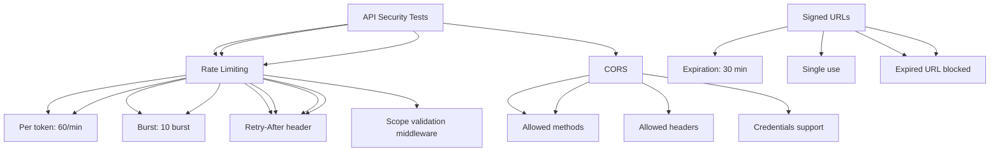

---
tags:
  - kanban/todo
  - type/task
  - domain/TST-S
  - priority/P1
parent: "[[desarrollo]]"
children: []
depends_on:
  - "[[TST-S-006]]"
blocks:
  - "[[TST-S-008]]"
status: todo
assignee: "@dev"
created: 2026-08-04
updated: 2026-08-04
---

# [[TST-S-007]] API Security: Token Scopes, Rate Limits, CORS, Signed URLs

## Descripción
Tests de seguridad para API: validación de scopes de tokens, rate limiting por token, CORS, URLs firmadas.

## Código de Ejemplo
```php
// tests/Feature/Security/ApiSecurityTest.php
uses()->group('security', 'api');

test('API token requires valid scope', function () {
    $token = ApiToken::factory()->create([
        'scopes' => ['read:channels'],
        'expires_at' => now()->addYear(),
    ]);
    
    // Token con scope read:channels puede acceder
    $response = $this->withHeaders([
        'Authorization' => 'Bearer ' . decrypt($token->token),
    ])->getJson(route('api.channels.index'));
    
    $response->assertStatus(200);
    
    // Sin scope write:webhooks no puede crear webhook
    $response = $this->withHeaders([
        'Authorization' => 'Bearer ' . decrypt($token->token),
    ])->postJson(route('api.webhooks.store'), [
        'url' => 'https://example.com/webhook',
    ]);
    
    $response->assertStatus(403);
});

test('API token rate limiting per token', function () {
    $token = ApiToken::factory()->create([
        'scopes' => ['read:channels'],
    ]);
    
    // 60 requests in 1 minute should be allowed
    for ($i = 0; $i < 60; $i++) {
        $response = $this->withHeaders([
            'Authorization' => 'Bearer ' . decrypt($token->token),
        ])->getJson(route('api.channels.index'));
        
        $response->assertStatus(200);
    }
    
    // 61st request should be rate limited
    $response = $this->withHeaders([
        'Authorization' => 'Bearer ' . decrypt($token->token),
    ])->getJson(route('api.channels.index'));
    
    $response->assertStatus(429);
});

test('CORS headers configured correctly', function () {
    $response = $this->optionsJson(route('api.channels.index'), [], [
        'Origin' => 'https://app.tgpagate.com',
        'Access-Control-Request-Method' => 'GET',
        'Access-Control-Request-Headers' => 'Authorization',
    ]);
    
    $response->assertHeader('Access-Control-Allow-Origin', 'https://app.tgpagate.com')
             ->assertHeader('Access-Control-Allow-Methods', 'GET, POST, PUT, PATCH, DELETE, OPTIONS')
             ->assertHeader('Access-Control-Allow-Headers', 'Authorization, Content-Type, X-Requested-With')
             ->assertHeader('Access-Control-Allow-Credentials', 'true')
             ->assertHeader('Access-Control-Max-Age', '86400');
});

test('CORS preflight blocked for unauthorized origins', function () {
    $response = $this->optionsJson(route('api.channels.index'), [], [
        'Origin' => 'https://evil.com',
        'Access-Control-Request-Method' => 'GET',
    ]);
    
    $response->assertStatus(403)
             ->assertHeaderMissing('Access-Control-Allow-Origin');
});

test('signed URLs expire and are single-use', function () {
    $url = URL::temporarySignedRoute(
        'subscription.activate',
        now()->addMinutes(30),
        ['subscription' => 1, 'token' => 'abc123']
    );
    
    // Valid signed URL works
    $response = $this->get($url);
    $response->assertStatus(200);
    
    // Same URL used again should fail (single use)
    $response = $this->get($url);
    $response->assertStatus(403);
    
    // Expired URL fails
    $expiredUrl = URL::temporarySignedRoute(
        'subscription.activate',
        now()->subMinute(),
        ['subscription' => 1, 'token' => 'abc123']
    );
    
    $response = $this->get($expiredUrl);
    $response->assertStatus(403);
});

test('API tokens cannot be used for web routes', function () {
    $token = ApiToken::factory()->create([
        'scopes' => ['read:channels'],
    ]);
    
    // Try to access web route with API token
    $response = $this->withHeaders([
        'Authorization' => 'Bearer ' . decrypt($token->token),
    ])->get(route('creadores.dashboard'));
    
    $response->assertStatus(403);
});
```

## Diagramas Mermaid


## Criterios de Aceptación
- [ ] Token scopes: read:channels, write:webhooks, read:analytics, write:channels
- [ ] Scope validation: middleware verifica scope requerido
- [ ] Rate limiting: 60 req/min por token, burst 10
- [ ] Rate limit headers: X-RateLimit-Limit, Remaining, Retry-After
- [ ] CORS: Origin validation, allowed methods/headers, credentials
- [ ] Signed URLs: expiración 30 min, single use, expiradas bloqueadas
- [ ] API tokens no funcionan en rutas web (solo API)
- [ ] Tokens revocados/ expirados rechazados
- [ ] Rate limit headers: X-RateLimit-Limit, Remaining, Reset

## Notas Técnicas
- Middleware `CheckTokenScopes` para validar scopes
- Rate limiter: `RateLimiter::for('api', ...)` con `by('token')`
- CORS: `fruitcake/laravel-cors` o middleware personalizado
- Signed URLs: `URL::temporarySignedRoute()`, `URL::hasValidSignature()`
- Token validation: middleware `auth:api` + `CheckTokenScopes`
- Rate limiter: `RateLimiter::for('api', fn() => Limit::perMinute(60)->by('token'))`

## Enlaces
- [[TST-S-006]] Auth security
- [[TST-S-008]] File upload security
- [[TST-S-009]] Encryption
- [[CRE-008]] API Tokens creadores