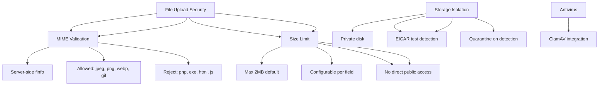

---
tags:
  - kanban/todo
  - type/task
  - domain/TST-S
  - priority/P1
parent: "[[desarrollo]]"
children: []
depends_on:
  - "[[TST-S-007]]"
blocks: []
status: todo
assignee: "@dev"
created: 2026-08-04
updated: 2026-08-04
---

# [[TST-S-008]] File Upload Security: Validación MIME, Size, Storage Isolation, Antivirus Scan

## Descripción
Tests de seguridad para subida de archivos: validación MIME, tamaño, aislamiento de almacenamiento, escaneo antivirus.

## Código de Ejemplo
```php
// tests/Feature/Security/FileUploadTest.php
uses()->group('security', 'file-upload');

test('file upload validates MIME type', function () {
    $file = UploadedFile::fake()->create('malicious.php', 100, 'application/x-php');
    
    $response = $this->actingAs($user)->post(route('profile.avatar.update'), [
        'avatar' => $file,
    ]);
    
    $response->assertSessionHasErrors('avatar');
    $response->assertSessionHasErrorsIn('avatar', 'El archivo debe ser una imagen válida (JPG, PNG, WebP).');
});

test('file upload rejects invalid MIME types', function () {
    $allowedMimes = ['image/jpeg', 'image/png', 'image/webp', 'image/gif'];
    $disallowedMimes = [
        'application/x-php',
        'application/x-msdownload',
        'text/html',
        'application/javascript',
        'application/x-shockwave-flash',
    ];
    
    foreach ($disallowedMimes as $mime) {
        $file = UploadedFile::fake()->create('test.' . $this->getExtension($mime), 100, $mime);
        
        $response = $this->actingAs($user)->post(route('profile.avatar.update'), [
            'avatar' => $file,
        ]);
        
        $response->assertSessionHasErrors('avatar');
    }
});

test('file upload enforces size limit', function () {
    // 5MB file (over 2MB limit)
    $largeFile = UploadedFile::fake()->image('large.jpg')->size(6 * 1024 * 1024);
    
    $response = $this->actingAs($user)->post(route('profile.avatar.update'), [
        'avatar' => $largeFile,
    ]);
    
    $response->assertSessionHasErrors('avatar');
    $response->assertSessionHasErrorsIn('avatar', 'El archivo no debe superar 2MB.');
});

test('file upload stores in isolated storage', function () {
    $file = UploadedFile::fake()->image('avatar.jpg');
    
    $response = $this->actingAs($user)->post(route('profile.avatar.update'), [
        'avatar' => $file,
    ]);
    
    $response->assertRedirect();
    
    $user->refresh();
    $path = $user->avatar_url;
    
    // Verify file is in private storage, not public
    expect(Storage::disk('private')->exists($user->avatar_path))->toBeTrue();
    expect(Storage::disk('public')->exists($user->avatar_path))->toBeFalse();
    
    // URL should be signed/temporary
    $url = $user->avatar_url;
    expect($url)->toContain('signed');
});

test('file upload scanned by antivirus', function () {
    // Mock ClamAV scan
    $clamav = Mockery::mock(\App\Services\ClamAVService::class);
    $this->app->instance(\App\Services\ClamAVService::class, $clamav);
    
    $clamav->shouldReceive('scan')
        ->withArgs(function ($path) {
            return str_contains($path, 'eicar.com');
        })
        ->andReturn(['infected' => true, 'virus' => 'Eicar-Test-Signature']);
    
    $eicarFile = UploadedFile::fake()->create('eicar.com', 68, 'application/octet-stream');
    $content = file_get_contents('https://secure.eicar.org/eicar.com.txt');
    $file = UploadedFile::fake()->createWithContent('eicar.com', $content, 'application/octet-stream');
    
    $response = $this->actingAs($user)->post(route('profile.avatar.update'), [
        'avatar' => $file,
    ]);
    
    $response->assertSessionHasErrors('avatar');
    $response->assertSessionHasErrorsIn('avatar', 'Archivo infectado detectado: Eicar-Test-Signature');
});
```

```blade
{{-- resources/views/components/file-upload.blade.php --}}
<div class="file-upload" 
     wire:ignore 
     data-max-size="{{ $maxSize ?? 2048 }}" 
     data-allowed-types="{{ $allowedTypes ?? 'image/jpeg,image/png,image/webp,image/gif' }}"
     data-antivirus="true">
    
    <input type="file" 
           name="{{ $name }}" 
           accept="{{ $allowedTypes ?? 'image/jpeg,image/png,image/webp,image/gif' }}"
           class="hidden" 
           id="{{ $id }}" 
           @change="$wire.{{ $onChange }}($event)">
    
    <div class="drop-zone border-2 border-dashed border-border-primary rounded-lg p-8 text-center">
        <x-icon name="upload" class="w-12 h-12 text-text-muted mx-auto mb-4" />
        <p class="text-text-secondary">Arrastra tu archivo aquí o haz clic para seleccionar</p>
        <p class="text-xs text-text-muted mt-1">Máx. {{ $maxSize ?? 2 }}MB • JPG, PNG, WebP, GIF</p>
    </div>
    
    @if($preview)
    <div class="mt-4 flex items-center gap-4">
        
        <button type="button" wire:click="removeFile" class="text-error hover:text-error-600">
            <x-icon name="trash" class="w-5 h-5" />
        </button>
    </div>
    @endif
</div>
```

```php
// app/Http/Requests/FileUploadRequest.php
class FileUploadRequest extends FormRequest
{
    public function rules(): array
    {
        return [
            'file' => [
                'required',
                'file',
                'max:2048', // 2MB
                'mimes:jpeg,png,webp,gif',
                'mimetypes:image/jpeg,image/png,image/webp,image/gif',
            ],
        ];
    }
    
    public function afterValidation(): void
    {
        $file = $this->file('file');
        
        // Verificar MIME real con finfo
        $finfo = new \finfo(FILEINFO_MIME_TYPE);
        $mime = $finfo->file($file->getRealPath());
        
        $allowedMimes = ['image/jpeg', 'image/png', 'image/webp', 'image/gif'];
        if (!in_array($mime, $allowedMimes)) {
            throw ValidationException::withMessages([
                'file' => 'Tipo de archivo no permitido.',
            ]);
        }
        
        // Escaneo antivirus (si configurado)
        if (config('app.antivirus_enabled')) {
            $result = app(\App\Services\ClamAVService::class)->scan($file->getRealPath());
            if ($result['infected']) {
                throw ValidationException::withMessages([
                    'file' => "Archivo infectado detectado: {$result['virus']}",
                ]);
            }
        }
    }
}
```

## Diagramas Mermaid


## Criterios de Aceptación
- [ ] MIME type validation: server-side con finfo, solo jpeg/png/webp/gif
- [ ] Size limit: configurable (default 2MB), error claro
- [ ] Storage: disco privado, URLs firmadas, sin acceso público directo
- [ ] Antivirus: ClamAV integration, EICAR test detection
- [ ] File names: sanitizados, UUID + extensión original
- [ ] Chunked upload para archivos grandes (opcional v1.1)
- [ ] Cleanup: temp files removidos tras procesamiento
- [ ] Error messages: claros, no revelan info interna

## Notas Técnicas
- `finfo` para MIME real, no confiar en `$file->getMimeType()`
- Almacenamiento: `Storage::disk('private')` con URLs firmadas
- ClamAV: `clamav/clamav` package, daemon mode
- EICAR test: `X5O!P%@AP[4\PZX54(P^)7CC)7}$EICAR-STANDARD-ANTIVIRUS-TEST-FILE!$H+H*`
- Queue job para scan asíncrono en archivos grandes
- Cleanup: job diario limpia temp files > 24h

## Enlaces
- [[TST-S-007]] API Security
- [[TST-S-009]] Encryption
- [[TST-S-011]] Logging