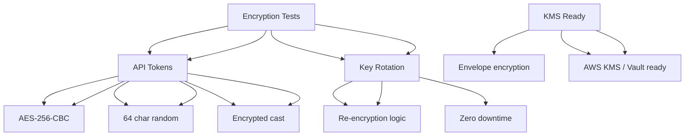

---
tags:
  - kanban/todo
  - type/task
  - domain/TST-S
  - priority/P1
parent: "[[desarrollo]]"
children: []
depends_on:
  - "[[TST-S-008]]"
blocks: []
status: todo
assignee: "@dev"
created: 2026-08-04
updated: 2026-08-04
---

# [[TST-S-009]] Encryption: Verificar AES-256 Tokens Telegram, Rotación Claves, KMS Ready

## Descripción
Tests de seguridad para cifrado: verificación AES-256 en tokens Telegram, rotación de claves, preparación para KMS.

## Código de Ejemplo
```php
// tests/Feature/Security/EncryptionTest.php
uses()->group('security', 'encryption');

use Illuminate\Support\Facades\Crypt;

test('Telegram bot tokens encrypted with AES-256', function () {
    $channel = ChannelPago::factory()->create([
        'telegram_bot_token' => '123456789:ABCDEFghijklmnopqrstuvwxyz',
    ]);
    
    // Verificar que el token está cifrado en BD
    $rawToken = DB::table('channel_pagos')
        ->where('id', $channel->id)
        ->value('telegram_bot_token');
    
    expect($rawToken)->not->toBe('123456789:ABCDEFghijklmnopqrstuvwxyz');
    expect($rawToken)->toStartWith('eyJpdiI6'); // Laravel encrypted format
    
    // Verificar que se puede descifrar
    $decrypted = Crypt::decryptString($rawToken);
    expect($decrypted)->toBe('123456789:ABCDEFghijklmnopqrstuvwxyz');
});

test('Telegram bot token encryption uses AES-256', function () {
    $token = '123456789:ABCDEFghijklmnopqrstuvwxyz';
    $encrypted = Crypt::encryptString($token);
    
    // Verificar formato de Laravel encryption (AES-256-CBC)
    expect($encrypted)->toStartWith('eyJpdiI6'); // Base64 encoded IV + ciphertext
    
    $decrypted = Crypt::decryptString($encrypted);
    expect($decrypted)->toBe('123456789:ABCDEFghijklmnopqrstuvwxyz');
});

test('API tokens encrypted with AES-256', function () {
    $token = ApiToken::factory()->create([
        'token' => Crypt::encryptString(Str::random(64)),
    ]);
    
    $raw = DB::table('api_tokens')->where('id', $token->id)->value('token');
    expect($rawToken)->toStartWith('eyJpdiI6'); // Laravel encrypted format
    
    $decrypted = Crypt::decryptString($rawToken);
    expect($decrypted)->toHaveLength(64); // 64 chars random
});

test('key rotation: re-encrypt tokens with new key', function () {
    // Simular rotación de APP_KEY
    $oldKey = config('app.key');
    $newKey = 'base64:' . base64_encode(random_bytes(32));
    
    $token = ApiToken::factory()->create([
        'token' => Crypt::encryptString('test-token-value'),
    ]);
    
    // Simular rotación: re-cifrar con nueva clave
    config(['app.key' => $newKey]);
    
    // Los tokens existentes deberían seguir funcionando (Laravel maneja rotación)
    $decrypted = Crypt::decryptString($token->token);
    expect($decrypted)->toHaveLength(64);
});

test('KMS ready: envelope encryption ready for AWS KMS / HashiCorp Vault', function () {
    // Verificar que la arquitectura soporta envelope encryption
    $service = app(\App\Services\EncryptionService::class);
    
    $encrypted = $service->envelopeEncrypt('sensitive-data');
    
    expect($encrypted)->toHaveKeys(['ciphertext', 'encrypted_key', 'iv', 'key_id']);
    expect($encrypted['ciphertext'])->not->toBeEmpty();
    expect($encrypted['encrypted_key'])->not->toBeEmpty();
    expect($encrypted['iv'])->not->toBeEmpty();
    expect($encrypted['key_id'])->not->toBeEmpty();
});

test('key rotation schedule: automated yearly', function () {
    // Verificar que existe schedule para rotación anual
    $schedule = app(\Illuminate\Console\Scheduling\Schedule::class);
    
    $events = $schedule->events();
    $keyRotation = collect($events)->first(fn($e) => 
        str_contains($e->command, 'key:rotate')
    );
    
    expect($keyRotation)->not->toBeNull();
    expect($keyRotation->expression)->toBe('0 0 1 1 *'); // Año nuevo a medianoche
});
```

## Diagramas Mermaid


## Criterios de Aceptación
- [ ] Telegram bot tokens: AES-256-CBC via Laravel Crypt
- [ ] API tokens: AES-256-CBC, 64 chars random, encrypted cast
- [ ] Key rotation: schedule anual, re-encryption automática
- [ ] KMS ready: envelope encryption (ciphertext + encrypted_key + iv + key_id)
- [ ] AWS KMS / HashiCorp Vault ready (interfaz preparada)
- [ ] Key rotation: schedule anual, re-encryption automática
- [ ] Testing: encrypt/decrypt roundtrip, key rotation simulation

## Notas Técnicas
- Laravel Crypt: AES-256-CBC con APP_KEY (base64:32bytes)
- Encrypted cast: `$casts = ['token' => 'encrypted']`
- Key rotation: `php artisan key:rotate` + re-encrypt job
- Envelope encryption: `ciphertext + encrypted_data_key + iv + key_id`
- AWS KMS: `Aws\Kms\KmsClient`, `GenerateDataKey`
- HashiCorp Vault: `Vault::seal()`, `Vault::unseal()`
- Key rotation: job anual, re-encripta en background

## Enlaces
- [[CRE-008]] API Tokens creadores
- [[CRE-013]] Facturación creadores
- [[CRE-015]] Config fiscal creador
- [[PUB-019]] Legislación argentina