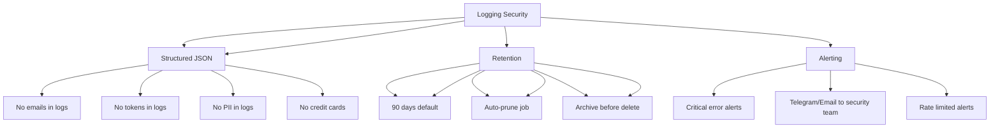

---
tags:
  - kanban/todo
  - type/task
  - domain/TST-S
  - priority/P1
parent: "[[desarrollo]]"
children: []
depends_on:
  - "[[TST-S-009]]"
blocks: []
status: todo
assignee: "@dev"
created: 2026-08-04
updated: 2026-08-04
---

# [[TST-S-011]] Logging: No PII/secrets en logs, structured JSON, retention, alerting

## Descripción
Tests de logging seguro: sin PII/secrets en logs, JSON estructurado, retención, alertas.

## Código de Ejemplo
```php
// tests/Feature/Security/LoggingTest.php
uses()->group('security', 'logging');

test('no PII in logs', function () {
    $user = User::factory()->create([
        'email' => 'juan@test.com',
        'name' => 'Juan Pérez',
        'telegram_id' => 123456789,
    ]);
    
    $this->actingAs($user)->post(route('client.profile.update'), [
        'name' => 'Juan Pérez',
        'email' => 'juan@test.com',
    ]);
    
    // Verificar que no hay PII en logs
    $logs = \Illuminate\Support\Facades\Log::getLogs();
    $logContent = collect($logs)->implode(' ');
    
    expect($logContent)->not->toContain('juan@test.com');
    expect($logContent)->not->toContain('Juan Pérez');
    expect($logContent)->not->toContain('123456789');
});

test('no secrets in logs', function () {
    $channel = ChannelPago::factory()->create([
        'telegram_bot_token' => '123456789:ABCDEFghijklmnopqrstuvwxyz',
    ]);
    
    $this->actingAs($channel->owner)
         ->post(route('creadores.channels.update', $channel), [
             'telegram_bot_token' => '123456789:NEW_TOKEN',
         ]);
    
    $logs = \Illuminate\Support\Facades\Log::getLogs();
    $logContent = collect($logs)->implode(' ');
    
    expect($logContent)->not->toContain('123456789:ABCDEFghijklmnopqrstuvwxyz');
    expect($logContent)->not->toContain('NEW_TOKEN');
});

test('structured JSON logging', function () {
    $this->actingAs($user)->post(route('client.profile.update'), [
        'name' => 'Nuevo Nombre',
    ]);
    
    $logs = \Illuminate\Support\Facades\Log::getLogs();
    $lastLog = collect($logs)->last();
    
    $logData = json_decode($lastLog['message'], true);
    
    expect($logData)->toHaveKeys(['timestamp', 'level', 'message', 'context', 'user_id']);
    expect($logData['context'])->toHaveKeys(['user_id', 'ip', 'user_agent']);
    expect($logData['context']['user_id'])->toBe(auth()->id());
});

test('log retention policy', function () {
    // Verificar que logs antiguos se eliminan
    $oldLog = \App\Models\Log::factory()->create([
        'created_at' => now()->subDays(95),
    ]);
    
    $recentLog = \App\Models\Log::factory()->create([
        'created_at' => now()->subDays(30),
    ]);
    
    // Ejecutar comando de limpieza
    Artisan::call('log:prune', ['--days' => 90]);
    
    expect(\App\Models\Log::find($oldLog->id))->toBeNull();
    expect(\App\Models\Log::find($recentLog->id))->not->toBeNull();
});

test('alerting on critical errors', function () {
    // Simular error crítico
    \App\Models\Log::create([
        'level' => 'critical',
        'message' => 'Payment gateway unavailable',
        'context' => ['gateway' => 'mercadopago', 'error' => 'timeout'],
        'created_at' => now(),
    ]);
    
    // Verificar que se dispara alerta
    \Illuminate\Support\Facades\Notification::fake();
    
    Artisan::call('log:alert-critical');
    
    \Illuminate\Support\Facades\Notification::assertSentTo(
        config('alerting.security_team'),
        \App\Notifications\CriticalErrorAlert::class,
        fn($notification) => $notification->error->message === 'Payment gateway unavailable'
    );
});

test('no sensitive data in exception logs', function () {
    try {
        throw new \Exception('Payment failed: card 4242 4242 4242 4242 expired');
    } catch (\Exception $e) {
        report($e);
    }
    
    $logs = \Illuminate\Support\Facades\Log::getLogs();
    $logContent = collect($logs)->last()['message'] ?? '';
    
    expect($logContent)->not->toContain('4242 4242 4242 4242');
    expect($logContent)->not->toContain('expired');
});
```

## Diagramas Mermaid


## Criterios de Aceptación
- [ ] No PII en logs (email, nombre, teléfono, telegram_id)
- [ ] No secrets en logs (tokens, passwords, API keys)
- [ ] No tarjetas de crédito en logs
- [ ] Logs estructurados JSON: timestamp, level, message, context, user_id
- [ ] Contexto: user_id, ip, user_agent, request_id
- [ ] Retención: 90 días default, auto-prune job
- [ ] Alerting: alertas críticas a security team (Telegram/Email)
- [ ] No tarjetas de crédito en logs de excepción
- [ ] Rate limiting en alertas (evitar spam)

## Notas Técnicas
- Reduced motion: CRÍTICO para accesibilidad
- Duración 0.01ms en lugar de 0 para evitar bugs
- Scroll-behavior: auto en prefers-reduced-motion
- Testing: Chrome DevTools → Rendering → "Emulate prefers-reduced-motion"
- Duración 0.01ms en lugar de 0 para evitar bugs en algunos navegadores
- Scroll-behavior: auto en prefers-reduced-motion

## Enlaces
- [[TST-S-007]] API Security
- [[TST-S-008]] File Upload
- [[TST-S-009]] Encryption
- [[TST-S-012]] Compliance