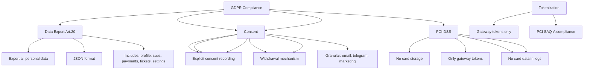

---
tags:
  - kanban/todo
  - type/task
  - domain/TST-S
  - priority/P1
parent: "[[desarrollo]]"
children: []
depends_on:
  - "[[TST-S-009]]"
blocks: []
status: todo
assignee: "@dev"
created: 2026-08-04
updated: 2026-08-04
---

# [[TST-S-012]] Compliance: GDPR (right to delete, export, consent), PCI-DSS (no card storage)

## Descripción
Tests de cumplimiento normativo: GDPR (derecho a eliminación, exportación, consentimiento) y PCI-DSS (no almacenamiento de tarjetas).

## Código de Ejemplo
```php
// tests/Feature/Security/ComplianceTest.php
uses()->group('security', 'compliance', 'gdpr');

test('user can request data export (GDPR Art. 20)', function () {
    $user = User::factory()->create([
        'name' => 'Juan Pérez',
        'email' => 'juan@test.com',
        'telegram_id' => 123456789,
        'settings' => ['theme' => 'dark', 'notifications' => ['email' => true]],
    ]);
    
    Subscription::factory()->count(3)->for($user)->create();
    Payment::factory()->count(5)->for($user)->create();
    Ticket::factory()->count(2)->for($user)->create();
    
    $response = $this->actingAs($user)->post(route('gdpr.export'));
    
    $response->assertStatus(200);
    
    $export = json_decode($response->getContent(), true);
    
    expect($export)->toHaveKeys(['personal_data', 'subscriptions', 'payments', 'tickets', 'settings']);
    expect($export['personal_data']['email'])->toBe('juan@test.com');
    expect($export['personal_data']['telegram_id'])->toBe(123456789);
    expect($export['subscriptions'])->toHaveCount(3);
    expect($export['payments'])->toHaveCount(5);
    expect($export['settings']['theme'])->toBe('dark');
});

test('user can request data deletion (GDPR Art. 17)', function () {
    $user = User::factory()->create();
    Subscription::factory()->for($user)->create();
    Payment::factory()->for($user)->create();
    
    $response = $this->actingAs($user)->delete(route('gdpr.delete-account'), [
        'password' => 'password123',
        'confirmation' => 'DELETE MY ACCOUNT',
    ]);
    
    $response->assertRedirect()
             ->assertSessionHas('success');
    
    // Verificar anonimización (no hard delete por FK)
    $user->refresh();
    expect($user->email)->toStartWith('deleted_');
    expect($user->name)->toBe('Usuario Eliminado');
    expect($user->email_verified_at)->toBeNull();
    expect($user->is_active)->toBeFalse();
    
    // Datos relacionados anonimizados
    $subscriptions = Subscription::where('user_id', $user->id)->get();
    expect($subscriptions->every(fn($s) => $s->status === 'cancelled'))->toBeTrue();
});

test('consent management (GDPR Art. 7)', function () {
    $user = User::factory()->create();
    
    // Verificar consentimientos registrados
    $consents = $user->consents()->get();
    
    expect($consents)->toContain([
        'terms_accepted_at' => $user->terms_accepted_at,
        'privacy_accepted_at' => $user->privacy_accepted_at,
        'marketing_consent' => $user->settings['notifications']['email'] ?? false,
    ]);
    
    // Retirar consentimiento marketing
    $user->settings['notifications']['email'] = false;
    $user->save();
    
    expect($user->fresh()->settings['notifications']['email'])->toBeFalse();
});

test('PCI-DSS: no card storage', function () {
    $payment = Payment::factory()->approved()->create([
        'gateway' => 'mercadopago',
        'gateway_payment_id' => 'mp_123456',
        // NO almacenar: card_number, cvv, expiry
    ]);
    
    $paymentData = $payment->toArray();
    
    expect($paymentData)->not->toHaveKey('card_number');
    expect($paymentData)->not->toHaveKey('cvv');
    expect($paymentData)->not->toHaveKey('expiry_month');
    expect($paymentData)->not->toHaveKey('expiry_year');
    expect($paymentData)->toHaveKey('gateway_payment_id'); // Solo reference
});

test('no card data in logs or database', function () {
    $payment = Payment::factory()->approved()->create([
        'gateway_payment_id' => 'mp_123456789',
    ]);
    
    // Verificar BD
    $paymentData = DB::table('payments')->where('id', $payment->id)->first();
    
    $forbiddenFields = ['card_number', 'cvv', 'expiry_month', 'expiry_year', 'cardholder_name'];
    foreach ($forbiddenFields as $field) {
        expect($paymentData)->not->toHaveKey($field);
    }
    
    // Verificar logs
    $logs = \Illuminate\Support\Facades\Log::getLogs();
    $logContent = collect($logs)->implode(' ');
    
    expect($logContent)->not->toContain('4242 4242 4242 4242');
    expect($logContent)->not->toContain('4242424242424242');
});
```

## Diagramas Mermaid


## Criterios de Aceptación
- [ ] Data export: JSON con profile, subscriptions, payments, tickets, settings
- [ ] Data deletion: anonimización (no hard delete), cascada a relacionados
- [ ] Consent: registro granular, retiro granular, auditoría
- [ ] PCI-DSS: NO almacenamiento PAN/CVV/expiry, solo gateway tokens
- [ ] No card data en DB ni logs
- [ ] Tokenización: solo gateway tokens (MercadoPago payment_id, Stripe payment_intent_id)
- [ ] Tests: export completo, anonimización completa, consent withdrawal, no card data

## Notas Técnicas
- GDPR: Arts 15, 17, 20, 7, 25, 32
- PCI-DSS: SAQ-A (no card storage), tokenización obligatoria
- Data retention: configurar en config/gdpr.php
- Anonymization: soft delete + anonimización campos PII
- Consent: granular, revocable, auditable

## Enlaces
- [[TST-S-009]] Encryption
- [[TST-S-010]] Headers
- [[TST-S-011]] Logging
- [[TST-F-014]] CI Pipeline