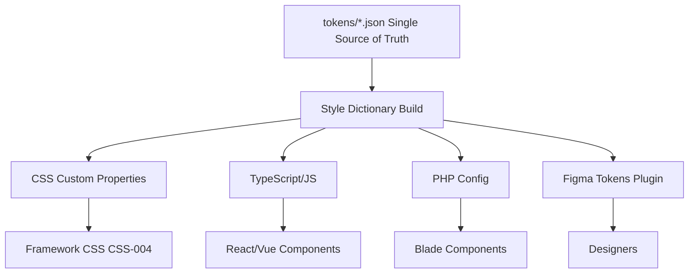

---
tags:
  - kanban/todo
  - type/task
  - domain/UI
  - priority/P0
parent: "[[desarrollo]]"
children: []
depends_on:
  - "[[UX-001]]"
  - "[[UX-005]]"
  - "[[UX-006]]"
  - "[[UX-007]]"
blocks:
  - "[[UI-002]]"
  - "[[UI-003]]"
  - "[[UI-004]]"
  - "[[UI-005]]"
  - "[[CSS-002]]"
  - "[[CSS-003]]"
  - "[[CSS-004]]"
status: todo
assignee: "@dev"
created: 2026-08-04
updated: 2026-08-04
---

# [[UI-001]] Design Tokens: Colores, Spacing, Tipografía, Shadows, Border-Radius, Z-Index

## Descripción
Definir el sistema de design tokens como única fuente de verdad (Single Source of Truth) para todos los valores de diseño. Exportables a CSS Custom Properties, JSON, TypeScript, PHP config.

## Código de Ejemplo
```json
// tokens/color.json
{
  "color": {
    "primary": {
      "50": { "value": "#eff6ff", "type": "color", "description": "Primary lightest" },
      "100": { "value": "#dbeafe", "type": "color" },
      "200": { "value": "#bfdbfe", "type": "color" },
      "300": { "value": "#93c5fd", "type": "color" },
      "400": { "value": "#60a5fa", "type": "color" },
      "500": { "value": "#3b82f6", "type": "color", "description": "Primary base" },
      "600": { "value": "#2563eb", "type": "color", "description": "Primary hover" },
      "700": { "value": "#1d4ed8", "type": "color" },
      "800": { "value": "#1e40af", "type": "color" },
      "900": { "value": "#1e3a5f", "type": "color", "description": "Primary darkest" },
      "950": { "value": "#172554", "type": "color" }
    },
    "neutral": {
      "50": { "value": "#fafafa", "type": "color" },
      "100": { "value": "#f5f5f5", "type": "color" },
      "200": { "value": "#e5e5e5", "type": "color" },
      "300": { "value": "#d4d4d4", "type": "color" },
      "400": { "value": "#a3a3a3", "type": "color" },
      "500": { "value": "#737373", "type": "color" },
      "600": { "value": "#525252", "type": "color" },
      "700": { "value": "#404040", "type": "color" },
      "800": { "value": "#262626", "type": "color" },
      "900": { "value": "#171717", "type": "color" },
      "950": { "value": "#0a0a0a", "type": "color" }
    },
    "semantic": {
      "success": { "value": "{color.green.600}", "type": "color" },
      "error": { "value": "{color.red.600}", "type": "color" },
      "warning": { "value": "{color.amber.600}", "type": "color" },
      "info": { "value": "{color.blue.600}", "type": "color" },
      "bg": { "value": "{color.neutral.50}", "type": "color" },
      "text": { "value": "{color.neutral.900}", "type": "color" },
      "border": { "value": "{color.neutral.200}", "type": "color" }
    }
  }
}
```

```json
// tokens/spacing.json
{
  "spacing": {
    "0": { "value": "0", "type": "dimension" },
    "1": { "value": "0.25rem", "type": "dimension" },
    "2": { "value": "0.5rem", "type": "dimension" },
    "3": { "value": "0.75rem", "type": "dimension" },
    "4": { "value": "1rem", "type": "dimension" },
    "5": { "value": "1.25rem", "type": "dimension" },
    "6": { "value": "1.5rem", "type": "dimension" },
    "8": { "value": "2rem", "type": "dimension" },
    "10": { "value": "2.5rem", "type": "dimension" },
    "12": { "value": "3rem", "type": "dimension" },
    "16": { "value": "4rem", "type": "dimension" },
    "20": { "value": "5rem", "type": "dimension" },
    "24": { "value": "6rem", "type": "dimension" }
  }
}
```

```json
// tokens/typography.json
{
  "typography": {
    "fontFamily": {
      "sans": { "value": "\"Inter\", system-ui, -apple-system, sans-serif", "type": "fontFamily" },
      "mono": { "value": "\"JetBrains Mono\", \"Fira Code\", monospace", "type": "fontFamily" }
    },
    "fontSize": {
      "xs": { "value": "0.75rem", "type": "fontSize" },
      "sm": { "value": "0.875rem", "type": "fontSize" },
      "base": { "value": "1rem", "type": "fontSize" },
      "lg": { "value": "1.125rem", "type": "fontSize" },
      "xl": { "value": "1.25rem", "type": "fontSize" },
      "2xl": { "value": "1.5rem", "type": "fontSize" },
      "3xl": { "value": "1.875rem", "type": "fontSize" },
      "4xl": { "value": "2.25rem", "type": "fontSize" },
      "5xl": { "value": "3rem", "type": "fontSize" }
    },
    "fontWeight": {
      "normal": { "value": "400", "type": "fontWeight" },
      "medium": { "value": "500", "type": "fontWeight" },
      "semibold": { "value": "600", "type": "fontWeight" },
      "bold": { "value": "700", "type": "fontWeight" }
    },
    "lineHeight": {
      "tight": { "value": "1.25", "type": "lineHeight" },
      "normal": { "value": "1.5", "type": "lineHeight" },
      "relaxed": { "value": "1.75", "type": "lineHeight" }
    }
  }
}
```

## Cálculos y Algoritmos (LaTeX)
### Generación de Escalas de Color (Interpolación LAB)
$$
L^* = 116 \cdot f(Y/Y_n) - 16
$$
$$
f(t) = \begin{cases} 
t^{1/3} & \text{si } t > \delta^3 \\
t/(3\delta^2) + 4/29 & \text{si no}
\end{cases}
$$
Donde $\delta = 6/29$. Mantener $a^*, b^*$ constantes, variar $L^*$ para escalas 50-950.

### Sistema Espacial (Base 4px / 0.25rem)
$$
\text{Spacing}(n) = n \times 0.25\text{rem} \quad \text{para } n \in \{0,1,2,3,4,5,6,8,10,12,16,20,24\}
$$

### Escala Tipográfica Modular (Ratio 1.125)
$$
\text{Size}_{n+1} = \text{Size}_n \times 1.125
$$
Base: 1rem → 1.125rem → 1.266rem → 1.424rem → 1.602rem...

## Diagramas Mermaid
### Arquitectura Tokens → Platforms


## Criterios de Aceptación
- [ ] Archivos JSON en `tokens/{color,spacing,typography,borderRadius,shadow,zIndex,breakpoints,transition}.json`
- [ ] Escalas completas: color (50-950 + semánticos), spacing (13 valores), typography (familias, tamaños, pesos, line-height)
- [ ] Tokens semánticos referencian tokens base (`{color.green.600}`)
- [ ] Documentación en `docu/especificaciones/design-tokens.md` con tabla de valores
- [ ] Contraste WCAG AA validado para todos los pares semánticos
- [ ] Exportable a CSS, JS, PHP via Style Dictionary
- [ ] Versionado semántico (tokens v1.0.0)

## Notas Técnicas
- Usar Style Dictionary (Amazon) como build tool estándar
- Tokens semánticos (success, error, warning, info, bg, text, border) para theming
- No hardcodear valores en componentes: siempre `var(--token)`
- Breakpoints mobile-first: sm=640, md=768, lg=1024, xl=1280, 2xl=1536
- Z-index scale: dropdown=100, sticky=200, modal=500, toast=900, tooltip=1000

## Enlaces
- [[UX-001]] Proto-personas (brand personality → colors)
- [[UX-005]] IA (spacing scale para rhythm vertical)
- [[UX-006]] Accesibilidad (contraste tokens)
- [[CSS-002]] Design Tokens (implementación CSS)
- [[CSS-003]] Tipografía (usa font tokens)
- [[CSS-004]] Custom Properties (generación)
- [[CSS-031]] Dark Mode (semantic tokens swap)