---
tags:
  - kanban/todo
  - type/task
  - domain/UI
  - priority/P0
parent: "[[desarrollo]]"
children: []
depends_on:
  - "[[UI-001]]"
  - "[[UX-004]]"
blocks:
  - "[[UI-003]]"
  - "[[CSS-007]]"
  - "[[CSS-008]]"
  - "[[CSS-009]]"
  - "[[CSS-010]]"
  - "[[CSS-011]]"
  - "[[CSS-012]]"
  - "[[CSS-013]]"
  - "[[CSS-014]]"
  - "[[CSS-015]]"
  - "[[CSS-016]]"
  - "[[CSS-017]]"
  - "[[CSS-018]]"
  - "[[CSS-019]]"
  - "[[CSS-020]]"
  - "[[CSS-021]]"
status: todo
assignee: "@dev"
created: 2026-08-04
updated: 2026-08-04
---

# [[UI-002]] Component Library: 15 Componentes Base

## Descripción
Diseñar y documentar la librería de 15 componentes UI base con variantes, estados, props, accesibilidad y ejemplos de uso. Cada componente definido en Figma + documentado en Storybook/Markdown.

## Código de Ejemplo
```markdown
# Component Library Inventory

## 1. Button
**Variantes**: primary, secondary, ghost, danger, success
**Tamaños**: sm, md, lg, xl
**Estados**: default, hover, focus, active, disabled, loading
**Props**: variant, size, disabled, loading, leftIcon, rightIcon, fullWidth, onClick
**A11y**: type="button", aria-disabled, aria-busy, focus-visible

## 2. Input
**Tipos**: text, email, password, number, tel, url, search
**Estados**: default, hover, focus, error, disabled, readonly
**Props**: label, placeholder, error, hint, leftAddon, rightAddon, required
**A11y**: label for/id, aria-describedby (error/hint), autocomplete

## 3. Select
**Variantes**: default, searchable, multi, grouped
**Estados**: default, hover, focus, error, disabled
**Props**: options, placeholder, searchable, multi, maxSelected, groups
**A11y**: combobox role, aria-expanded, aria-activedescendant, keyboard nav

## 4. Modal / Dialog
**Tamaños**: sm, md, lg, xl, full
**Props**: open, onClose, title, description, children, footer, closeOnOverlay, closeOnEscape
**A11y**: role="dialog", aria-modal, aria-labelledby, focus trap, restore focus

## 5. Table
**Features**: sortable, filterable, pagination, row selection, expandable rows
**Responsive**: horizontal scroll desktop, card layout mobile
**A11y**: scope="col/row", caption, sortable headers aria-sort

## 6. Card
**Variantes**: elevated, outlined, filled, interactive
**Slots**: header, media, body, footer, actions
**Props**: variant, hoverable, clickable, image, imageAlt

## 7. Badge / Tag
**Variantes**: default, success, error, warning, info, neutral
**Tamaños**: sm, md
**Props**: variant, size, dot, dismissible, count, onDismiss

## 8. Avatar
**Tamaños**: xs, sm, md, lg, xl, 2xl
**Props**: src, alt, fallback (iniciales), size, status (online/offline/busy), group
**A11y**: alt text, role="img"

## 9. Dropdown / Menu
**Props**: trigger, items, position, offset, closeOnSelect, closeOnClickOutside
**Items**: label, icon, shortcut, disabled, divider, submenu
**A11y**: menu role, aria-orientation, keyboard nav (arrows, home/end)

## 10. Tabs
**Variantes**: line, enclosed, soft, pills
**Props**: defaultIndex, onChange, orientation, lazy, activationMode
**A11y**: tablist, tab, tabpanel, aria-selected, aria-controls, keyboard

## 11. Accordion
**Props**: items, allowMultiple, allowToggle, defaultIndex
**Items**: title, content, disabled, icon
**A11y**: region, heading, button, aria-expanded, aria-controls

## 12. Toast / Notification
**Tipos**: success, error, warning, info, loading
**Props**: type, title, message, action, duration, dismissible, position
**Stack**: max 5, auto-dismiss, pause on hover
**A11y**: role="alert" (error), role="status" (otros), aria-live

## 13. Tooltip / Popover
**Props**: content, trigger (hover/focus/click), position, offset, delay, interactive
**Arrow**: auto-positioned, sized
**A11y**: role="tooltip", aria-describedby, focus management

## 14. Pagination
**Variantes**: default, withEllipsis, withPageSize
**Props**: total, page, pageSize, onChange, showFirstLast, siblingCount
**A11y**: nav, aria-label, aria-current, button roles

## 15. Breadcrumb
**Props**: items, separator, maxItems, collapsible
**Items**: label, href, current
**A11y**: nav, aria-label, aria-current="page"
```

## Cálculos y Algoritmos (LaTeX)
### Matriz de Estados por Componente
$$
\text{Estados} = \{ \text{default}, \text{hover}, \text{focus}, \text{active}, \text{disabled}, \text{loading}, \text{error} \}
$$
Cada componente implementa subconjunto relevante.

### Variantes API Consistente
$$
\text{Props} = \{ \text{variant} \in V, \text{size} \in S, \text{disabled} \in \{T,F\}, \text{loading} \in \{T,F\}, \dots \}
$$

## Diagramas Mermaid
### Jerarquía de Componentes

```mermaid
graph TD
    subgraph Form
        B[Button] --> I[Input]
        I --> S[Select]
        S --> C[Checkbox/Radio/Switch]
    end
    
    subgraph Data Display
        T[Table] --> CA[Card]
        CA --> BA[Badge]
        BA --> AV[Avatar]
    end
    
    subgraph Feedback
        M[Modal] --> TO[Toast]
        TO --> TP[Tooltip]
    end
    
    subgraph Navigation
        DD[Dropdown] --> TA[Tabs]
        TA --> AC[Accordion]
        AC --> PG[Pagination]
        PG --> BR[Breadcrumb]
    end
    
    subgraph Layout
        GR[Grid] --> FL[Flex]
        FL --> CN[Container]
    end
```


## Criterios de Aceptación
- [ ] 15 componentes definidos en `docu/especificaciones/component-library.md`
- [ ] Cada componente: variantes, tamaños, estados, props, slots, a11y, ejemplos
- [ ] Diseños en Figma/Excalidraw exportados a `docu/especificaciones/components/`
- [ ] Storybook configurado (opcional v1.0, obligatorio v1.1)
- [ ] API props consistente (variant, size, disabled, loading pattern)
- [ ] Estados focus-visible en todos los interactivos
- [ ] Keyboard navigation completa (Tab, Enter, Escape, Arrows)
- [ ] Screen reader tested (NVDA/VoiceOver)
- [ ] Documentación de uso en Blade components (CSS-007 a CSS-021)

## Notas Técnicas
- Usar Class Variance Authority (CVA) pattern para variantes en CSS
- Componentes como Blade components: `<x-button variant="primary" />`
- Slots para flexibilidad: `<x-card><x-slot name="header">...</x-slot></x-card>`
- Tree-shaking: importar solo componentes usados
- Prefijo CSS: `--tgp-` (configurable via CSS_FRAMEWORK_PREFIX)

## Enlaces
- [[UI-001]] Design Tokens (fuente de valores)
- [[UI-003]] Layouts (usan componentes)
- [[UX-004]] Wireframes (referencia visual)
- [[UX-006]] Accesibilidad (checklist por componente)
- [[CSS-007]] a [[CSS-021]] Implementación CSS por componente
- [[CSS-034]] Build System