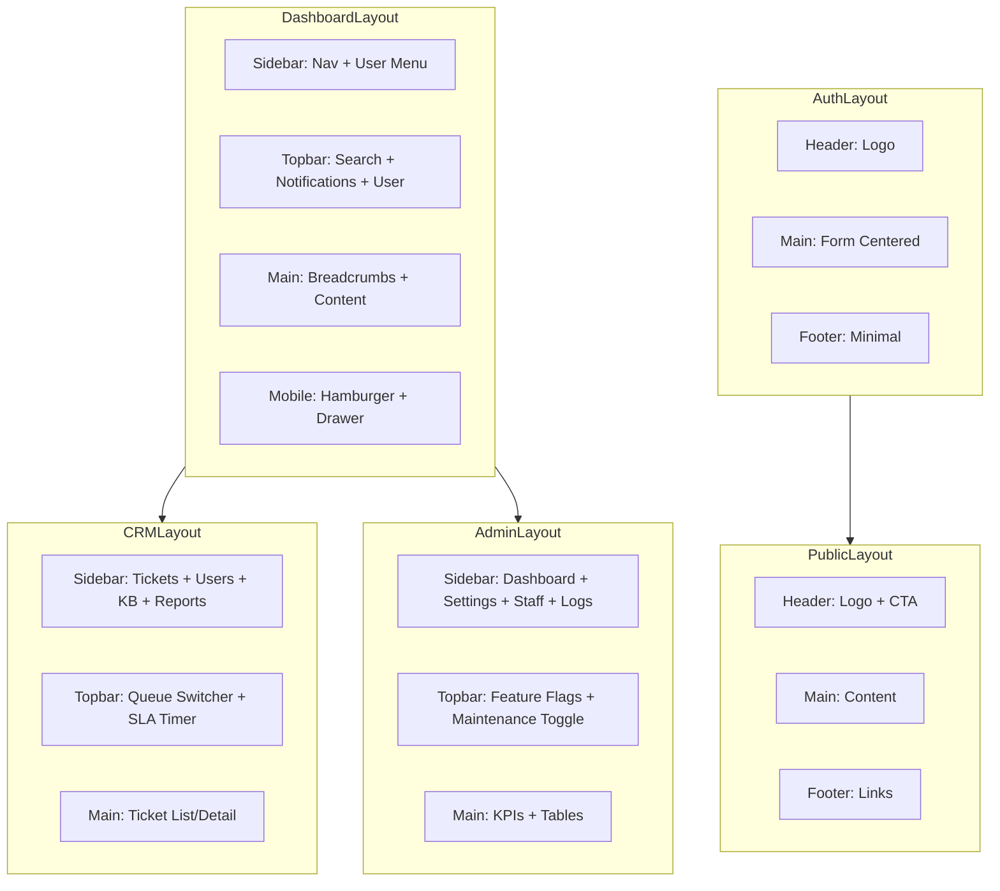

---
tags:
  - "kanban/done"
  - "type/task"
  - "domain/UI"
  - "priority/P0"
parent: "[[desarrollo]]"
children: []
depends_on:
  - "[[UI-002]]"
  - "[[UX-005]]"
blocks:
  - "[[CSS-006]]"
  - "[[PUB-001]]"
  - "[[CRE-001]]"
  - "[[ADM-001]]"
  - "[[CRM-001]]"
  - "[[UI-004]]"
status: "done"
assignee: "@dev"
created: "2026-08-04"
updated: "2026-08-06"
---

# [[UI-003]] Layouts Base: PublicLayout, AuthLayout, DashboardLayout, CRMLayout, AdminLayout

## Descripción
Definir 5 layouts base reutilizables que estructuran todas las páginas. Cada layout incluye: header, navigation, sidebar, main content, footer, y slots para contenido específico.

## Código de Ejemplo
```blade
{{-- resources/views/layouts/public.blade.php --}}
<!DOCTYPE html>
<html lang="{{ str_replace('_', '-', app()->getLocale()) }}" data-theme="{{ session('theme', 'system') }}">
<head>
    <meta charset="utf-8">
    <meta name="viewport" content="width=device-width, initial-scale=1">
    <title>@yield('title', config('app.name'))</title>
    @vite(['resources/css/app.css', 'resources/js/app.js'])
    @yield('head')
</head>
<body class="font-sans antialiased bg-white text-neutral-900 dark:bg-neutral-950 dark:text-neutral-50">
    @include('components.skip-link')
    
    <header class="sticky top-0 z-40 bg-white/80 backdrop-blur-sm border-b border-neutral-200 dark:bg-neutral-950/80 dark:border-neutral-800">
        <nav class="container mx-auto px-4 h-16 flex items-center justify-between" aria-label="Navegación principal">
            <a href="{{ route('home') }}" class="text-xl font-bold text-primary-600" aria-label="{{ config('app.name') }}">
                {{ config('app.name') }}
            </a>
            <div class="flex items-center gap-4">
                @yield('header-actions')
                <a href="{{ route('creadores.login') }}" class="btn btn--ghost">Acceso Creadores</a>
                <a href="{{ route('register') }}" class="btn btn--primary">Empezar</a>
            </div>
        </nav>
    </header>

    <main id="main-content" class="min-h-[calc(100vh-16rem)]">
        @yield('content')
    </main>

    <footer class="bg-neutral-50 dark:bg-neutral-900 border-t border-neutral-200 dark:border-neutral-800">
        <div class="container mx-auto px-4 py-12">
            @yield('footer')
        </div>
    </footer>

    @yield('scripts')
</body>
</html>
```

```blade
{{-- resources/views/layouts/dashboard.blade.php (Creadores/Staff/Admin) --}}
@extends('layouts.auth')

@section('content')
<div class="flex min-h-screen">
    {{-- Sidebar --}}
    <aside class="hidden lg:block w-64 bg-white dark:bg-neutral-950 border-r border-neutral-200 dark:border-neutral-800 fixed lg:static inset-y-0 left-0 z-30 transform transition-transform duration-200" 
           :class="{ 'translate-x-0': sidebarOpen, '-translate-x-full': !sidebarOpen }"
           aria-label="Navegación lateral">
        <nav class="p-4 space-y-1" aria-label="Menú principal">
            @yield('sidebar-nav')
        </nav>
    </aside>

    {{-- Mobile sidebar overlay --}}
    <div class="lg:hidden fixed inset-0 z-20 bg-black/50" 
         :class="{ 'block': sidebarOpen, 'hidden': !sidebarOpen }"
         @click="sidebarOpen = false" aria-hidden="true"></div>

    {{-- Main Content --}}
    <div class="flex-1 lg:ml-0 min-h-screen" :class="{ 'lg:ml-64': true }">
        {{-- Topbar --}}
        <header class="sticky top-0 z-20 bg-white dark:bg-neutral-950 border-b border-neutral-200 dark:border-neutral-800">
            <div class="container mx-auto px-4 h-16 flex items-center justify-between">
                <button @click="sidebarOpen = !sidebarOpen" class="lg:hidden p-2 rounded-lg hover:bg-neutral-100 dark:hover:bg-neutral-800" aria-label="Abrir menú">
                    <svg class="w-6 h-6" fill="none" stroke="currentColor" viewBox="0 0 24 24"><path stroke-linecap="round" stroke-linejoin="round" stroke-width="2" d="M4 6h16M4 12h16M4 18h16"></path></svg>
                </button>
                <div class="flex-1 lg:hidden"></div>
                <div class="flex items-center gap-4">
                    @yield('topbar-actions')
                    <div class="relative" x-data="dropdown()">
                        <button @click="toggle" class="flex items-center gap-2 p-2 rounded-lg hover:bg-neutral-100 dark:hover:bg-neutral-800" aria-expanded="false" aria-haspopup="true">
                            user()->avatar_url ?? asset('images/default-avatar.png') }}" alt="" class="w-8 h-8 rounded-full">
                            <span class="hidden sm:block">{{ auth()->user()->name }}</span>
                            <svg class="w-4 h-4" fill="none" stroke="currentColor" viewBox="0 0 24 24"><path stroke-linecap="round" stroke-linejoin="round" stroke-width="2" d="M19 9l-7 7-7-7"></path></svg>
                        </button>
                        <div x-show="open" x-transition @click.outside="close" class="absolute right-0 mt-2 w-48 bg-white dark:bg-neutral-800 rounded-lg shadow-lg border border-neutral-200 dark:border-neutral-700 py-1" role="menu">
                            <a href="{{ route('profile') }}" class="block px-4 py-2 text-sm hover:bg-neutral-100 dark:hover:bg-neutral-700" role="menuitem">Perfil</a>
                            <a href="{{ route('settings') }}" class="block px-4 py-2 text-sm hover:bg-neutral-100 dark:hover:bg-neutral-700" role="menuitem">Configuración</a>
                            <hr class="my-1 border-neutral-200 dark:border-neutral-700">
                            <form action="{{ route('logout') }}" method="POST">
                                @csrf
                                <button type="submit" class="block w-full text-left px-4 py-2 text-sm text-error hover:bg-neutral-100 dark:hover:bg-neutral-700" role="menuitem">Cerrar sesión</button>
                            </form>
                        </div>
                    </div>
                </div>
            </div>
        </header>

        {{-- Page Content --}}
        <main id="main-content" class="container mx-auto px-4 py-6" role="main">
            @include('components.breadcrumbs')
            @yield('page-header')
            @yield('content')
        </main>
    </div>
</div>
@endsection
```

## Cálculos y Algoritmos (LaTeX)
### Grid Layout Dashboard
$$
\text{Sidebar} = 256px (16rem), \quad \text{Main} = \text{calc}(100\% - 256px)
$$
$$
\text{Topbar} = 64px (4rem), \quad \text{Content} = \text{calc}(100vh - 64px)
$$

### Breakpoints Responsive
$$
\begin{aligned}
\text{Mobile} &: < 640px \quad (\text{sidebar drawer}) \\
\text{Tablet} &: 640-1024px \quad (\text{sidebar colapsable}) \\
\text{Desktop} &: > 1024px \quad (\text{sidebar fijo})
\end{aligned}
$$

## Diagramas Mermaid
### Estructura de Layouts


## Criterios de Aceptación
- [ ] 5 layouts Blade creados en `resources/views/layouts/`
- [ ] `public.blade.php`: header público, main, footer
- [ ] `auth.blade.php`: centrado, minimal header/footer
- [ ] `dashboard.blade.php`: sidebar responsive, topbar, breadcrumbs, user menu
- [ ] `crm.blade.php`: extiende dashboard, sidebar CRM-specific, queue switcher
- [ ] `admin.blade.php`: extiende dashboard, sidebar Admin-specific, feature flags
- [ ] Slots definidos: `header-actions`, `sidebar-nav`, `topbar-actions`, `page-header`, `content`, `scripts`
- [ ] Alpine.js para sidebar mobile (drawer), dropdown user menu
- [ ] Skip link en todos los layouts
- [ ] Dark mode via `data-theme` en `<html>`
- [ ] Accesibilidad: landmarks (header, nav, main, aside, footer), ARIA labels

## Notas Técnicas
- Usar `@extends` + `@section`/`@yield` para herencia
- Sidebar state persistido en localStorage
- Topbar user menu: Alpine.js dropdown component
- Breadcrumbs automáticos desde route name (helper)
- Container max-width: 1280px (xl) con padding responsive
- Focus management: skip link → main content

## Enlaces
- [[UI-002]] Component Library (usa Button, Avatar, Dropdown, Breadcrumb)
- [[UI-004]] Responsive (breakpoints en layouts)
- [[UX-005]] IA (estructura navegación)
- [[CRE-001]] Onboarding Creador (usa dashboard layout)
- [[ADM-001]] Dashboard Admin (usa admin layout)
- [[CRM-001]] Ticketing (usa crm layout)
- [[CSS-006]] Layout Primitives (container, grid, flex)
- [[CSS-020]] Sidebar Component