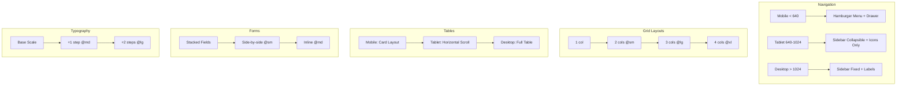

---
tags:
  - kanban/todo
  - type/task
  - domain/UI
  - priority/P1
parent: "[[desarrollo]]"
children: []
depends_on:
  - "[[UI-003]]"
blocks:
  - "[[CSS-006]]"
  - "[[CSS-022]]"
  - "[[CSS-023]]"
  - "[[CSS-024]]"
status: todo
assignee: "@dev"
created: 2026-08-04
updated: 2026-08-04
---

# [[UI-004]] Responsive Breakpoints: Mobile-First (320, 640, 768, 1024, 1280, 1536)

## Descripción
Definir sistema de breakpoints mobile-first consistente con tokens. Documentar comportamiento de componentes y layouts en cada breakpoint. Generar utilities CSS responsive.

## Código de Ejemplo
```json
// tokens/breakpoints.json
{
  "breakpoints": {
    "xs": { "value": "320px", "type": "breakpoint", "name": "Mobile small" },
    "sm": { "value": "640px", "type": "breakpoint", "name": "Mobile large" },
    "md": { "value": "768px", "type": "breakpoint", "name": "Tablet" },
    "lg": { "value": "1024px", "type": "breakpoint", "name": "Desktop small" },
    "xl": { "value": "1280px", "type": "breakpoint", "name": "Desktop" },
    "2xl": { "value": "1536px", "type": "breakpoint", "name": "Desktop large" }
  }
}
```

```css
/* CSS Custom Properties generadas */
:root {
  --breakpoint-xs: 320px;
  --breakpoint-sm: 640px;
  --breakpoint-md: 768px;
  --breakpoint-lg: 1024px;
  --breakpoint-xl: 1280px;
  --breakpoint-2xl: 1536px;
}

/* Media queries mobile-first */
@media (min-width: 640px) { /* sm */ }
@media (min-width: 768px) { /* md */ }
@media (min-width: 1024px) { /* lg */ }
@media (min-width: 1280px) { /* xl */ }
@media (min-width: 1536px) { /* 2xl */ }

/* Container queries (futuro) */
@container (min-width: 640px) { /* sm */ }
```

```css
/* Utilities responsive generadas (CSS-022 a CSS-024) */
.hidden { display: none; }
.sm\:block { display: block; }
.md\:flex { display: flex; }
.lg\:grid { display: grid; }

/* Grid responsive */
.grid-cols-1 { grid-template-columns: repeat(1, minmax(0, 1fr)); }
.sm\:grid-cols-2 { grid-template-columns: repeat(2, minmax(0, 1fr)); }
.lg\:grid-cols-3 { grid-template-columns: repeat(3, minmax(0, 1fr)); }
.xl\:grid-cols-4 { grid-template-columns: repeat(4, minmax(0, 1fr)); }

/* Spacing responsive */
.p-4 { padding: var(--spacing-4); }
.md\:p-6 { padding: var(--spacing-6); }
.lg\:p-8 { padding: var(--spacing-8); }

/* Typography responsive */
.text-base { font-size: var(--font-size-base); }
.lg\:text-lg { font-size: var(--font-size-lg); }
```

## Cálculos y Algoritmos (LaTeX)
### Escalado Fluido (Clamp) para Tipografía
$$
\text{clamp}(min, preferred, max) = \text{clamp}(1rem, 1vw + 0.5rem, 1.5rem)
$$

### Container Max-Widths por Breakpoint
$$
\begin{aligned}
\text{xs} &: 100\% \\
\text{sm} &: 640px \\
\text{md} &: 768px \\
\text{lg} &: 1024px \\
\text{xl} &: 1280px \\
\text{2xl} &: 1536px
\end{aligned}
$$

### Columnas Grid por Breakpoint
$$
\text{Cols}(bp) = \begin{cases}
1 & bp < sm \\
2 & sm \leq bp < lg \\
3 & lg \leq bp < xl \\
4 & bp \geq xl
\end{cases}
$$

## Diagramas Mermaid
### Comportamiento Responsive por Componente


## Criterios de Aceptación
- [ ] Breakpoints definidos en `tokens/breakpoints.json` (6 valores)
- [ ] CSS Custom Properties generadas: `--breakpoint-*`
- [ ] Media queries mobile-first documentadas
- [ ] Comportamiento por componente documentado en `docu/especificaciones/responsive-behavior.md`
- [ ] Container max-widths por breakpoint
- [ ] Grid column counts por breakpoint
- [ ] Typography fluid scaling (clamp) para headings
- [ ] Utilities responsive generadas (CSS-022 a CSS-024)
- [ ] Testing: Chrome DevTools device toolbar + real devices

## Notas Técnicas
- Mobile-first: estilos base para móvil, `@media (min-width: ...)` para up
- Breakpoints nombrados: xs, sm, md, lg, xl, 2xl (consistente con Tailwind)
- Container queries evaluar para v1.1 (soporte navegador)
- Fluid typography: `clamp(1rem, 0.875rem + 0.5vw, 1.25rem)` para body
- Imágenes: `srcset` + `sizes` para responsive images
- Touch targets: mínimo 44x44px en móvil

## Enlaces
- [[UI-001]] Design Tokens (breakpoint tokens)
- [[UI-003]] Layouts (comportamiento responsive)
- [[CSS-006]] Layout Primitives (grid, flex responsive)
- [[CSS-022]] a [[CSS-024]] Utilities Responsive
- [[CSS-025]] Typography Utilities (fluid)
- [[PUB-001]] Landing Page (responsive hero, grid)
- [[CRE-001]] Dashboard (sidebar responsive)