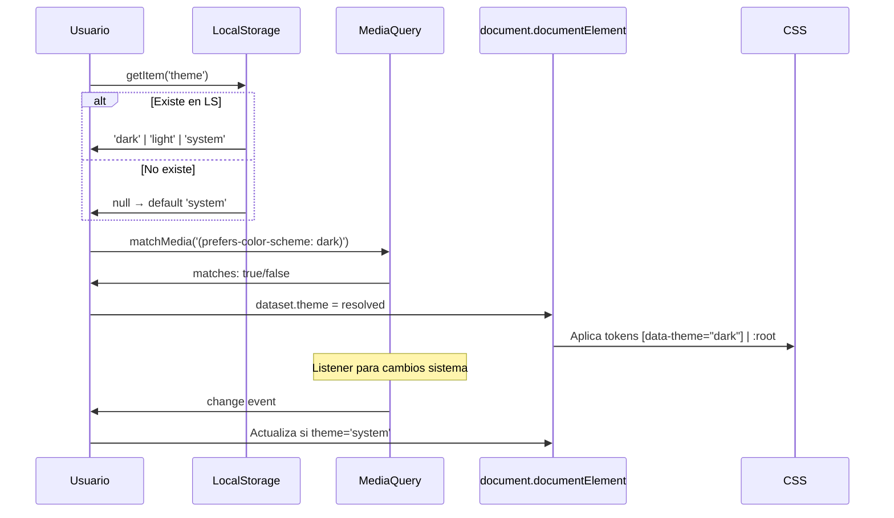

---
tags:
  - kanban/todo
  - type/task
  - domain/UI
  - priority/P0
parent: "[[desarrollo]]"
children: []
depends_on:
  - "[[UI-001]]"
blocks:
  - "[[CSS-004]]"
  - "[[CSS-031]]"
  - "[[CSS-033]]"
status: todo
assignee: "@dev"
created: 2026-08-04
updated: 2026-08-04
---

# [[UI-005]] Dark Mode: Strategy (class en html), Tokens Duales, Toggle Persistido

## Descripción
Implementar estrategia completa de dark mode: CSS custom properties duales, toggle en UI, persistencia en localStorage + sincronización con preferencia sistema (`prefers-color-scheme`).

## Código de Ejemplo
```css
/* Tokens Light (default) */
:root {
  --color-bg-primary: var(--color-neutral-50);
  --color-bg-secondary: var(--color-neutral-100);
  --color-bg-tertiary: var(--color-neutral-200);
  --color-text-primary: var(--color-neutral-900);
  --color-text-secondary: var(--color-neutral-600);
  --color-text-muted: var(--color-neutral-400);
  --color-border: var(--color-neutral-200);
  --color-border-focus: var(--color-primary-500);
  --color-overlay: rgba(0, 0, 0, 0.5);
  --shadow-sm: 0 1px 2px 0 rgb(0 0 0 / 0.05);
  --shadow-md: 0 4px 6px -1px rgb(0 0 0 / 0.1);
  --shadow-lg: 0 10px 15px -3px rgb(0 0 0 / 0.1);
}

/* Tokens Dark (via data-theme) */
[data-theme="dark"] {
  --color-bg-primary: var(--color-neutral-950);
  --color-bg-secondary: var(--color-neutral-900);
  --color-bg-tertiary: var(--color-neutral-800);
  --color-text-primary: var(--color-neutral-50);
  --color-text-secondary: var(--color-neutral-400);
  --color-text-muted: var(--color-neutral-500);
  --color-border: var(--color-neutral-700);
  --color-border-focus: var(--color-primary-400);
  --color-overlay: rgba(0, 0, 0, 0.7);
  --shadow-sm: 0 1px 2px 0 rgb(0 0 0 / 0.3);
  --shadow-md: 0 4px 6px -1px rgb(0 0 0 / 0.4);
  --shadow-lg: 0 10px 15px -3px rgb(0 0 0 / 0.4);
}

/* Transición suave */
*, *::before, *::after {
  transition: background-color 0.2s ease, border-color 0.2s ease, color 0.2s ease;
}

/* Respeta prefers-reduced-motion */
@media (prefers-reduced-motion: reduce) {
  *, *::before, *::after {
    transition: none !important;
  }
}
```

```javascript
// resources/js/theme.js (Alpine.js component)
document.addEventListener('alpine:init', () => {
    Alpine.data('theme', () => ({
        theme: 'system', // 'light', 'dark', 'system'
        
        init() {
            this.theme = localStorage.getItem('theme') || 'system';
            this.apply();
            this.watchSystem();
        },
        
        apply() {
            const root = document.documentElement;
            const isDark = this.theme === 'dark' || 
                (this.theme === 'system' && window.matchMedia('(prefers-color-scheme: dark)').matches);
            
            root.dataset.theme = isDark ? 'dark' : 'light';
            localStorage.setItem('theme', this.theme);
        },
        
        watchSystem() {
            if (this.mediaQuery) this.mediaQuery.removeEventListener('change', this.apply);
            this.mediaQuery = window.matchMedia('(prefers-color-scheme: dark)');
            this.mediaQuery.addEventListener('change', () => {
                if (this.theme === 'system') this.apply();
            });
        },
        
        toggle() {
            const themes = ['light', 'dark', 'system'];
            const currentIndex = themes.indexOf(this.theme);
            this.theme = themes[(currentIndex + 1) % 3];
            this.apply();
        },
        
        setTheme(theme) {
            this.theme = theme;
            this.apply();
        }
    }));
});
```

```blade
{{-- Componente Theme Toggle --}}
<div x-data="theme" class="flex items-center gap-2">
    <button @click="toggle" 
            :aria-label="'Tema actual: ' + theme"
            class="btn btn--ghost p-2 rounded-lg"
            x-text="theme === 'dark' ? '☀️' : (theme === 'light' ? '🌙' : '💻')">
    </button>
    <select x-model="theme" @change="apply" class="hidden sm:block select select--sm">
        <option value="system">Sistema</option>
        <option value="light">Claro</option>
        <option value="dark">Oscuro</option>
    </select>
</div>
```

## Cálculos y Algoritmos (LaTeX)
### Lógica de Resolución de Tema
$$
\text{theme}(user, system) = 
\begin{cases}
user & \text{si } user \in \{light, dark\} \\
system & \text{si } user = system
\end{cases}
$$

### Contraste en Dark Mode
$$
\text{Contraste}_{dark} = \frac{L_{text} + 0.05}{L_{bg} + 0.05} \geq 4.5:1
$$
Validar todos los pares semánticos en ambos temas.

## Diagramas Mermaid
### Flujo de Inicialización Tema


## Criterios de Aceptación
- [ ] Tokens semánticos duales definidos (light/dark) en `tokens/color.json`
- [ ] CSS `[data-theme="dark"]` override implementado
- [ ] Toggle UI: 3 estados (light, dark, system) con iconos
- [ ] Persistencia en localStorage (`theme` key)
- [ ] Sincronización con `prefers-color-scheme` (MediaQuery listener)
- [ ] Transiciones suaves (0.2s) respetando `prefers-reduced-motion`
- [ ] Inicialización sin flash (inline script en `<head>`)
- [ ] Testing: toggle manual, cambio sistema, recarga página, incógnito
- [ ] Accesibilidad: aria-label dinámico, focus visible, keyboard nav

## Notas Técnicas
- Inline script en `<head>` para evitar FOUC (Flash of Unstyled Content)
- `data-theme` en `<html>` (no body) para CSS inmediato
- Tokens semánticos (bg-primary, text-primary, border) NO duplicar componentes
- Imágenes: `filter: invert(1) hue-rotate(180deg)` para icons SVG en dark (opcional)
- Charts/gráficos: colores adaptativos via CSS variables
- Email templates: versiones light/dark via `@media (prefers-color-scheme)`

## Enlaces
- [[UI-001]] Design Tokens (semantic color tokens)
- [[UI-003]] Layouts (aplican data-theme)
- [[CSS-004]] Custom Properties (generación tokens)
- [[CSS-031]] Dark Mode Strategy (esta tarea)
- [[CSS-033]] Accesibilidad (prefers-reduced-motion)
- [[WEB-003]] Email Templates (dark mode support)