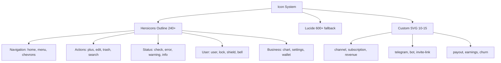

---
tags:
  - kanban/todo
  - type/task
  - domain/UI
  - priority/P1
parent: "[[desarrollo]]"
children: []
depends_on:
  - "[[UI-001]]"
blocks:
  - "[[CSS-006]]"
  - "[[CSS-007]]"
  - "[[WEB-001]]"
status: todo
assignee: "@dev"
created: 2026-08-04
updated: 2026-08-04
---

# [[UI-006]] Iconografía: Set Consistente (Heroicons/Lucide) + Custom SVG

## Descripción
Definir set de iconografía consistente: elegir librería base (Heroicons outline + Lucide), crear iconos custom para dominio, documentar uso, tamaños, y accesibilidad.

## Código de Ejemplo
```php
// resources/views/components/icon.blade.php
@props(['name', 'class' => 'w-5 h-5', 'aria-hidden' => 'true'])

<?php
$icons = [
    // Navegación
    'home' => 'heroicon-o-home',
    'menu' => 'heroicon-o-bars-3',
    'chevron-right' => 'heroicon-o-chevron-right',
    'chevron-left' => 'heroicon-o-chevron-left',
    'chevron-up' => 'heroicon-o-chevron-up',
    'chevron-down' => 'heroicon-o-chevron-down',
    
    // Acciones
    'plus' => 'heroicon-o-plus',
    'minus' => 'heroicon-o-minus',
    'edit' => 'heroicon-o-pencil-square',
    'trash' => 'heroicon-o-trash',
    'save' => 'heroicon-o-check-badge',
    'cancel' => 'heroicon-o-x-mark',
    'search' => 'heroicon-o-magnifying-glass',
    'filter' => 'heroicon-o-funnel',
    'download' => 'heroicon-o-arrow-down-tray',
    'upload' => 'heroicon-o-arrow-up-tray',
    
    // Estados
    'check' => 'heroicon-o-check-circle',
    'error' => 'heroicon-o-exclamation-triangle',
    'warning' => 'heroicon-o-exclamation-circle',
    'info' => 'heroicon-o-information-circle',
    'loading' => 'heroicon-o-arrow-path',
    
    // Usuario
    'user' => 'heroicon-o-user',
    'users' => 'heroicon-o-users',
    'user-plus' => 'heroicon-o-user-plus',
    'lock' => 'heroicon-o-lock-closed',
    'unlock' => 'heroicon-o-lock-open',
    'key' => 'heroicon-o-key',
    'shield' => 'heroicon-o-shield-check',
    
    // Negocio
    'channel' => 'custom-channel',      // Custom SVG
    'subscription' => 'custom-subscription', // Custom SVG
    'revenue' => 'custom-revenue',      // Custom SVG
    'analytics' => 'heroicon-o-chart-bar',
    'settings' => 'heroicon-o-cog-6-tooth',
    'bell' => 'heroicon-o-bell',
    'mail' => 'heroicon-o-envelope',
    'telegram' => 'custom-telegram',    // Custom SVG
    'wallet' => 'heroicon-o-credit-card',
    'bank' => 'heroicon-o-building-office',
    
    // UI
    'eye' => 'heroicon-o-eye',
    'eye-slash' => 'heroicon-o-eye-slash',
    'copy' => 'heroicon-o-document-duplicate',
    'link' => 'heroicon-o-link',
    'external' => 'heroicon-o-arrow-top-right-on-square',
    'refresh' => 'heroicon-o-arrow-path',
    'more' => 'heroicon-o-ellipsis-horizontal',
    'more-vertical' => 'heroicon-o-ellipsis-vertical',
];

$svg = $icons[$name] ?? $name;
?>

<svg class="{{ $class }}" aria-hidden="{{ $ariaHidden }}" xmlns="http://www.w3.org/2000/svg" viewBox="0 0 24 24" fill="none" stroke="currentColor" stroke-width="2" stroke-linecap="round" stroke-linejoin="round">
    @include("icons.{$svg}")
</svg>
```

```blade
{{-- Uso en Blade --}}
<x-icon name="channel" class="w-6 h-6 text-primary-600" />
<x-icon name="user" aria-hidden="false" aria-label="Perfil de usuario" />
<x-icon name="loading" class="animate-spin" />
```

```json
// Iconos Custom SVG (ejemplo: custom-channel.svg)
<symbol id="custom-channel" viewBox="0 0 24 24">
    <path d="M21 8V7l-3 2-3-2v1a2 2 0 0 1-2 2H5a2 2 0 0 1-2-2V4a2 2 0 0 1 2-2h14a2 2 0 0 1 2 2v3a2 2 0 0 1-2 2zm-10 7v-6a2 2 0 0 1 2-2h6a2 2 0 0 1 2 2v6a2 2 0 0 1-2 2H13a2 2 0 0 1-2-2z"/>
</symbol>
```

## Cálculos y Algoritmos (LaTeX)
### Sistema de Tamaños Iconos
$$
\text{Size} \in \{ 12, 16, 20, 24, 32, 48 \} \text{px} \equiv \{ 3, 4, 5, 6, 8, 12 \} \text{ en rem (base 16px)}
$$

### Accesibilidad
$$
\text{Decorativo} \to aria-hidden="true" \quad \text{vs} \quad \text{Semántico} \to aria-label="descripción"
$$

## Diagramas Mermaid
### Organización Iconos


## Criterios de Aceptación
- [ ] Librería base elegida: Heroicons Outline (oficial Laravel) + Lucide fallback
- [ ] 50+ iconos mapeados en `resources/views/components/icon.blade.php`
- [ ] 10-15 iconos custom SVG creados para dominio (channel, subscription, telegram, bot, invite, payout, earnings, churn, creator, analytics-custom)
- [ ] Componente `<x-icon name="..." />` funcional con props: name, class, aria-hidden, aria-label
- [ ] Tamaños estándar: w-4 h-4 (16px), w-5 h-5 (20px), w-6 h-6 (24px), w-8 h-8 (32px)
- [ ] Stroke width consistente: 2 (outline style)
- [ ] currentColor para herencia de color de texto
- [ ] Documentación en `docu/especificaciones/iconography.md` con catálogo visual
- [ ] Testing: render en light/dark, tamaños, colores, accesibilidad

## Notas Técnicas
- Heroicons ya incluido en Laravel (via `blade-heroicons` o manual)
- SVGs inline para control total de color (currentColor)
- Sprite SVG opcional para performance (symbol + use)
- Iconos custom en `resources/svg/icons/` + sprite generator
- No usar icon fonts (accesibilidad, performance)
- Lucide como CDN fallback para iconos no en Heroicons

## Enlaces
- [[UI-001]] Design Tokens (color tokens para iconos)
- [[UI-002]] Component Library (Button, Input, Select usan iconos)
- [[UI-003]] Layouts (navigation icons)
- [[CSS-016]] Avatar (status icons)
- [[CSS-017]] Badge (dot indicators)
- [[PUB-001]] Landing (feature icons)
- [[CRE-001]] Dashboard (metric icons)